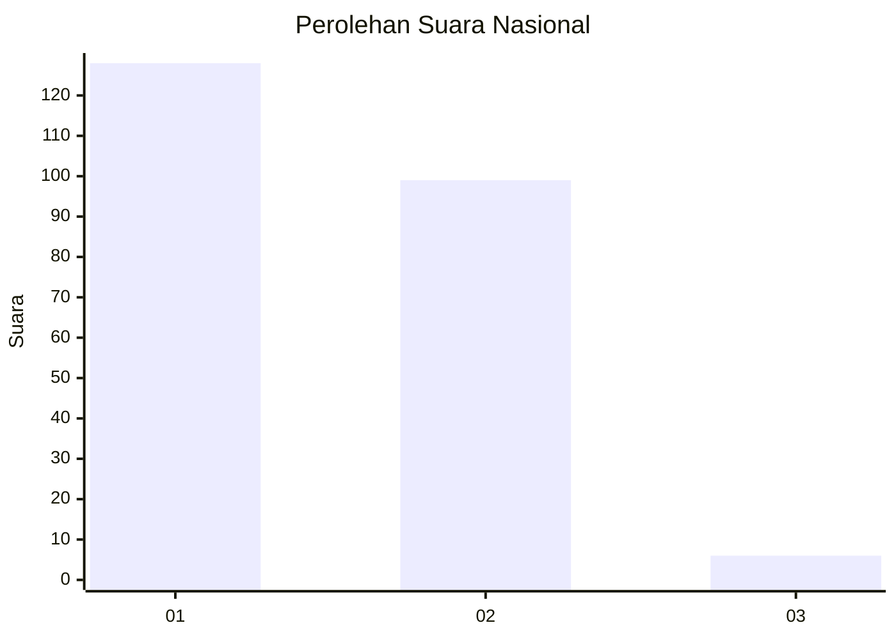
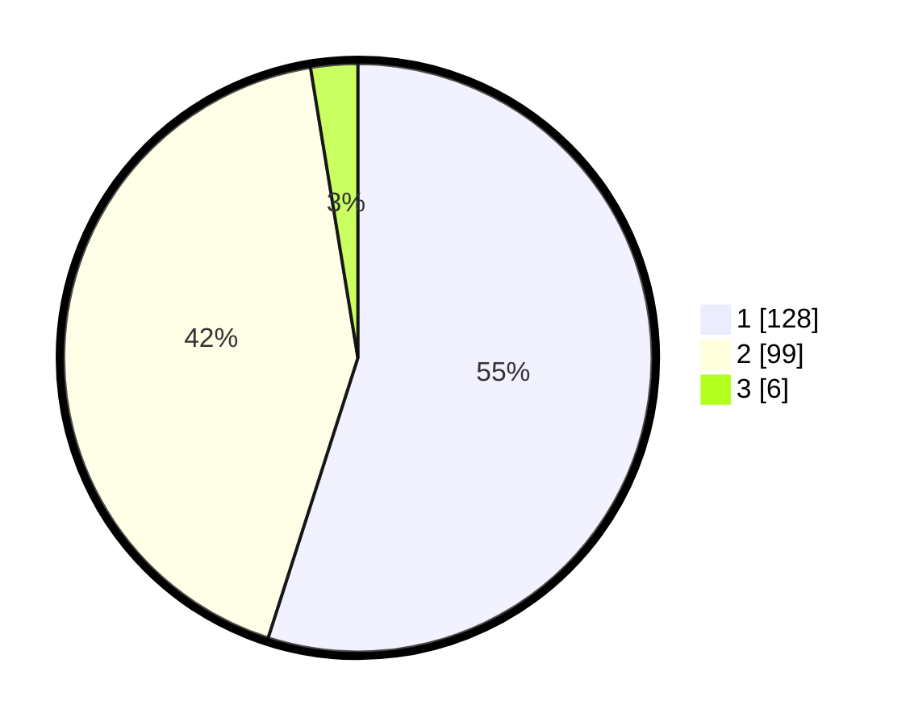

# Hasil

## Grafik

## Tabel

| No. | Nama Paslon    | Suara | Suara (raw) | Persentase |
|:--- |:-------------- | -----:| -----------:| ----------:|
| 1   | ANIES MUHAIMIN | 128   | [128][p-1]  | 54,94      |
| 2   | PRABOWO GIBRAN | 99    | [99][p-2]   | 42,49      |
| 3   | GANJAR MAHFUD  | 6     | [6][p-3]    | 2,58       |

[p-1]: https://github.com/gigit-pemilu/pemilu-2024/blob/main/pilpres/hitung-suara/sub/14-riau/sub/07--rokan-hilir/sub/13-rantau-kopar/sub/1002-rantau-kopar/sub/006-tps/sub/paslon-1.txt
[p-2]: https://github.com/gigit-pemilu/pemilu-2024/blob/main/pilpres/hitung-suara/sub/14-riau/sub/07--rokan-hilir/sub/13-rantau-kopar/sub/1002-rantau-kopar/sub/006-tps/sub/paslon-2.txt
[p-3]: https://github.com/gigit-pemilu/pemilu-2024/blob/main/pilpres/hitung-suara/sub/14-riau/sub/07--rokan-hilir/sub/13-rantau-kopar/sub/1002-rantau-kopar/sub/006-tps/sub/paslon-3.txt

## Foto C Plano

https://sirekap-obj-formc.kpu.go.id/1d9c/pemilu/ppwp/14/07/13/10/02/1407131002006-20240215-140046--37084607-33b7-4063-a94b-2c8b762f7f63.jpg

https://sirekap-obj-formc.kpu.go.id/1d9c/pemilu/ppwp/14/07/13/10/02/1407131002006-20240214-191427--453f5061-708c-4828-b564-7618a5b5aa41.jpg

https://sirekap-obj-formc.kpu.go.id/1d9c/pemilu/ppwp/14/07/13/10/02/1407131002006-20240214-190746--627aafac-1082-4ca3-8b29-51bc7e01e7be.jpg

## Metadata

| Key        | Value               |
| ---------- | ------------------- |
| Time Stamp | 2024-02-16 12:51:22 |

