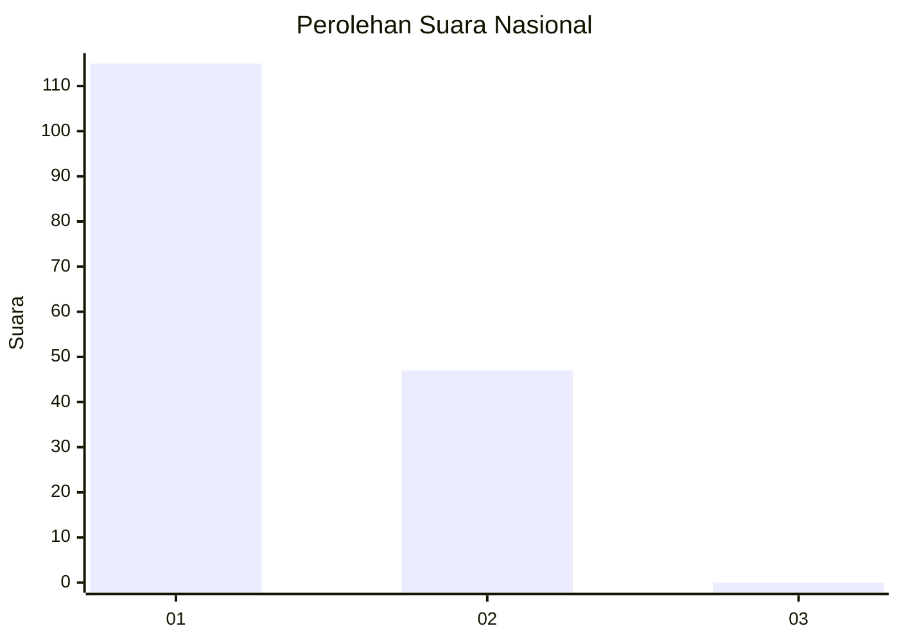
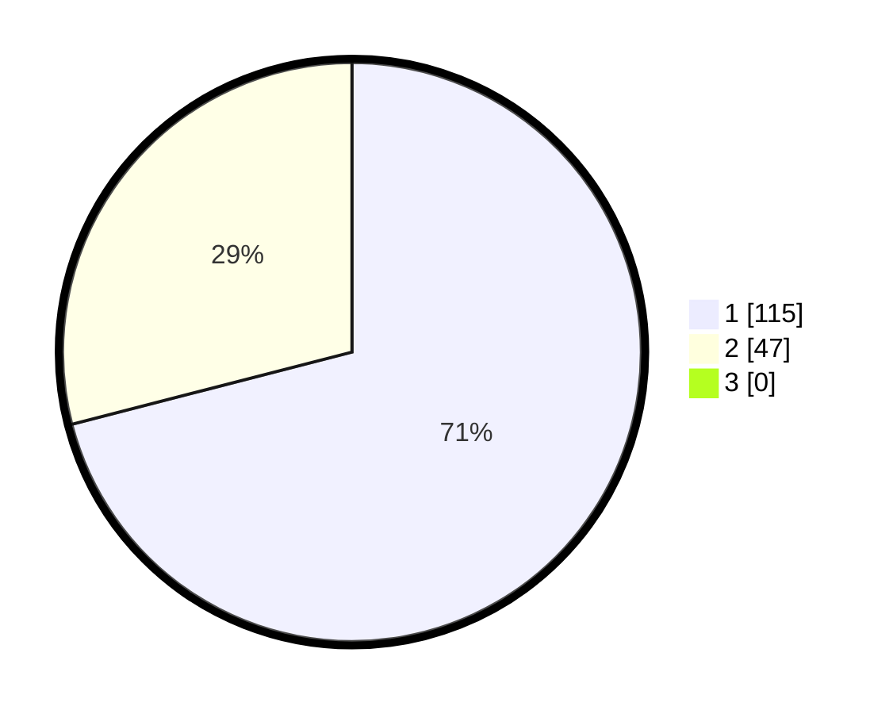

# Hasil

## Grafik

## Tabel

| No. | Nama Paslon    | Suara | Suara (raw) | Persentase |
|:--- |:-------------- | -----:| -----------:| ----------:|
| 1   | ANIES MUHAIMIN | 115   | [115][p-1]  | 70,99      |
| 2   | PRABOWO GIBRAN | 47    | [47][p-2]   | 29,01      |
| 3   | GANJAR MAHFUD  | 0     | [0][p-3]    | 0,00       |

[p-1]: https://github.com/gigit-pemilu/pemilu-2024/blob/main/pilpres/hitung-suara/sub/14-riau/sub/07--rokan-hilir/sub/13-rantau-kopar/sub/2001-sekapas/sub/002-tps/sub/paslon-1.txt
[p-2]: https://github.com/gigit-pemilu/pemilu-2024/blob/main/pilpres/hitung-suara/sub/14-riau/sub/07--rokan-hilir/sub/13-rantau-kopar/sub/2001-sekapas/sub/002-tps/sub/paslon-2.txt
[p-3]: https://github.com/gigit-pemilu/pemilu-2024/blob/main/pilpres/hitung-suara/sub/14-riau/sub/07--rokan-hilir/sub/13-rantau-kopar/sub/2001-sekapas/sub/002-tps/sub/paslon-3.txt

## Foto C Plano

https://sirekap-obj-formc.kpu.go.id/56d7/pemilu/ppwp/14/07/13/20/01/1407132001002-20240217-110406--d057e2da-3591-4f2d-87db-58feb8bad8b9.jpg

https://sirekap-obj-formc.kpu.go.id/56d7/pemilu/ppwp/14/07/13/20/01/1407132001002-20240217-110541--016d7808-16c0-428e-9da5-3559a1f3aa88.jpg

https://sirekap-obj-formc.kpu.go.id/56d7/pemilu/ppwp/14/07/13/20/01/1407132001002-20240217-110711--c04d4aac-7338-40fc-a0dd-c0143f0cc093.jpg

## Metadata

| Key        | Value               |
| ---------- | ------------------- |
| Time Stamp | 2024-02-19 06:16:00 |

