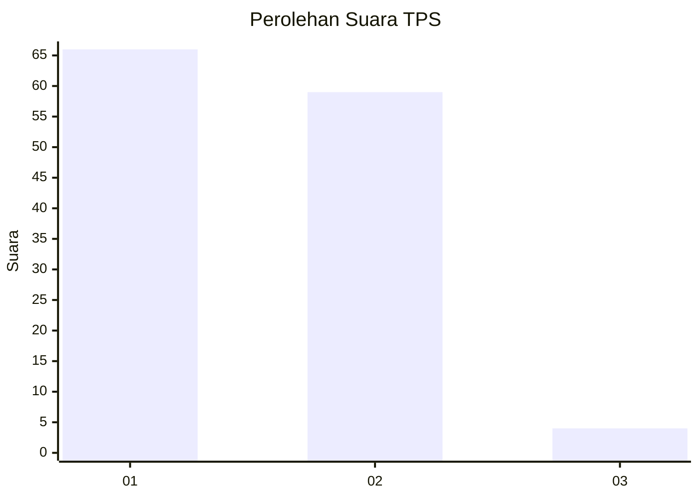
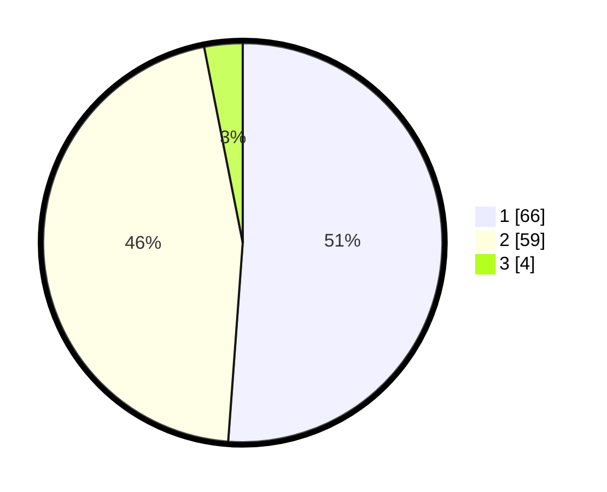

# Hasil

## Grafik

## Tabel

| No. | Nama Paslon    | Suara | Suara (raw) | Persentase |
|:--- |:-------------- | -----:| -----------:| ----------:|
| 1   | ANIES MUHAIMIN | 66    | [66][p-1]   | 51,16      |
| 2   | PRABOWO GIBRAN | 59    | [59][p-2]   | 45,74      |
| 3   | GANJAR MAHFUD  | 4     | [4][p-3]    | 3,10       |

[p-1]: https://github.com/gigit-pemilu/pemilu-2024-14-riau/blob/main/pilpres/hitung-suara/sub/14-riau/sub/07--rokan-hilir/sub/13-rantau-kopar/sub/2001-sekapas/sub/003-tps/sub/paslon-1.txt
[p-2]: https://github.com/gigit-pemilu/pemilu-2024-14-riau/blob/main/pilpres/hitung-suara/sub/14-riau/sub/07--rokan-hilir/sub/13-rantau-kopar/sub/2001-sekapas/sub/003-tps/sub/paslon-2.txt
[p-3]: https://github.com/gigit-pemilu/pemilu-2024-14-riau/blob/main/pilpres/hitung-suara/sub/14-riau/sub/07--rokan-hilir/sub/13-rantau-kopar/sub/2001-sekapas/sub/003-tps/sub/paslon-3.txt

## Foto C Plano

https://sirekap-obj-formc.kpu.go.id/9bc4/pemilu/ppwp/14/07/13/20/01/1407132001003-20240215-093937--40230c93-a25a-499a-ae82-0804e27e85cd.jpg

https://sirekap-obj-formc.kpu.go.id/9bc4/pemilu/ppwp/14/07/13/20/01/1407132001003-20240215-094312--85aea618-956e-4aaf-b62c-cc6bc6fe1846.jpg

https://sirekap-obj-formc.kpu.go.id/9bc4/pemilu/ppwp/14/07/13/20/01/1407132001003-20240215-094502--ac364d77-abd9-4df2-a641-5067fbd5d161.jpg

## Metadata

| Key        | Value               |
| ---------- | ------------------- |
| Time Stamp | 2024-02-16 12:51:22 |

