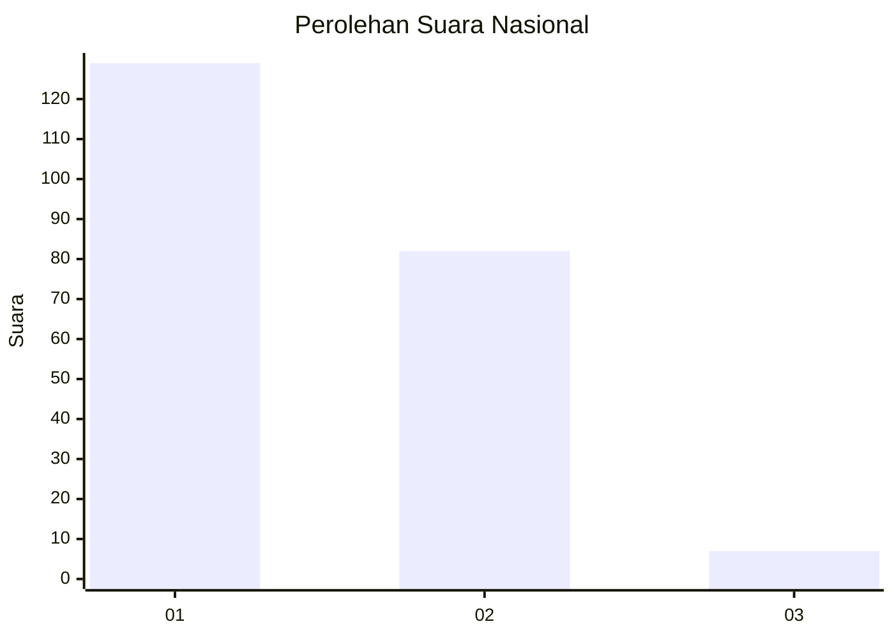
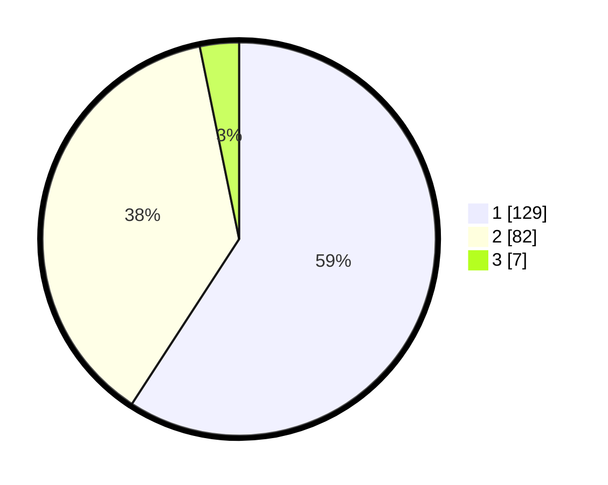

# Hasil

## Grafik

## Tabel

| No. | Nama Paslon    | Suara | Suara (raw) | Persentase |
|:--- |:-------------- | -----:| -----------:| ----------:|
| 1   | ANIES MUHAIMIN | 129   | [129][p-1]  | 59,17      |
| 2   | PRABOWO GIBRAN | 82    | [82][p-2]   | 37,61      |
| 3   | GANJAR MAHFUD  | 7     | [7][p-3]    | 3,21       |

[p-1]: https://github.com/gigit-pemilu/pemilu-2024/blob/main/pilpres/hitung-suara/sub/14-riau/sub/07--rokan-hilir/sub/13-rantau-kopar/sub/2004-bagan-cempedak/sub/001-tps/sub/paslon-1.txt
[p-2]: https://github.com/gigit-pemilu/pemilu-2024/blob/main/pilpres/hitung-suara/sub/14-riau/sub/07--rokan-hilir/sub/13-rantau-kopar/sub/2004-bagan-cempedak/sub/001-tps/sub/paslon-2.txt
[p-3]: https://github.com/gigit-pemilu/pemilu-2024/blob/main/pilpres/hitung-suara/sub/14-riau/sub/07--rokan-hilir/sub/13-rantau-kopar/sub/2004-bagan-cempedak/sub/001-tps/sub/paslon-3.txt

## Foto C Plano

https://sirekap-obj-formc.kpu.go.id/e39b/pemilu/ppwp/14/07/13/20/04/1407132004001-20240215-105031--d201aca7-15b8-4872-99be-6d46eb964305.jpg

https://sirekap-obj-formc.kpu.go.id/e39b/pemilu/ppwp/14/07/13/20/04/1407132004001-20240215-105108--f08d5061-1b6b-46a1-8f95-adb00461a71a.jpg

https://sirekap-obj-formc.kpu.go.id/e39b/pemilu/ppwp/14/07/13/20/04/1407132004001-20240215-105147--aeed1cfd-7fc1-41da-8c4c-2b5dec4fcc9e.jpg

## Metadata

| Key        | Value               |
| ---------- | ------------------- |
| Time Stamp | 2024-02-16 12:51:22 |

