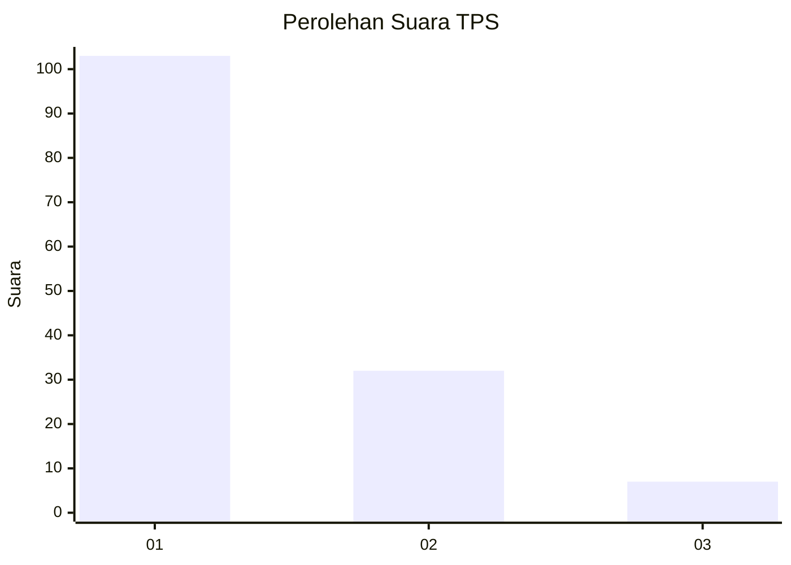
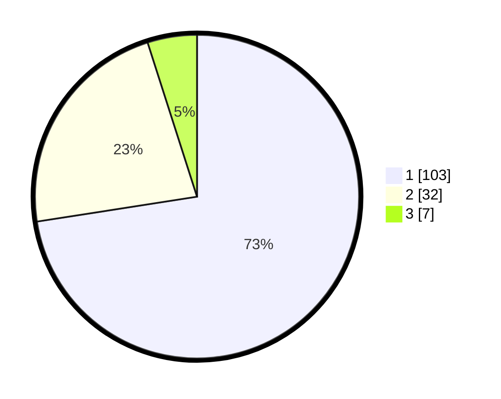

# Hasil

## Grafik

## Tabel

| No. | Nama Paslon    | Suara | Suara (raw) | Persentase |
|:--- |:-------------- | -----:| -----------:| ----------:|
| 1   | ANIES MUHAIMIN | 103   | [103][p-1]  | 72,54      |
| 2   | PRABOWO GIBRAN | 32    | [32][p-2]   | 22,54      |
| 3   | GANJAR MAHFUD  | 7     | [7][p-3]    | 4,93       |

[p-1]: https://github.com/gigit-pemilu/pemilu-2024-14-riau/blob/main/pilpres/hitung-suara/sub/14-riau/sub/07--rokan-hilir/sub/14-pekaitan/sub/2003-sei-besar/sub/004-tps/sub/paslon-1.txt
[p-2]: https://github.com/gigit-pemilu/pemilu-2024-14-riau/blob/main/pilpres/hitung-suara/sub/14-riau/sub/07--rokan-hilir/sub/14-pekaitan/sub/2003-sei-besar/sub/004-tps/sub/paslon-2.txt
[p-3]: https://github.com/gigit-pemilu/pemilu-2024-14-riau/blob/main/pilpres/hitung-suara/sub/14-riau/sub/07--rokan-hilir/sub/14-pekaitan/sub/2003-sei-besar/sub/004-tps/sub/paslon-3.txt

## Foto C Plano

https://sirekap-obj-formc.kpu.go.id/037e/pemilu/ppwp/14/07/14/20/03/1407142003004-20240223-215616--bb2a3bec-4d1b-4aab-b371-dde8b09f8a9b.jpg

https://sirekap-obj-formc.kpu.go.id/037e/pemilu/ppwp/14/07/14/20/03/1407142003004-20240223-215709--1e11a9de-62d7-47f0-a3c1-3cd70fc0fef0.jpg

https://sirekap-obj-formc.kpu.go.id/037e/pemilu/ppwp/14/07/14/20/03/1407142003004-20240223-215757--6b7a0032-b641-41f8-85b6-2e91e3463d9c.jpg

## Metadata

| Key        | Value               |
| ---------- | ------------------- |
| Time Stamp | 2024-02-24 22:31:28 |

