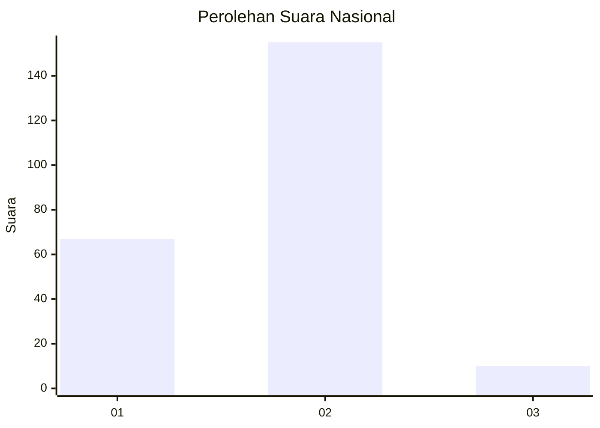
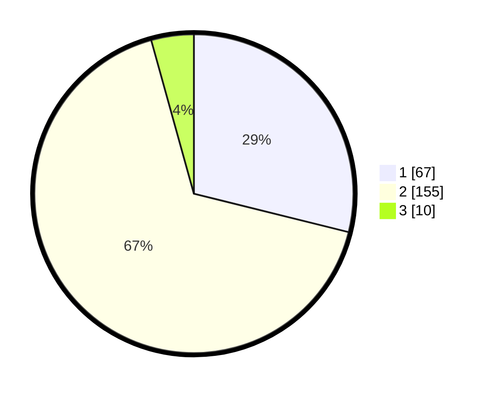

# Hasil

## Grafik

## Tabel

| No. | Nama Paslon    | Suara | Suara (raw) | Persentase |
|:--- |:-------------- | -----:| -----------:| ----------:|
| 1   | ANIES MUHAIMIN | 67    | [67][p-1]   | 28,88      |
| 2   | PRABOWO GIBRAN | 155   | [155][p-2]  | 66,81      |
| 3   | GANJAR MAHFUD  | 10    | [10][p-3]   | 4,31       |

[p-1]: https://github.com/gigit-pemilu/pemilu-2024/blob/main/pilpres/hitung-suara/sub/14-riau/sub/07--rokan-hilir/sub/14-pekaitan/sub/2005-teluk-bano-ii/sub/001-tps/sub/paslon-1.txt
[p-2]: https://github.com/gigit-pemilu/pemilu-2024/blob/main/pilpres/hitung-suara/sub/14-riau/sub/07--rokan-hilir/sub/14-pekaitan/sub/2005-teluk-bano-ii/sub/001-tps/sub/paslon-2.txt
[p-3]: https://github.com/gigit-pemilu/pemilu-2024/blob/main/pilpres/hitung-suara/sub/14-riau/sub/07--rokan-hilir/sub/14-pekaitan/sub/2005-teluk-bano-ii/sub/001-tps/sub/paslon-3.txt

## Foto C Plano

https://sirekap-obj-formc.kpu.go.id/1e03/pemilu/ppwp/14/07/14/20/05/1407142005001-20240215-094421--d2c5fbce-aa0a-43cb-b06c-623f0a4801ac.jpg

https://sirekap-obj-formc.kpu.go.id/1e03/pemilu/ppwp/14/07/14/20/05/1407142005001-20240215-094751--9d46f9b9-c686-4482-afe3-4f8acd3b1458.jpg

https://sirekap-obj-formc.kpu.go.id/1e03/pemilu/ppwp/14/07/14/20/05/1407142005001-20240215-094857--b2e94655-02cd-400a-8bb4-86b315ff6e25.jpg

## Metadata

| Key        | Value               |
| ---------- | ------------------- |
| Time Stamp | 2024-02-16 12:51:22 |

