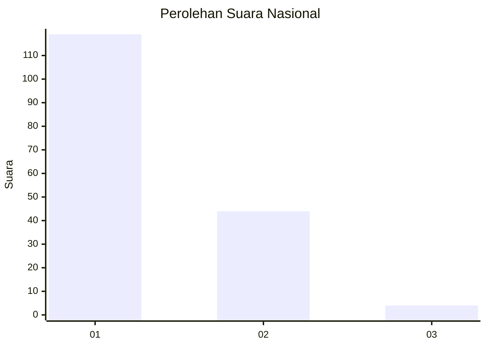
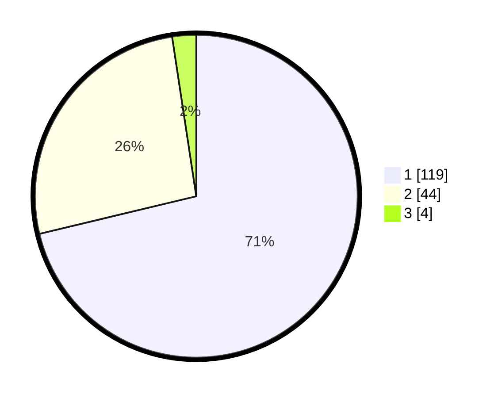

# Hasil

## Grafik

## Tabel

| No. | Nama Paslon    | Suara | Suara (raw) | Persentase |
|:--- |:-------------- | -----:| -----------:| ----------:|
| 1   | ANIES MUHAIMIN | 119   | [119][p-1]  | 71,26      |
| 2   | PRABOWO GIBRAN | 44    | [44][p-2]   | 26,35      |
| 3   | GANJAR MAHFUD  | 4     | [4][p-3]    | 2,40       |

[p-1]: https://github.com/gigit-pemilu/pemilu-2024/blob/main/pilpres/hitung-suara/sub/14-riau/sub/07--rokan-hilir/sub/15-kubu-babussalam/sub/2001-rantau-panjang-kiri/sub/007-tps/sub/paslon-1.txt
[p-2]: https://github.com/gigit-pemilu/pemilu-2024/blob/main/pilpres/hitung-suara/sub/14-riau/sub/07--rokan-hilir/sub/15-kubu-babussalam/sub/2001-rantau-panjang-kiri/sub/007-tps/sub/paslon-2.txt
[p-3]: https://github.com/gigit-pemilu/pemilu-2024/blob/main/pilpres/hitung-suara/sub/14-riau/sub/07--rokan-hilir/sub/15-kubu-babussalam/sub/2001-rantau-panjang-kiri/sub/007-tps/sub/paslon-3.txt

## Foto C Plano

https://sirekap-obj-formc.kpu.go.id/7d6d/pemilu/ppwp/14/07/15/20/01/1407152001007-20240215-015554--0959e4ad-e9d5-486d-846c-65e273b7186d.jpg

https://sirekap-obj-formc.kpu.go.id/7d6d/pemilu/ppwp/14/07/15/20/01/1407152001007-20240215-015715--6d74f73d-ecad-4346-9c68-3b75cc7f5393.jpg

https://sirekap-obj-formc.kpu.go.id/7d6d/pemilu/ppwp/14/07/15/20/01/1407152001007-20240215-015838--86ea9f15-d607-4c2e-85d6-20a42dc3b6e5.jpg

## Metadata

| Key        | Value               |
| ---------- | ------------------- |
| Time Stamp | 2024-02-16 12:51:22 |

