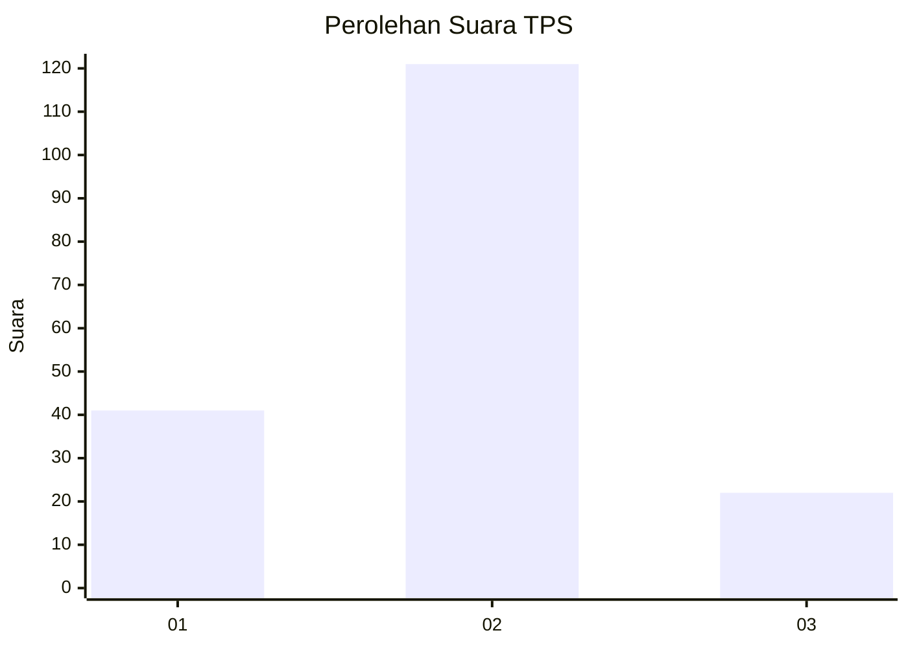
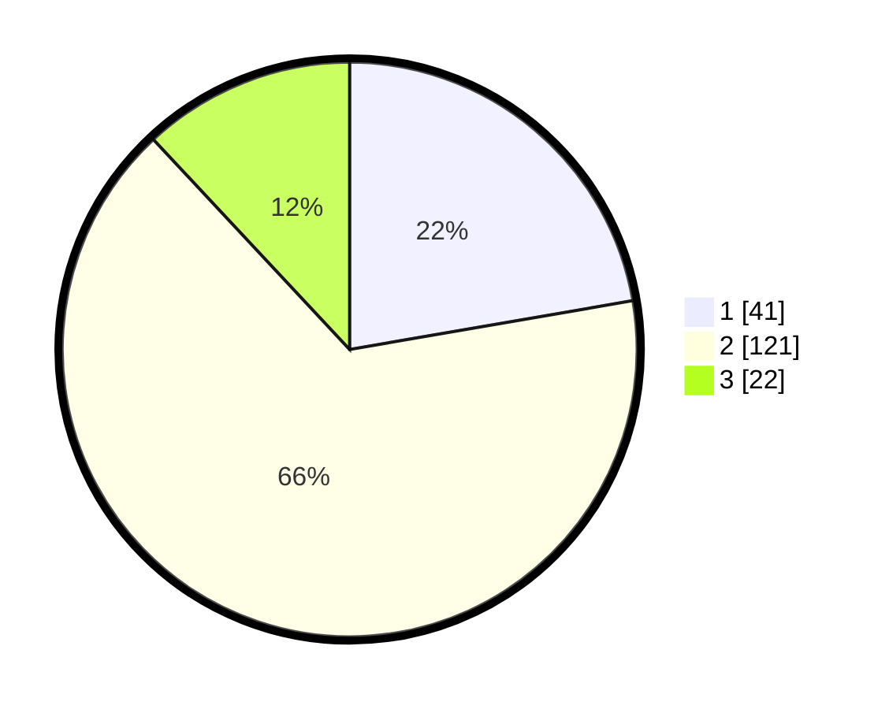

# Hasil

## Grafik

## Tabel

| No. | Nama Paslon    | Suara | Suara (raw) | Persentase |
|:--- |:-------------- | -----:| -----------:| ----------:|
| 1   | ANIES MUHAIMIN | 41    | [41][p-1]   | 22,28      |
| 2   | PRABOWO GIBRAN | 121   | [121][p-2]  | 65,76      |
| 3   | GANJAR MAHFUD  | 22    | [22][p-3]   | 11,96      |

[p-1]: https://github.com/gigit-pemilu/pemilu-2024-14-riau/blob/main/pilpres/hitung-suara/sub/14-riau/sub/07--rokan-hilir/sub/15-kubu-babussalam/sub/2002-teluknilap/sub/009-tps/sub/paslon-1.txt
[p-2]: https://github.com/gigit-pemilu/pemilu-2024-14-riau/blob/main/pilpres/hitung-suara/sub/14-riau/sub/07--rokan-hilir/sub/15-kubu-babussalam/sub/2002-teluknilap/sub/009-tps/sub/paslon-2.txt
[p-3]: https://github.com/gigit-pemilu/pemilu-2024-14-riau/blob/main/pilpres/hitung-suara/sub/14-riau/sub/07--rokan-hilir/sub/15-kubu-babussalam/sub/2002-teluknilap/sub/009-tps/sub/paslon-3.txt

## Foto C Plano

https://sirekap-obj-formc.kpu.go.id/ffde/pemilu/ppwp/14/07/15/20/02/1407152002009-20240215-025649--d5a25e4b-6ce3-443f-9b65-e22b7639ad5c.jpg

https://sirekap-obj-formc.kpu.go.id/ffde/pemilu/ppwp/14/07/15/20/02/1407152002009-20240215-025831--fa42cd57-b02d-4704-9c49-9a7b935c9184.jpg

https://sirekap-obj-formc.kpu.go.id/ffde/pemilu/ppwp/14/07/15/20/02/1407152002009-20240215-030044--92f77fe9-923b-4287-a79c-753d54e83f24.jpg

## Metadata

| Key        | Value               |
| ---------- | ------------------- |
| Time Stamp | 2024-02-16 12:51:22 |

