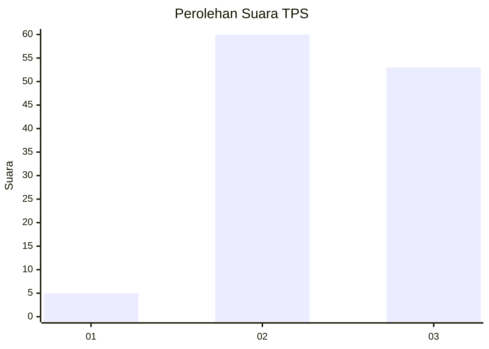
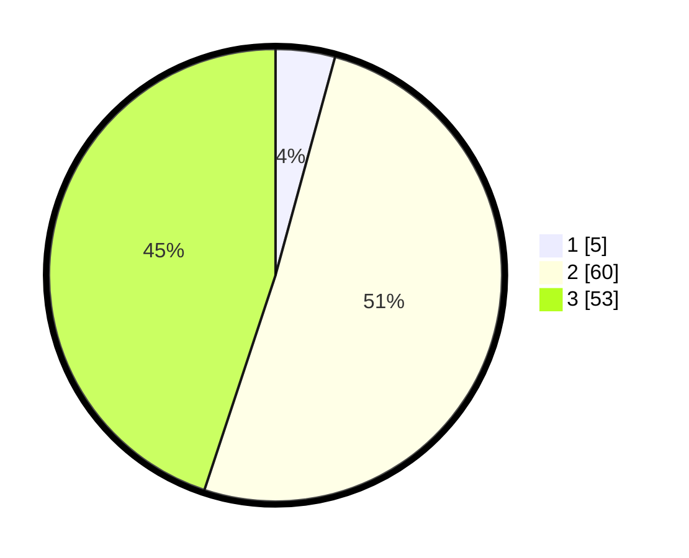

# Hasil

## Grafik

## Tabel

| No. | Nama Paslon    | Suara | Suara (raw) | Persentase |
|:--- |:-------------- | -----:| -----------:| ----------:|
| 1   | ANIES MUHAIMIN | 5     | [5][p-1]    | 4,24       |
| 2   | PRABOWO GIBRAN | 60    | [60][p-2]   | 50,85      |
| 3   | GANJAR MAHFUD  | 53    | [53][p-3]   | 44,92      |

[p-1]: https://github.com/gigit-pemilu/pemilu-2024-14-riau/blob/main/pilpres/hitung-suara/sub/14-riau/sub/07--rokan-hilir/sub/15-kubu-babussalam/sub/2007-pulauhalang-muka/sub/002-tps/sub/paslon-1.txt
[p-2]: https://github.com/gigit-pemilu/pemilu-2024-14-riau/blob/main/pilpres/hitung-suara/sub/14-riau/sub/07--rokan-hilir/sub/15-kubu-babussalam/sub/2007-pulauhalang-muka/sub/002-tps/sub/paslon-2.txt
[p-3]: https://github.com/gigit-pemilu/pemilu-2024-14-riau/blob/main/pilpres/hitung-suara/sub/14-riau/sub/07--rokan-hilir/sub/15-kubu-babussalam/sub/2007-pulauhalang-muka/sub/002-tps/sub/paslon-3.txt

## Foto C Plano

https://sirekap-obj-formc.kpu.go.id/5ef8/pemilu/ppwp/14/07/15/20/07/1407152007002-20240215-002453--64b33152-4ce5-46f9-80bf-05a2d4a59868.jpg

https://sirekap-obj-formc.kpu.go.id/5ef8/pemilu/ppwp/14/07/15/20/07/1407152007002-20240215-002607--1fc2b9ef-ac66-4e25-9b69-279b8a63d09f.jpg

https://sirekap-obj-formc.kpu.go.id/5ef8/pemilu/ppwp/14/07/15/20/07/1407152007002-20240215-002658--fd831e13-a675-4f97-b438-87dfe30264f4.jpg

## Metadata

| Key        | Value               |
| ---------- | ------------------- |
| Time Stamp | 2024-02-16 12:51:22 |

