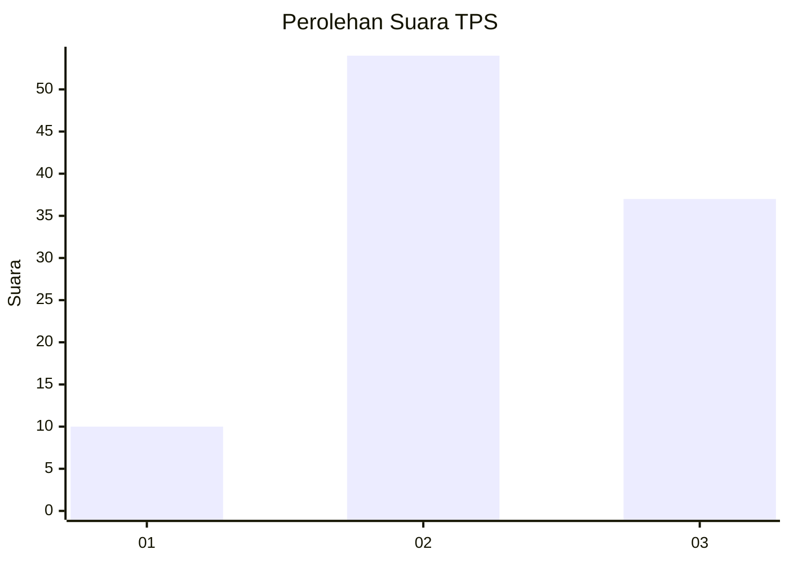
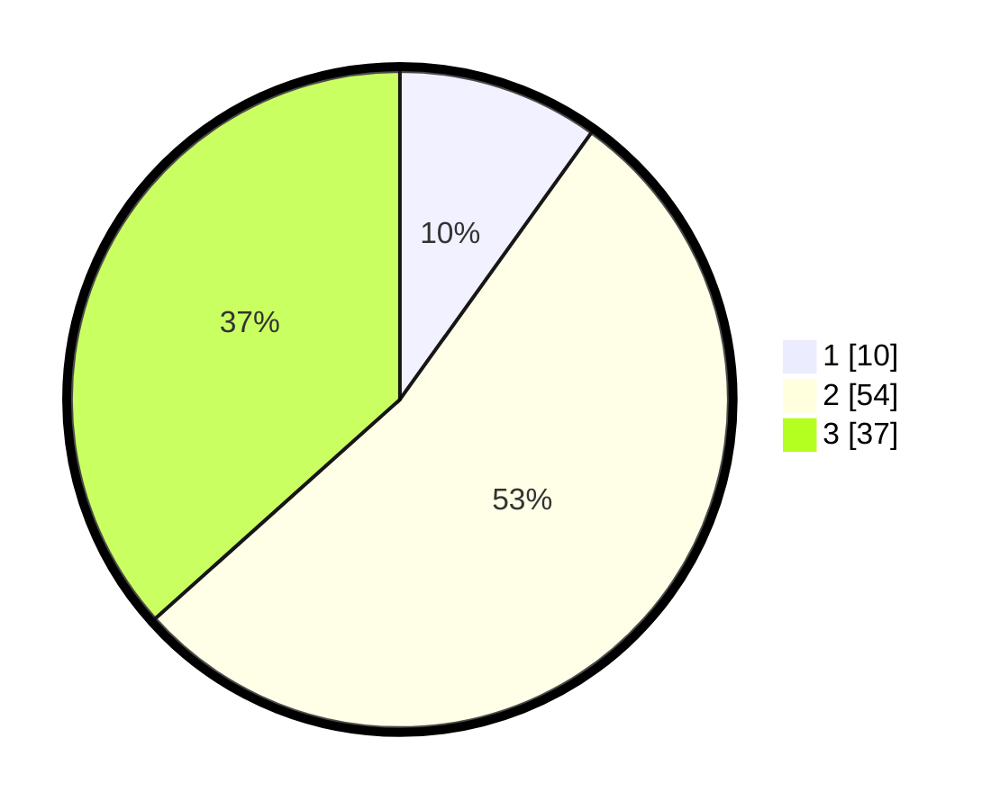

# Hasil

## Grafik

## Tabel

| No. | Nama Paslon    | Suara | Suara (raw) | Persentase |
|:--- |:-------------- | -----:| -----------:| ----------:|
| 1   | ANIES MUHAIMIN | 10    | [10][p-1]   | 9,90       |
| 2   | PRABOWO GIBRAN | 54    | [54][p-2]   | 53,47      |
| 3   | GANJAR MAHFUD  | 37    | [37][p-3]   | 36,63      |

[p-1]: https://github.com/gigit-pemilu/pemilu-2024-14-riau/blob/main/pilpres/hitung-suara/sub/14-riau/sub/07--rokan-hilir/sub/15-kubu-babussalam/sub/2007-pulauhalang-muka/sub/004-tps/sub/paslon-1.txt
[p-2]: https://github.com/gigit-pemilu/pemilu-2024-14-riau/blob/main/pilpres/hitung-suara/sub/14-riau/sub/07--rokan-hilir/sub/15-kubu-babussalam/sub/2007-pulauhalang-muka/sub/004-tps/sub/paslon-2.txt
[p-3]: https://github.com/gigit-pemilu/pemilu-2024-14-riau/blob/main/pilpres/hitung-suara/sub/14-riau/sub/07--rokan-hilir/sub/15-kubu-babussalam/sub/2007-pulauhalang-muka/sub/004-tps/sub/paslon-3.txt

## Foto C Plano

https://sirekap-obj-formc.kpu.go.id/0b67/pemilu/ppwp/14/07/15/20/07/1407152007004-20240214-223615--5b051cc0-3ad8-4133-ba43-d9d0b3ac76f2.jpg

https://sirekap-obj-formc.kpu.go.id/0b67/pemilu/ppwp/14/07/15/20/07/1407152007004-20240214-194316--2267d76e-6668-462a-9147-6913f179a675.jpg

https://sirekap-obj-formc.kpu.go.id/0b67/pemilu/ppwp/14/07/15/20/07/1407152007004-20240214-223845--e673b539-4616-4783-b77f-518a7ddba3ac.jpg

## Metadata

| Key        | Value               |
| ---------- | ------------------- |
| Time Stamp | 2024-02-16 12:51:22 |

