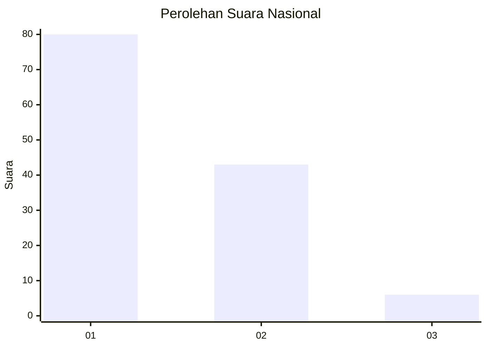
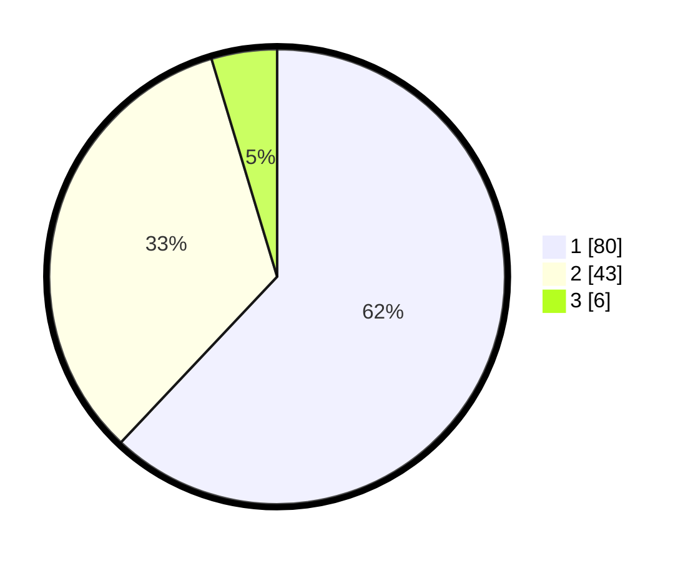

# Hasil

## Grafik

## Tabel

| No. | Nama Paslon    | Suara | Suara (raw) | Persentase |
|:--- |:-------------- | -----:| -----------:| ----------:|
| 1   | ANIES MUHAIMIN | 80    | [80][p-1]   | 62,02      |
| 2   | PRABOWO GIBRAN | 43    | [43][p-2]   | 33,33      |
| 3   | GANJAR MAHFUD  | 6     | [6][p-3]    | 4,65       |

[p-1]: https://github.com/gigit-pemilu/pemilu-2024/blob/main/pilpres/hitung-suara/sub/14-riau/sub/07--rokan-hilir/sub/15-kubu-babussalam/sub/2009-rantau-panjang-kiri-hilir/sub/004-tps/sub/paslon-1.txt
[p-2]: https://github.com/gigit-pemilu/pemilu-2024/blob/main/pilpres/hitung-suara/sub/14-riau/sub/07--rokan-hilir/sub/15-kubu-babussalam/sub/2009-rantau-panjang-kiri-hilir/sub/004-tps/sub/paslon-2.txt
[p-3]: https://github.com/gigit-pemilu/pemilu-2024/blob/main/pilpres/hitung-suara/sub/14-riau/sub/07--rokan-hilir/sub/15-kubu-babussalam/sub/2009-rantau-panjang-kiri-hilir/sub/004-tps/sub/paslon-3.txt

## Foto C Plano

https://sirekap-obj-formc.kpu.go.id/1b81/pemilu/ppwp/14/07/15/20/09/1407152009004-20240214-141747--96c162dd-39a1-48be-9fd8-e0bc4bdc6cd5.jpg

https://sirekap-obj-formc.kpu.go.id/1b81/pemilu/ppwp/14/07/15/20/09/1407152009004-20240214-141913--961427de-55de-4180-b102-577ff9e567b7.jpg

https://sirekap-obj-formc.kpu.go.id/1b81/pemilu/ppwp/14/07/15/20/09/1407152009004-20240214-141502--00fc476c-eb1d-4c96-a7ba-e3e51c36e653.jpg

## Metadata

| Key        | Value               |
| ---------- | ------------------- |
| Time Stamp | 2024-02-16 12:51:22 |

