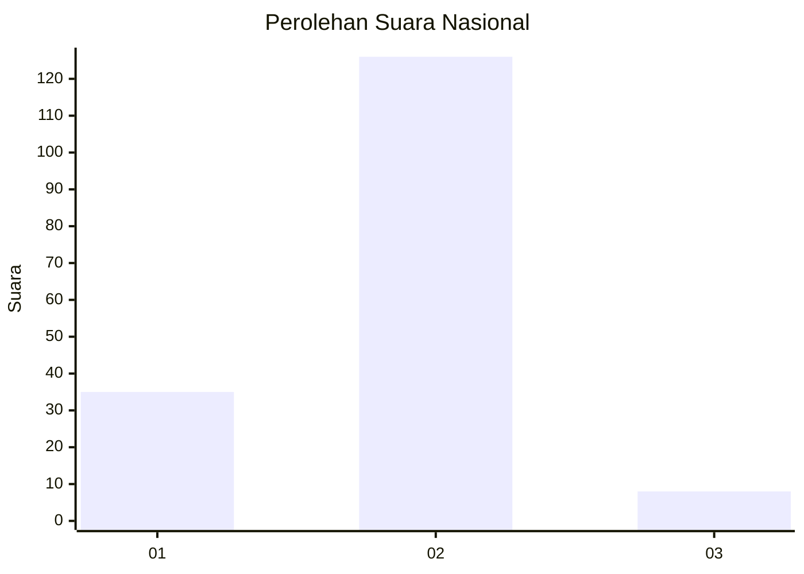
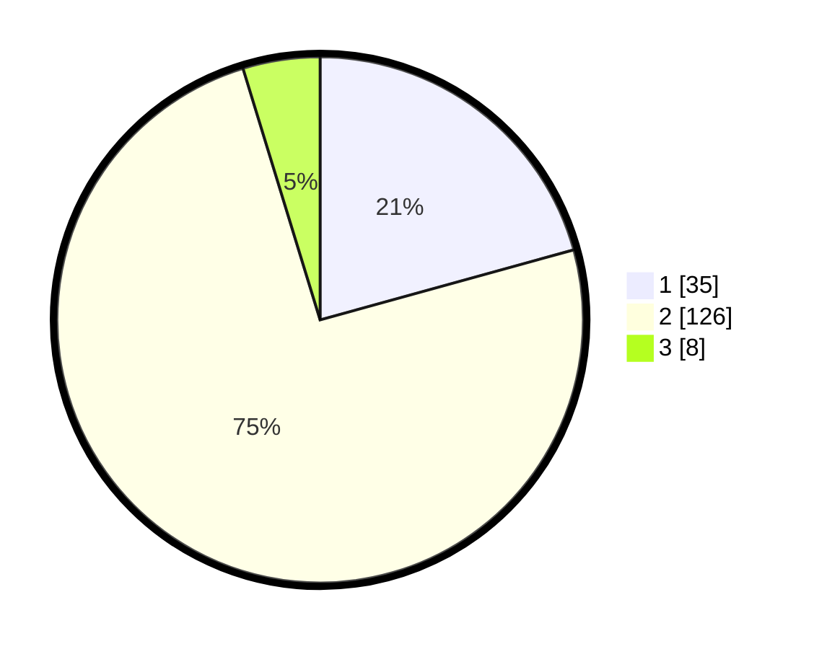

# Hasil

## Grafik

## Tabel

| No. | Nama Paslon    | Suara | Suara (raw) | Persentase |
|:--- |:-------------- | -----:| -----------:| ----------:|
| 1   | ANIES MUHAIMIN | 35    | [35][p-1]   | 20,71      |
| 2   | PRABOWO GIBRAN | 126   | [126][p-2]  | 74,56      |
| 3   | GANJAR MAHFUD  | 8     | [8][p-3]    | 4,73       |

[p-1]: https://github.com/gigit-pemilu/pemilu-2024/blob/main/pilpres/hitung-suara/sub/14-riau/sub/07--rokan-hilir/sub/16-tanjung-medan/sub/2001-tanjung-medan/sub/007-tps/sub/paslon-1.txt
[p-2]: https://github.com/gigit-pemilu/pemilu-2024/blob/main/pilpres/hitung-suara/sub/14-riau/sub/07--rokan-hilir/sub/16-tanjung-medan/sub/2001-tanjung-medan/sub/007-tps/sub/paslon-2.txt
[p-3]: https://github.com/gigit-pemilu/pemilu-2024/blob/main/pilpres/hitung-suara/sub/14-riau/sub/07--rokan-hilir/sub/16-tanjung-medan/sub/2001-tanjung-medan/sub/007-tps/sub/paslon-3.txt

## Foto C Plano

https://sirekap-obj-formc.kpu.go.id/2448/pemilu/ppwp/14/07/16/20/01/1407162001007-20240214-192440--df878f82-bde0-4f19-b2b0-d5350e339b7f.jpg

https://sirekap-obj-formc.kpu.go.id/2448/pemilu/ppwp/14/07/16/20/01/1407162001007-20240214-195731--65f96a59-ebf7-43a3-aab2-ec6235c1081c.jpg

https://sirekap-obj-formc.kpu.go.id/2448/pemilu/ppwp/14/07/16/20/01/1407162001007-20240214-195332--871cb5f6-6f84-4adf-8e99-bf37e52dc6be.jpg

## Metadata

| Key        | Value               |
| ---------- | ------------------- |
| Time Stamp | 2024-02-16 12:51:22 |

