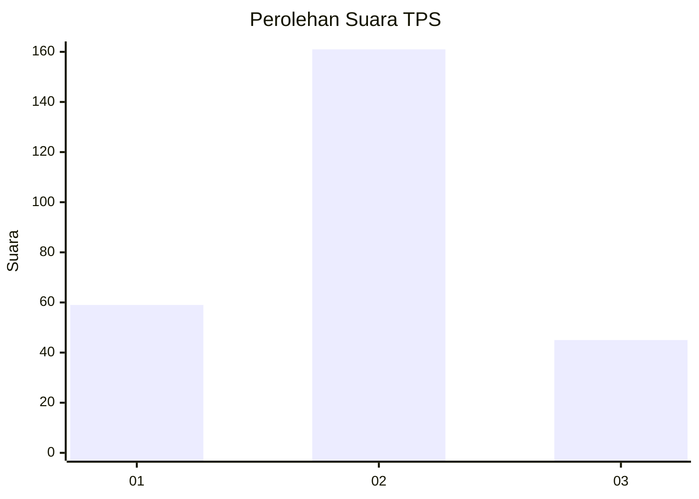

# Hasil

## Grafik

## Tabel

| No. | Nama Paslon    | Suara | Suara (raw) | Persentase |
|:--- |:-------------- | -----:| -----------:| ----------:|
| 1   | ANIES MUHAIMIN | 59    | [59][p-1]   | 22,26      |
| 2   | PRABOWO GIBRAN | 161   | [161][p-2]  | 60,75      |
| 3   | GANJAR MAHFUD  | 45    | [45][p-3]   | 16,98      |

[p-1]: https://github.com/gigit-pemilu/pemilu-2024-14-riau/blob/main/pilpres/hitung-suara/sub/14-riau/sub/07--rokan-hilir/sub/16-tanjung-medan/sub/2001-tanjung-medan/sub/009-tps/sub/paslon-1.txt
[p-2]: https://github.com/gigit-pemilu/pemilu-2024-14-riau/blob/main/pilpres/hitung-suara/sub/14-riau/sub/07--rokan-hilir/sub/16-tanjung-medan/sub/2001-tanjung-medan/sub/009-tps/sub/paslon-2.txt
[p-3]: https://github.com/gigit-pemilu/pemilu-2024-14-riau/blob/main/pilpres/hitung-suara/sub/14-riau/sub/07--rokan-hilir/sub/16-tanjung-medan/sub/2001-tanjung-medan/sub/009-tps/sub/paslon-3.txt

## Foto C Plano

https://sirekap-obj-formc.kpu.go.id/d881/pemilu/ppwp/14/07/16/20/01/1407162001009-20240214-234053--22cc5505-e14c-49b4-a188-84a97474f83b.jpg

https://sirekap-obj-formc.kpu.go.id/d881/pemilu/ppwp/14/07/16/20/01/1407162001009-20240214-234334--894c1e21-75be-47a3-bcd0-a469f36e3e66.jpg

https://sirekap-obj-formc.kpu.go.id/d881/pemilu/ppwp/14/07/16/20/01/1407162001009-20240214-234624--f94f820d-f050-4dae-87f9-d5990f3d90b3.jpg

## Metadata

| Key        | Value               |
| ---------- | ------------------- |
| Time Stamp | 2024-02-16 12:51:22 |

