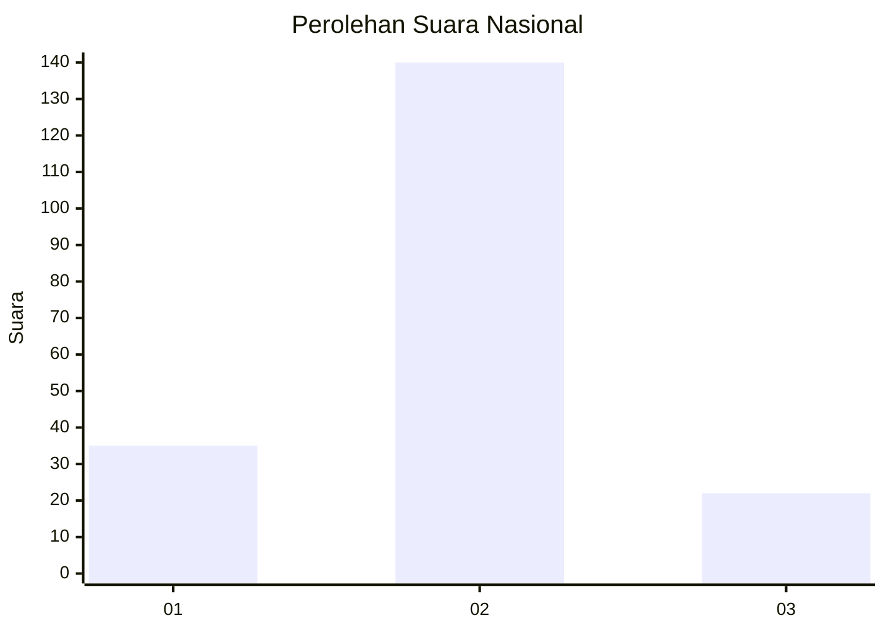
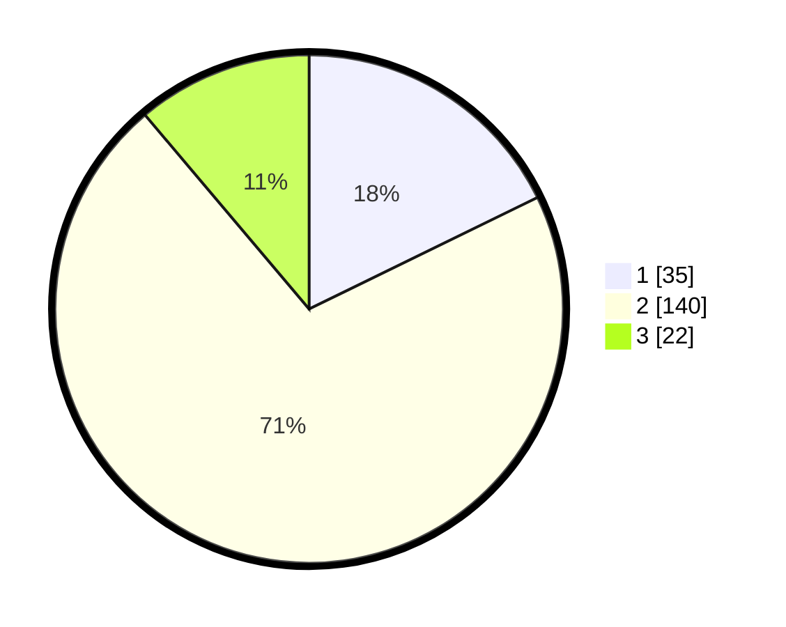

# Hasil

## Grafik

## Tabel

| No. | Nama Paslon    | Suara | Suara (raw) | Persentase |
|:--- |:-------------- | -----:| -----------:| ----------:|
| 1   | ANIES MUHAIMIN | 35    | [35][p-1]   | 17,77      |
| 2   | PRABOWO GIBRAN | 140   | [140][p-2]  | 71,07      |
| 3   | GANJAR MAHFUD  | 22    | [22][p-3]   | 11,17      |

[p-1]: https://github.com/gigit-pemilu/pemilu-2024/blob/main/pilpres/hitung-suara/sub/14-riau/sub/07--rokan-hilir/sub/16-tanjung-medan/sub/2001-tanjung-medan/sub/010-tps/sub/paslon-1.txt
[p-2]: https://github.com/gigit-pemilu/pemilu-2024/blob/main/pilpres/hitung-suara/sub/14-riau/sub/07--rokan-hilir/sub/16-tanjung-medan/sub/2001-tanjung-medan/sub/010-tps/sub/paslon-2.txt
[p-3]: https://github.com/gigit-pemilu/pemilu-2024/blob/main/pilpres/hitung-suara/sub/14-riau/sub/07--rokan-hilir/sub/16-tanjung-medan/sub/2001-tanjung-medan/sub/010-tps/sub/paslon-3.txt

## Foto C Plano

https://sirekap-obj-formc.kpu.go.id/7e00/pemilu/ppwp/14/07/16/20/01/1407162001010-20240215-022057--5b564e01-aa25-445d-abae-f48896fb6be6.jpg

https://sirekap-obj-formc.kpu.go.id/7e00/pemilu/ppwp/14/07/16/20/01/1407162001010-20240215-022600--cff39a24-564b-430f-87f3-1c2ee315f8f1.jpg

https://sirekap-obj-formc.kpu.go.id/7e00/pemilu/ppwp/14/07/16/20/01/1407162001010-20240215-022712--b621197e-3cbb-4f5e-a5af-2c4f71265e68.jpg

## Metadata

| Key        | Value               |
| ---------- | ------------------- |
| Time Stamp | 2024-02-16 12:51:22 |

