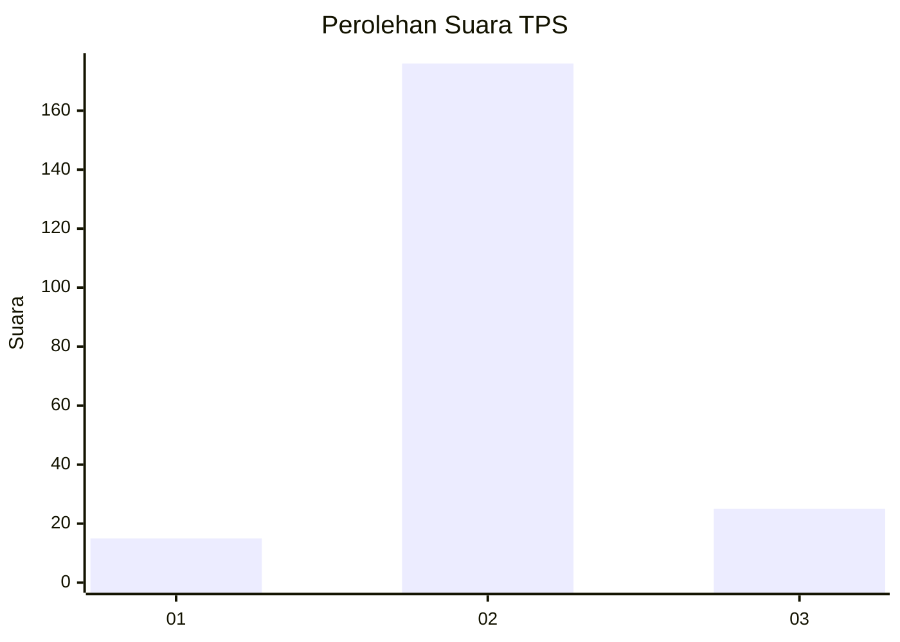
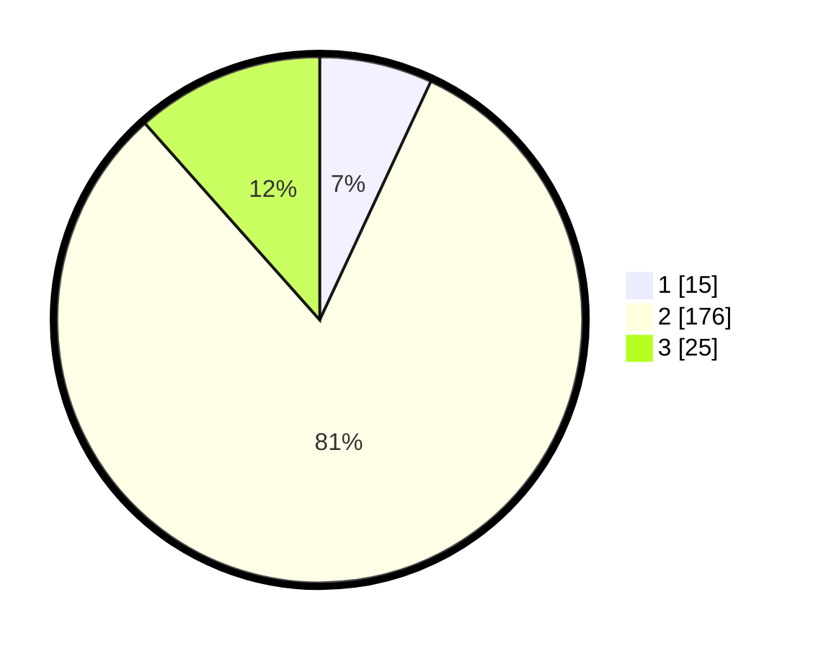

# Hasil

## Grafik

## Tabel

| No. | Nama Paslon    | Suara | Suara (raw) | Persentase |
|:--- |:-------------- | -----:| -----------:| ----------:|
| 1   | ANIES MUHAIMIN | 15    | [15][p-1]   | 6,94       |
| 2   | PRABOWO GIBRAN | 176   | [176][p-2]  | 81,48      |
| 3   | GANJAR MAHFUD  | 25    | [25][p-3]   | 11,57      |

[p-1]: https://github.com/gigit-pemilu/pemilu-2024-14-riau/blob/main/pilpres/hitung-suara/sub/14-riau/sub/07--rokan-hilir/sub/16-tanjung-medan/sub/2001-tanjung-medan/sub/013-tps/sub/paslon-1.txt
[p-2]: https://github.com/gigit-pemilu/pemilu-2024-14-riau/blob/main/pilpres/hitung-suara/sub/14-riau/sub/07--rokan-hilir/sub/16-tanjung-medan/sub/2001-tanjung-medan/sub/013-tps/sub/paslon-2.txt
[p-3]: https://github.com/gigit-pemilu/pemilu-2024-14-riau/blob/main/pilpres/hitung-suara/sub/14-riau/sub/07--rokan-hilir/sub/16-tanjung-medan/sub/2001-tanjung-medan/sub/013-tps/sub/paslon-3.txt

## Foto C Plano

https://sirekap-obj-formc.kpu.go.id/2da9/pemilu/ppwp/14/07/16/20/01/1407162001013-20240215-034555--b9000dba-4872-4cf3-9d51-ab37320dd27a.jpg

https://sirekap-obj-formc.kpu.go.id/2da9/pemilu/ppwp/14/07/16/20/01/1407162001013-20240215-035124--2b4ae00d-0695-4245-9636-e1495d90813b.jpg

https://sirekap-obj-formc.kpu.go.id/2da9/pemilu/ppwp/14/07/16/20/01/1407162001013-20240215-034907--22024a6e-0ae5-4a2e-92b7-81b870b2cd80.jpg

## Metadata

| Key        | Value               |
| ---------- | ------------------- |
| Time Stamp | 2024-02-16 12:51:22 |

