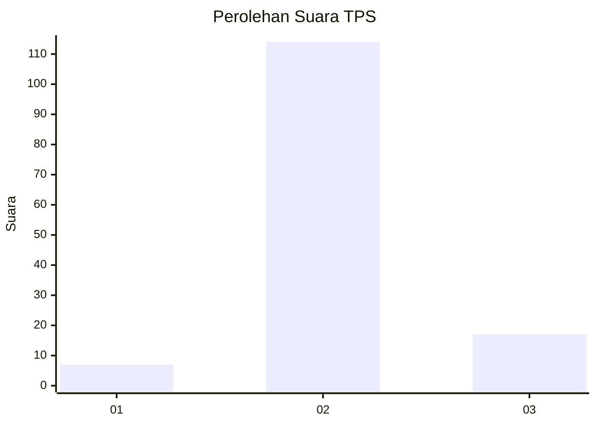
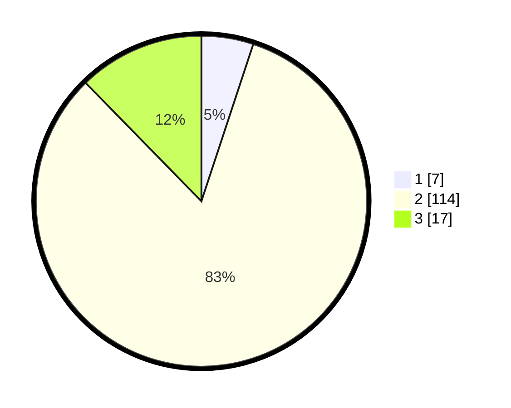

# Hasil

## Grafik

## Tabel

| No. | Nama Paslon    | Suara | Suara (raw) | Persentase |
|:--- |:-------------- | -----:| -----------:| ----------:|
| 1   | ANIES MUHAIMIN | 7     | [7][p-1]    | 5,07       |
| 2   | PRABOWO GIBRAN | 114   | [114][p-2]  | 82,61      |
| 3   | GANJAR MAHFUD  | 17    | [17][p-3]   | 12,32      |

[p-1]: https://github.com/gigit-pemilu/pemilu-2024-14-riau/blob/main/pilpres/hitung-suara/sub/14-riau/sub/07--rokan-hilir/sub/16-tanjung-medan/sub/2003-tanjung-medan-barat/sub/004-tps/sub/paslon-1.txt
[p-2]: https://github.com/gigit-pemilu/pemilu-2024-14-riau/blob/main/pilpres/hitung-suara/sub/14-riau/sub/07--rokan-hilir/sub/16-tanjung-medan/sub/2003-tanjung-medan-barat/sub/004-tps/sub/paslon-2.txt
[p-3]: https://github.com/gigit-pemilu/pemilu-2024-14-riau/blob/main/pilpres/hitung-suara/sub/14-riau/sub/07--rokan-hilir/sub/16-tanjung-medan/sub/2003-tanjung-medan-barat/sub/004-tps/sub/paslon-3.txt

## Foto C Plano

https://sirekap-obj-formc.kpu.go.id/e254/pemilu/ppwp/14/07/16/20/03/1407162003004-20240214-155732--da82e219-293f-4670-aaad-551df41526f3.jpg

https://sirekap-obj-formc.kpu.go.id/e254/pemilu/ppwp/14/07/16/20/03/1407162003004-20240214-141016--c4a432a6-1d2d-4481-9fd4-7a017ce7e43a.jpg

https://sirekap-obj-formc.kpu.go.id/e254/pemilu/ppwp/14/07/16/20/03/1407162003004-20240214-141425--ccd00550-2bdd-4a5c-97db-1f1a963ecc8e.jpg

## Metadata

| Key        | Value               |
| ---------- | ------------------- |
| Time Stamp | 2024-02-16 12:51:22 |

