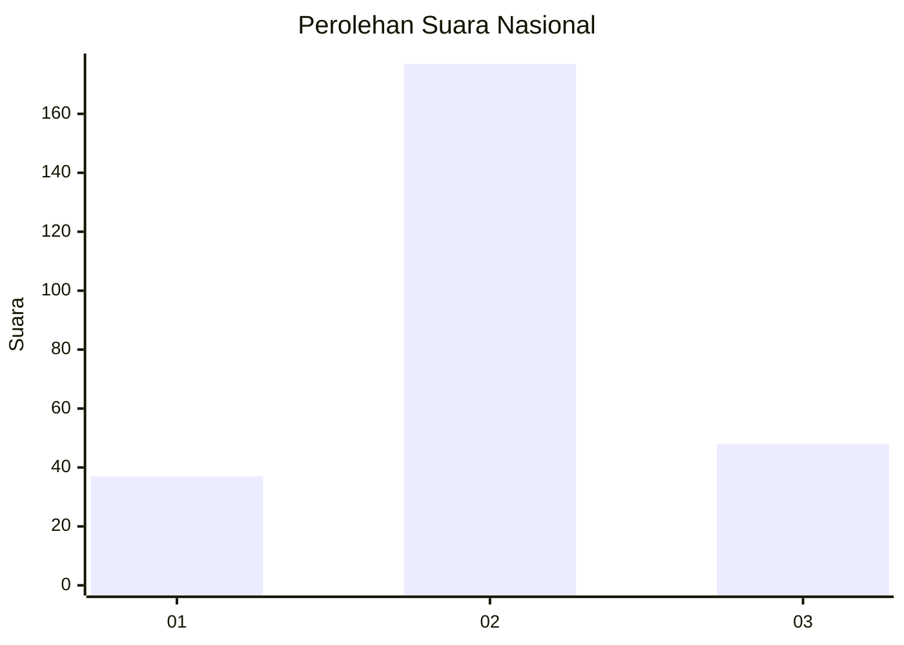
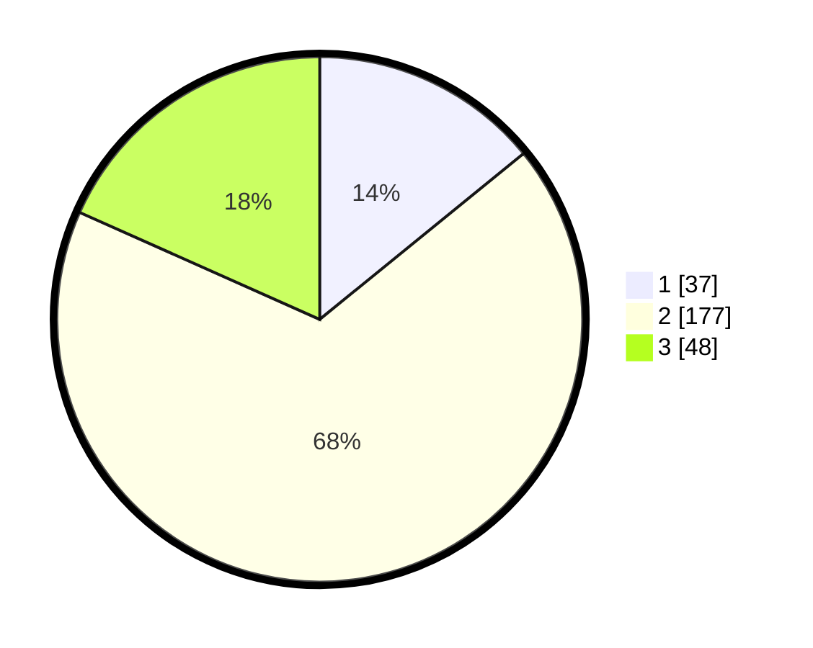

# Hasil

## Grafik

## Tabel

| No. | Nama Paslon    | Suara | Suara (raw) | Persentase |
|:--- |:-------------- | -----:| -----------:| ----------:|
| 1   | ANIES MUHAIMIN | 37    | [37][p-1]   | 14,12      |
| 2   | PRABOWO GIBRAN | 177   | [177][p-2]  | 67,56      |
| 3   | GANJAR MAHFUD  | 48    | [48][p-3]   | 18,32      |

[p-1]: https://github.com/gigit-pemilu/pemilu-2024/blob/main/pilpres/hitung-suara/sub/14-riau/sub/07--rokan-hilir/sub/16-tanjung-medan/sub/2003-tanjung-medan-barat/sub/009-tps/sub/paslon-1.txt
[p-2]: https://github.com/gigit-pemilu/pemilu-2024/blob/main/pilpres/hitung-suara/sub/14-riau/sub/07--rokan-hilir/sub/16-tanjung-medan/sub/2003-tanjung-medan-barat/sub/009-tps/sub/paslon-2.txt
[p-3]: https://github.com/gigit-pemilu/pemilu-2024/blob/main/pilpres/hitung-suara/sub/14-riau/sub/07--rokan-hilir/sub/16-tanjung-medan/sub/2003-tanjung-medan-barat/sub/009-tps/sub/paslon-3.txt

## Foto C Plano

https://sirekap-obj-formc.kpu.go.id/a909/pemilu/ppwp/14/07/16/20/03/1407162003009-20240215-092123--8560958a-39f5-4873-88af-e30b42a6575b.jpg

https://sirekap-obj-formc.kpu.go.id/a909/pemilu/ppwp/14/07/16/20/03/1407162003009-20240215-092129--4128bf38-3b93-4d3b-bcf4-7fe4619d14c7.jpg

https://sirekap-obj-formc.kpu.go.id/a909/pemilu/ppwp/14/07/16/20/03/1407162003009-20240215-092134--f521e4aa-a985-4bd0-9fca-0238ba51b657.jpg

## Metadata

| Key        | Value               |
| ---------- | ------------------- |
| Time Stamp | 2024-02-15 22:40:13 |

## DATA PEMILIH TETAP

Jumlah pemilih dalam DPT: **284**.
 * L: **253**.
 * P: **633**.

## DATA PENGGUNA HAK PILIH

Jumlah pengguna hak pilih dalam DPT: **256**.
 * L: **232**.
 * P: **824**.

Jumlah pengguna hak pilih dalam DPTb: **655**.
 * L: **0**.
 * P: **0**.

Jumlah pengguna hak pilih dalam DPK: **652**.
 * L: **3**.
 * P: **86**.

Jumlah pengguna hak pilih: **652**.
 * L: **135**.
 * P: **234**.

## JUMLAH SUARA SAH DAN TIDAK SAH

JUMLAH SELURUH SUARA SAH: **262**.

JUMLAH SUARA TIDAK SAH: **3**.

JUMLAH SELURUH SUARA SAH DAN SUARA TIDAK SAH: **265**.

