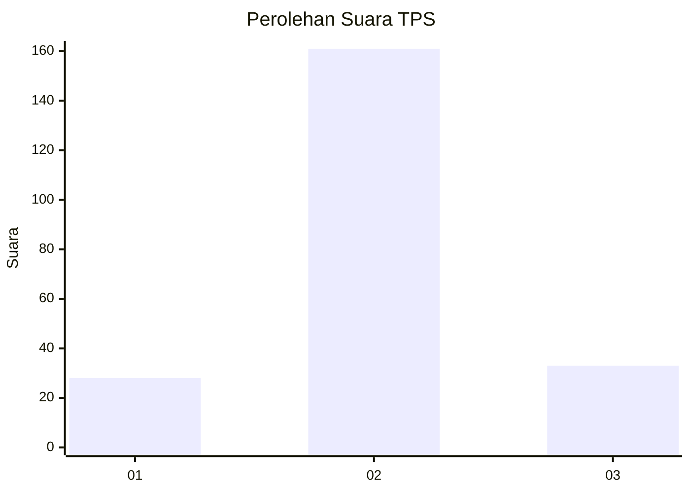
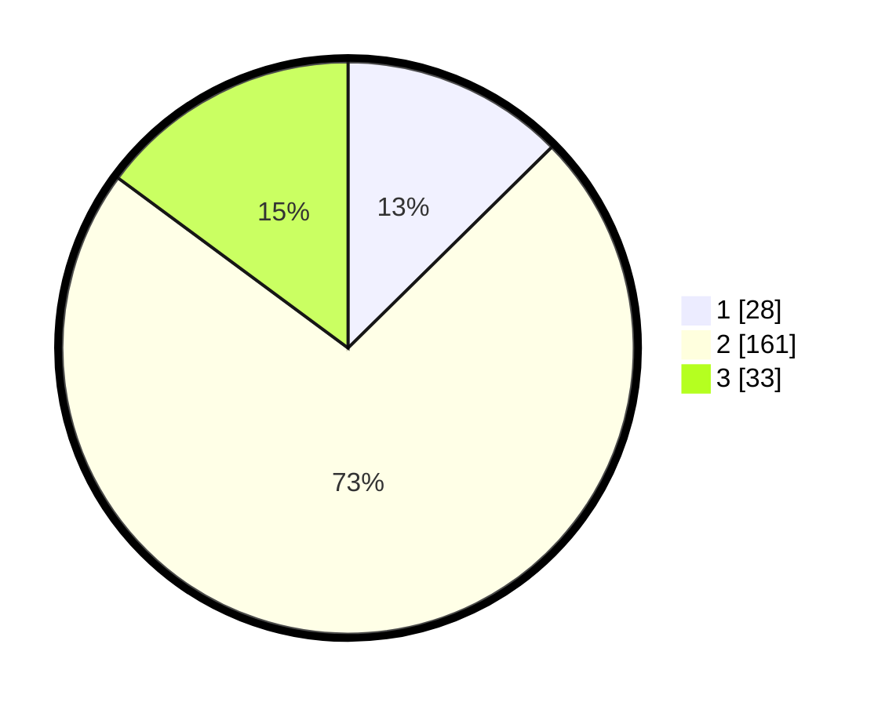

# Hasil

## Grafik

## Tabel

| No. | Nama Paslon    | Suara | Suara (raw) | Persentase |
|:--- |:-------------- | -----:| -----------:| ----------:|
| 1   | ANIES MUHAIMIN | 28    | [28][p-1]   | 12,61      |
| 2   | PRABOWO GIBRAN | 161   | [161][p-2]  | 72,52      |
| 3   | GANJAR MAHFUD  | 33    | [33][p-3]   | 14,86      |

[p-1]: https://github.com/gigit-pemilu/pemilu-2024-14-riau/blob/main/pilpres/hitung-suara/sub/14-riau/sub/07--rokan-hilir/sub/16-tanjung-medan/sub/2005-sei-meranti-darussalam/sub/007-tps/sub/paslon-1.txt
[p-2]: https://github.com/gigit-pemilu/pemilu-2024-14-riau/blob/main/pilpres/hitung-suara/sub/14-riau/sub/07--rokan-hilir/sub/16-tanjung-medan/sub/2005-sei-meranti-darussalam/sub/007-tps/sub/paslon-2.txt
[p-3]: https://github.com/gigit-pemilu/pemilu-2024-14-riau/blob/main/pilpres/hitung-suara/sub/14-riau/sub/07--rokan-hilir/sub/16-tanjung-medan/sub/2005-sei-meranti-darussalam/sub/007-tps/sub/paslon-3.txt

## Foto C Plano

https://sirekap-obj-formc.kpu.go.id/fb0a/pemilu/ppwp/14/07/16/20/05/1407162005007-20240215-074649--c08fcec2-a84a-4d8b-9f1a-54f0604caa70.jpg

https://sirekap-obj-formc.kpu.go.id/fb0a/pemilu/ppwp/14/07/16/20/05/1407162005007-20240215-075057--35d41b20-814a-4556-887f-4b9907c9cd62.jpg

https://sirekap-obj-formc.kpu.go.id/fb0a/pemilu/ppwp/14/07/16/20/05/1407162005007-20240215-075314--250cf380-5e31-4de8-9a2f-e21b956f9214.jpg

## Metadata

| Key        | Value               |
| ---------- | ------------------- |
| Time Stamp | 2024-02-16 12:51:22 |

