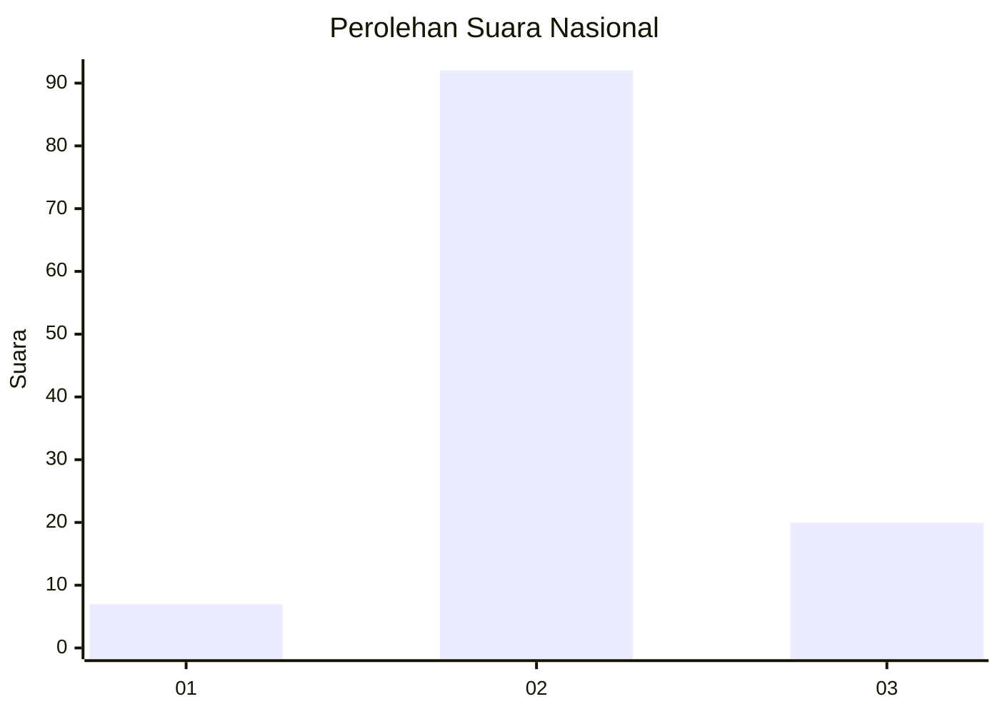
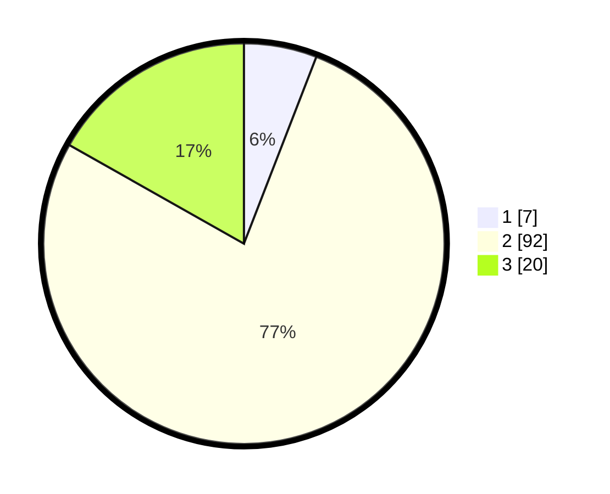

# Hasil

## Grafik

## Tabel

| No. | Nama Paslon    | Suara | Suara (raw) | Persentase |
|:--- |:-------------- | -----:| -----------:| ----------:|
| 1   | ANIES MUHAIMIN | 7     | [7][p-1]    | 5,88       |
| 2   | PRABOWO GIBRAN | 92    | [92][p-2]   | 77,31      |
| 3   | GANJAR MAHFUD  | 20    | [20][p-3]   | 16,81      |

[p-1]: https://github.com/gigit-pemilu/pemilu-2024/blob/main/pilpres/hitung-suara/sub/14-riau/sub/07--rokan-hilir/sub/16-tanjung-medan/sub/2005-sei-meranti-darussalam/sub/009-tps/sub/paslon-1.txt
[p-2]: https://github.com/gigit-pemilu/pemilu-2024/blob/main/pilpres/hitung-suara/sub/14-riau/sub/07--rokan-hilir/sub/16-tanjung-medan/sub/2005-sei-meranti-darussalam/sub/009-tps/sub/paslon-2.txt
[p-3]: https://github.com/gigit-pemilu/pemilu-2024/blob/main/pilpres/hitung-suara/sub/14-riau/sub/07--rokan-hilir/sub/16-tanjung-medan/sub/2005-sei-meranti-darussalam/sub/009-tps/sub/paslon-3.txt

## Foto C Plano

https://sirekap-obj-formc.kpu.go.id/9053/pemilu/ppwp/14/07/16/20/05/1407162005009-20240215-115224--8dfe8dad-c0aa-4c2a-9e8d-935e63de8580.jpg

https://sirekap-obj-formc.kpu.go.id/9053/pemilu/ppwp/14/07/16/20/05/1407162005009-20240215-115403--6c875323-a2f1-42c5-9d6b-5d93f78f8a69.jpg

https://sirekap-obj-formc.kpu.go.id/9053/pemilu/ppwp/14/07/16/20/05/1407162005009-20240215-115705--5997ebae-f8e3-414b-b5b8-7ecaabbd7788.jpg

## Metadata

| Key        | Value               |
| ---------- | ------------------- |
| Time Stamp | 2024-02-16 12:51:22 |

