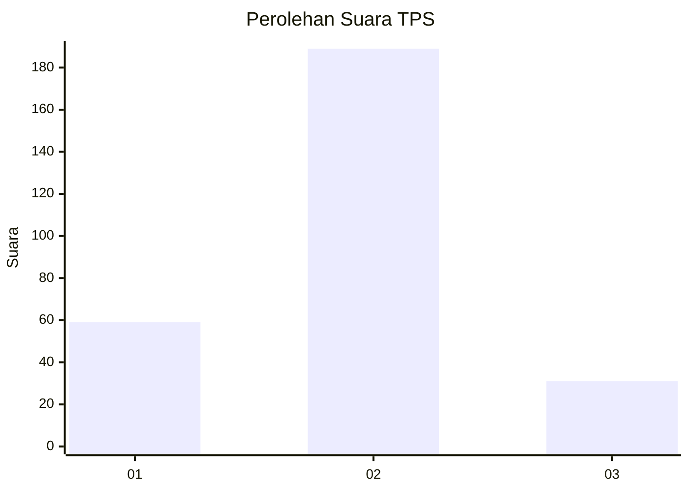
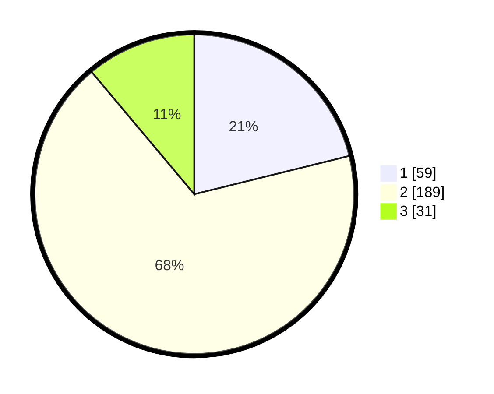

# Hasil

## Grafik

## Tabel

| No. | Nama Paslon    | Suara | Suara (raw) | Persentase |
|:--- |:-------------- | -----:| -----------:| ----------:|
| 1   | ANIES MUHAIMIN | 59    | [59][p-1]   | 21,15      |
| 2   | PRABOWO GIBRAN | 189   | [189][p-2]  | 67,74      |
| 3   | GANJAR MAHFUD  | 31    | [31][p-3]   | 11,11      |

[p-1]: https://github.com/gigit-pemilu/pemilu-2024-14-riau/blob/main/pilpres/hitung-suara/sub/14-riau/sub/07--rokan-hilir/sub/17-bagan-sinembah-raya/sub/1001-bagan-sinembah-kota/sub/004-tps/sub/paslon-1.txt
[p-2]: https://github.com/gigit-pemilu/pemilu-2024-14-riau/blob/main/pilpres/hitung-suara/sub/14-riau/sub/07--rokan-hilir/sub/17-bagan-sinembah-raya/sub/1001-bagan-sinembah-kota/sub/004-tps/sub/paslon-2.txt
[p-3]: https://github.com/gigit-pemilu/pemilu-2024-14-riau/blob/main/pilpres/hitung-suara/sub/14-riau/sub/07--rokan-hilir/sub/17-bagan-sinembah-raya/sub/1001-bagan-sinembah-kota/sub/004-tps/sub/paslon-3.txt

## Foto C Plano

https://sirekap-obj-formc.kpu.go.id/8f3e/pemilu/ppwp/14/07/17/10/01/1407171001004-20240218-165019--485b4224-3803-4928-aa5a-413e1872d188.jpg

https://sirekap-obj-formc.kpu.go.id/8f3e/pemilu/ppwp/14/07/17/10/01/1407171001004-20240219-104311--4eb8e051-84cd-4149-b293-63c089f234f5.jpg

https://sirekap-obj-formc.kpu.go.id/8f3e/pemilu/ppwp/14/07/17/10/01/1407171001004-20240219-104310--18d1e78b-c621-4b22-970e-d612faf5d6f0.jpg

## Metadata

| Key        | Value               |
| ---------- | ------------------- |
| Time Stamp | 2024-02-19 11:00:00 |

## DATA PEMILIH TETAP

Jumlah pemilih dalam DPT: **288**.
 * L: **148**.
 * P: **140**.

## DATA PENGGUNA HAK PILIH

Jumlah pengguna hak pilih dalam DPT: **263**.
 * L: **135**.
 * P: **128**.

Jumlah pengguna hak pilih dalam DPTb: **42**.
 * L: **802**.
 * P: **870**.

Jumlah pengguna hak pilih dalam DPK: **15**.
 * L: **8**.
 * P: **7**.

Jumlah pengguna hak pilih: **289**.
 * L: **145**.
 * P: **135**.

## JUMLAH SUARA SAH DAN TIDAK SAH

JUMLAH SELURUH SUARA SAH: **279**.

JUMLAH SUARA TIDAK SAH: **1**.

JUMLAH SELURUH SUARA SAH DAN SUARA TIDAK SAH: **280**.

