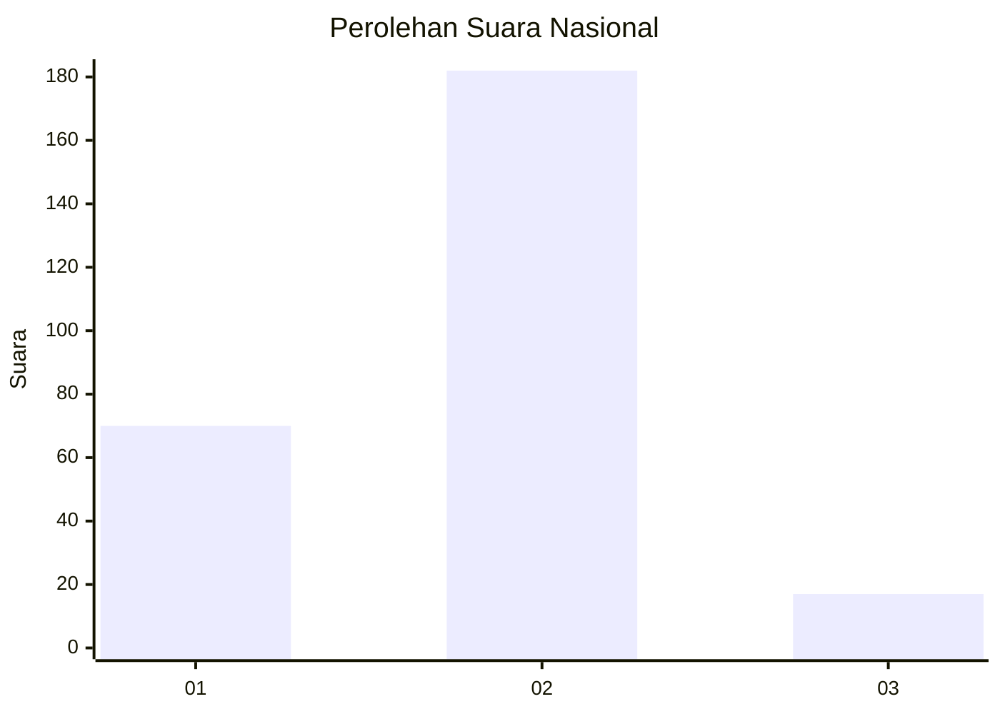
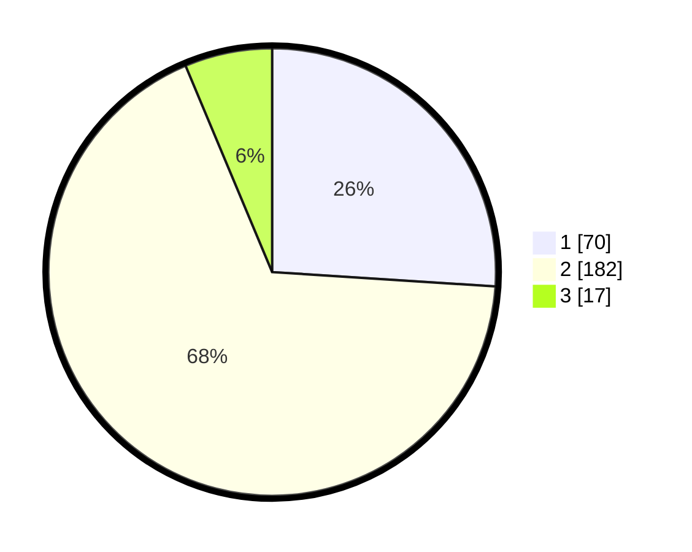

# Hasil

## Grafik

## Tabel

| No. | Nama Paslon    | Suara | Suara (raw) | Persentase |
|:--- |:-------------- | -----:| -----------:| ----------:|
| 1   | ANIES MUHAIMIN | 70    | [70][p-1]   | 26,02      |
| 2   | PRABOWO GIBRAN | 182   | [182][p-2]  | 67,66      |
| 3   | GANJAR MAHFUD  | 17    | [17][p-3]   | 6,32       |

[p-1]: https://github.com/gigit-pemilu/pemilu-2024/blob/main/pilpres/hitung-suara/sub/14-riau/sub/07--rokan-hilir/sub/17-bagan-sinembah-raya/sub/2003-harapan-makmur-selatan/sub/002-tps/sub/paslon-1.txt
[p-2]: https://github.com/gigit-pemilu/pemilu-2024/blob/main/pilpres/hitung-suara/sub/14-riau/sub/07--rokan-hilir/sub/17-bagan-sinembah-raya/sub/2003-harapan-makmur-selatan/sub/002-tps/sub/paslon-2.txt
[p-3]: https://github.com/gigit-pemilu/pemilu-2024/blob/main/pilpres/hitung-suara/sub/14-riau/sub/07--rokan-hilir/sub/17-bagan-sinembah-raya/sub/2003-harapan-makmur-selatan/sub/002-tps/sub/paslon-3.txt

## Foto C Plano

https://sirekap-obj-formc.kpu.go.id/9582/pemilu/ppwp/14/07/17/20/03/1407172003002-20240215-031148--e983b12c-da1b-42e7-8c41-809d8ea60ed6.jpg

https://sirekap-obj-formc.kpu.go.id/9582/pemilu/ppwp/14/07/17/20/03/1407172003002-20240215-031509--cb7febfb-0069-4a4d-91f4-22c00ca3981f.jpg

https://sirekap-obj-formc.kpu.go.id/9582/pemilu/ppwp/14/07/17/20/03/1407172003002-20240215-031443--b0b1fce5-6953-4dc4-9d35-06572f01c339.jpg

## Metadata

| Key        | Value               |
| ---------- | ------------------- |
| Time Stamp | 2024-02-16 12:51:22 |

