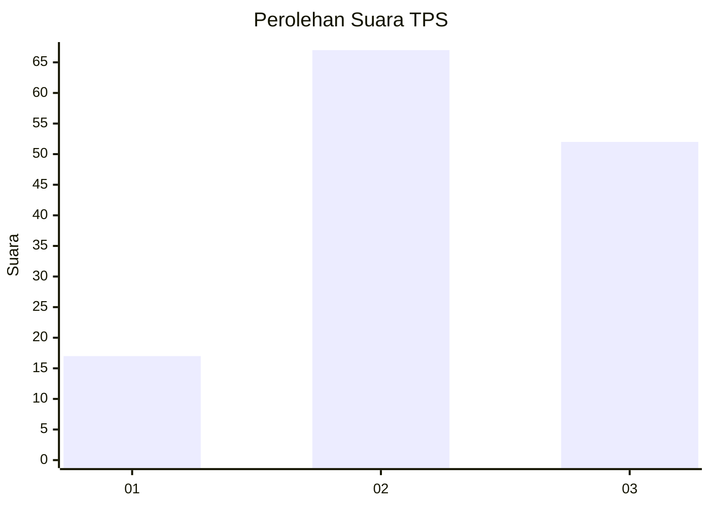
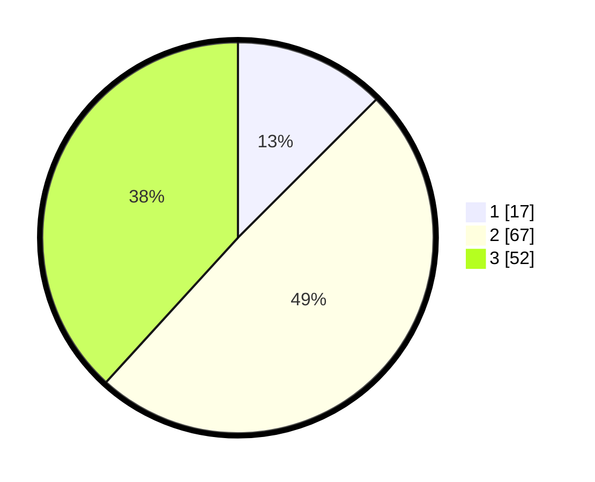

# Hasil

## Grafik

## Tabel

| No. | Nama Paslon    | Suara | Suara (raw) | Persentase |
|:--- |:-------------- | -----:| -----------:| ----------:|
| 1   | ANIES MUHAIMIN | 17    | [17][p-1]   | 12,50      |
| 2   | PRABOWO GIBRAN | 67    | [67][p-2]   | 49,26      |
| 3   | GANJAR MAHFUD  | 52    | [52][p-3]   | 38,24      |

[p-1]: https://github.com/gigit-pemilu/pemilu-2024-14-riau/blob/main/pilpres/hitung-suara/sub/14-riau/sub/08-siak/sub/01-siak/sub/1001-kampung-dalam/sub/003-tps/sub/paslon-1.txt
[p-2]: https://github.com/gigit-pemilu/pemilu-2024-14-riau/blob/main/pilpres/hitung-suara/sub/14-riau/sub/08-siak/sub/01-siak/sub/1001-kampung-dalam/sub/003-tps/sub/paslon-2.txt
[p-3]: https://github.com/gigit-pemilu/pemilu-2024-14-riau/blob/main/pilpres/hitung-suara/sub/14-riau/sub/08-siak/sub/01-siak/sub/1001-kampung-dalam/sub/003-tps/sub/paslon-3.txt

## Foto C Plano

https://sirekap-obj-formc.kpu.go.id/fb86/pemilu/ppwp/14/08/01/10/01/1408011001003-20240227-004632--7769e9f9-5d4f-4933-965a-e88494455048.jpg

https://sirekap-obj-formc.kpu.go.id/fb86/pemilu/ppwp/14/08/01/10/01/1408011001003-20240226-233044--c3a872d8-bfd2-4151-9ab8-f7b0627259af.jpg

https://sirekap-obj-formc.kpu.go.id/fb86/pemilu/ppwp/14/08/01/10/01/1408011001003-20240227-004947--1b76d316-c237-4edd-b725-78783c4b73a4.jpg

## Metadata

| Key        | Value               |
| ---------- | ------------------- |
| Time Stamp | 2024-02-28 19:00:00 |

