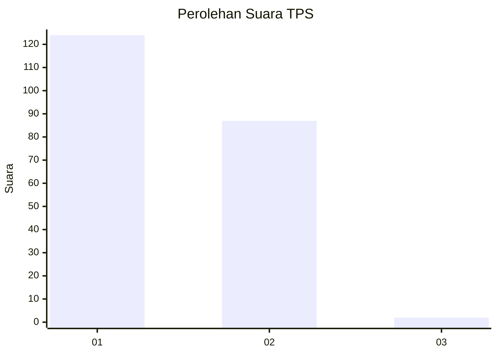
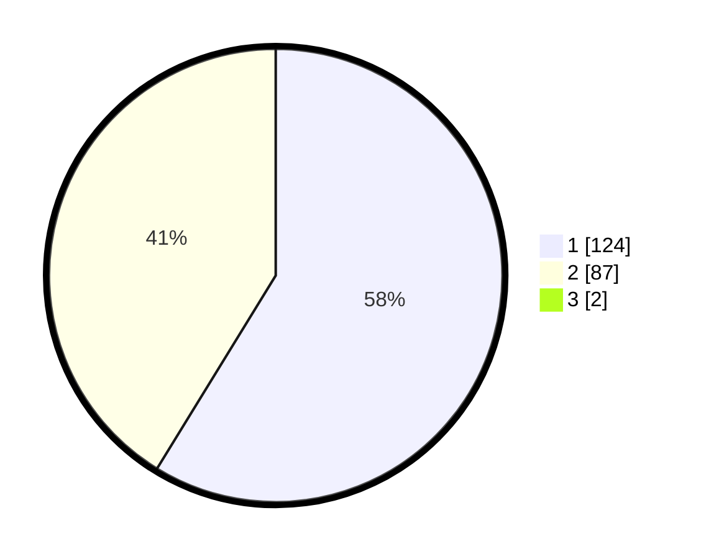

# Hasil

## Grafik

## Tabel

| No. | Nama Paslon    | Suara | Suara (raw) | Persentase |
|:--- |:-------------- | -----:| -----------:| ----------:|
| 1   | ANIES MUHAIMIN | 124   | [124][p-1]  | 58,22      |
| 2   | PRABOWO GIBRAN | 87    | [87][p-2]   | 40,85      |
| 3   | GANJAR MAHFUD  | 2     | [2][p-3]    | 0,94       |

[p-1]: https://github.com/gigit-pemilu/pemilu-2024-14-riau/blob/main/pilpres/hitung-suara/sub/14-riau/sub/08-siak/sub/01-siak/sub/1001-kampung-dalam/sub/005-tps/sub/paslon-1.txt
[p-2]: https://github.com/gigit-pemilu/pemilu-2024-14-riau/blob/main/pilpres/hitung-suara/sub/14-riau/sub/08-siak/sub/01-siak/sub/1001-kampung-dalam/sub/005-tps/sub/paslon-2.txt
[p-3]: https://github.com/gigit-pemilu/pemilu-2024-14-riau/blob/main/pilpres/hitung-suara/sub/14-riau/sub/08-siak/sub/01-siak/sub/1001-kampung-dalam/sub/005-tps/sub/paslon-3.txt

## Foto C Plano

https://sirekap-obj-formc.kpu.go.id/a30c/pemilu/ppwp/14/08/01/10/01/1408011001005-20240227-005358--4a2d5ce3-0cf9-4698-9457-4420f0b79adb.jpg

https://sirekap-obj-formc.kpu.go.id/a30c/pemilu/ppwp/14/08/01/10/01/1408011001005-20240217-080820--6cd917f7-63e1-4359-97e8-d53d73760fb9.jpg

https://sirekap-obj-formc.kpu.go.id/a30c/pemilu/ppwp/14/08/01/10/01/1408011001005-20240215-045634--0b6e9633-855c-4160-9935-c8fe69c843a4.jpg

## Metadata

| Key        | Value               |
| ---------- | ------------------- |
| Time Stamp | 2024-02-27 01:00:00 |

