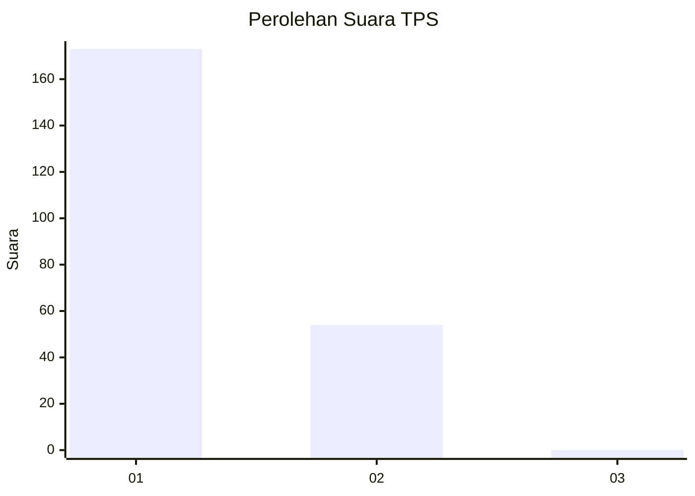
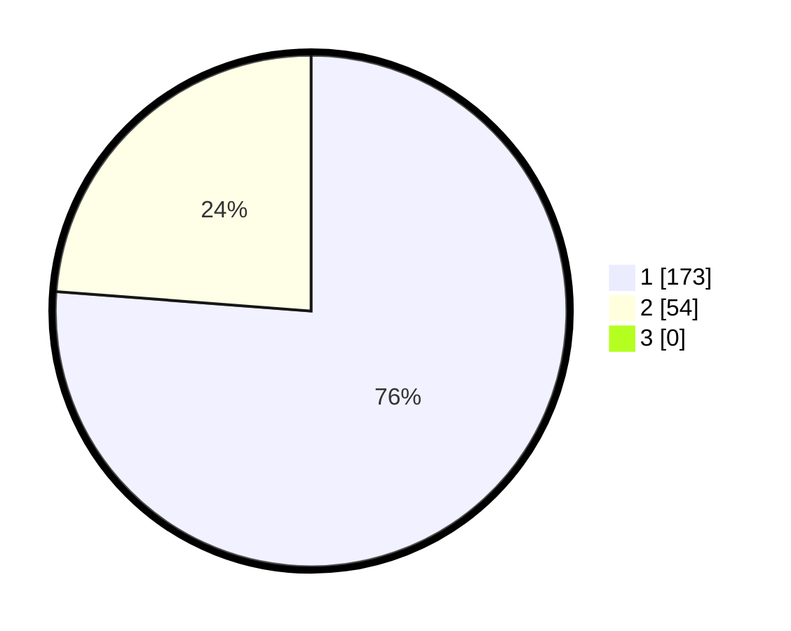

# Hasil

## Grafik

## Tabel

| No. | Nama Paslon    | Suara | Suara (raw) | Persentase |
|:--- |:-------------- | -----:| -----------:| ----------:|
| 1   | ANIES MUHAIMIN | 173   | [173][p-1]  | 76,21      |
| 2   | PRABOWO GIBRAN | 54    | [54][p-2]   | 23,79      |
| 3   | GANJAR MAHFUD  | 0     | [0][p-3]    | 0,00       |

[p-1]: https://github.com/gigit-pemilu/pemilu-2024-14-riau/blob/main/pilpres/hitung-suara/sub/14-riau/sub/08-siak/sub/01-siak/sub/1001-kampung-dalam/sub/019-tps/sub/paslon-1.txt
[p-2]: https://github.com/gigit-pemilu/pemilu-2024-14-riau/blob/main/pilpres/hitung-suara/sub/14-riau/sub/08-siak/sub/01-siak/sub/1001-kampung-dalam/sub/019-tps/sub/paslon-2.txt
[p-3]: https://github.com/gigit-pemilu/pemilu-2024-14-riau/blob/main/pilpres/hitung-suara/sub/14-riau/sub/08-siak/sub/01-siak/sub/1001-kampung-dalam/sub/019-tps/sub/paslon-3.txt

## Foto C Plano

https://sirekap-obj-formc.kpu.go.id/c9ca/pemilu/ppwp/14/08/01/10/01/1408011001019-20240214-224214--9f4127ad-c8b5-4dde-abbf-b74ea039e125.jpg

https://sirekap-obj-formc.kpu.go.id/c9ca/pemilu/ppwp/14/08/01/10/01/1408011001019-20240214-224329--1a45229b-fd13-4e48-a92d-69e201776724.jpg

https://sirekap-obj-formc.kpu.go.id/c9ca/pemilu/ppwp/14/08/01/10/01/1408011001019-20240214-224440--b7f941e7-ef62-4096-9994-87ef9981ced0.jpg

## Metadata

| Key        | Value               |
| ---------- | ------------------- |
| Time Stamp | 2024-02-15 16:30:25 |

