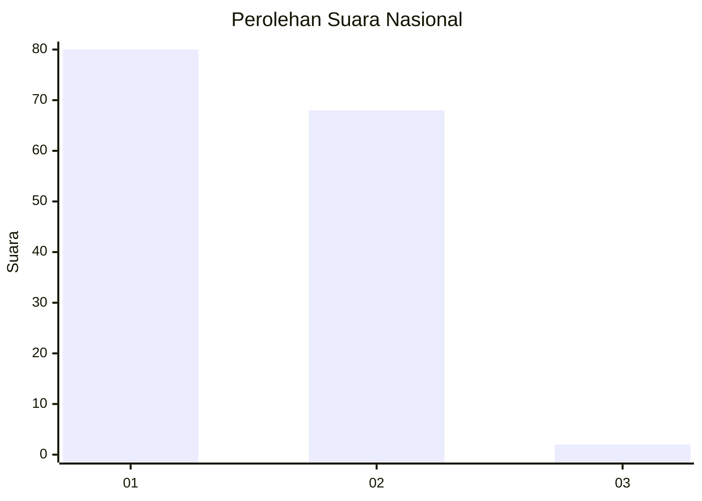
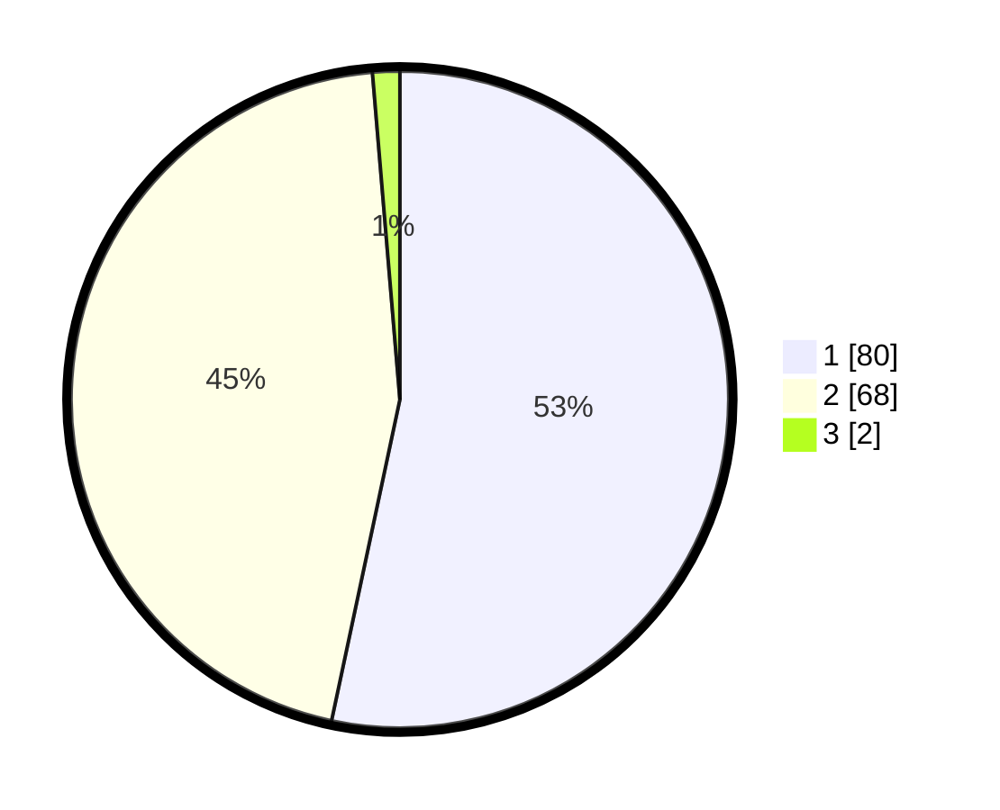

# Hasil

## Grafik

## Tabel

| No. | Nama Paslon    | Suara | Suara (raw) | Persentase |
|:--- |:-------------- | -----:| -----------:| ----------:|
| 1   | ANIES MUHAIMIN | 80    | [80][p-1]   | 53,33      |
| 2   | PRABOWO GIBRAN | 68    | [68][p-2]   | 45,33      |
| 3   | GANJAR MAHFUD  | 2     | [2][p-3]    | 1,33       |

[p-1]: https://github.com/gigit-pemilu/pemilu-2024/blob/main/pilpres/hitung-suara/sub/14-riau/sub/08-siak/sub/01-siak/sub/1002-kampung-rempak/sub/009-tps/sub/paslon-1.txt
[p-2]: https://github.com/gigit-pemilu/pemilu-2024/blob/main/pilpres/hitung-suara/sub/14-riau/sub/08-siak/sub/01-siak/sub/1002-kampung-rempak/sub/009-tps/sub/paslon-2.txt
[p-3]: https://github.com/gigit-pemilu/pemilu-2024/blob/main/pilpres/hitung-suara/sub/14-riau/sub/08-siak/sub/01-siak/sub/1002-kampung-rempak/sub/009-tps/sub/paslon-3.txt

## Foto C Plano

https://sirekap-obj-formc.kpu.go.id/c3df/pemilu/ppwp/14/08/01/10/02/1408011002009-20240214-155211--2dc36b9e-a52a-4e7b-9974-af4f0361e4f7.jpg

https://sirekap-obj-formc.kpu.go.id/c3df/pemilu/ppwp/14/08/01/10/02/1408011002009-20240214-155227--fac1baea-0cc0-410e-8443-2b281f77d64c.jpg

https://sirekap-obj-formc.kpu.go.id/c3df/pemilu/ppwp/14/08/01/10/02/1408011002009-20240214-155153--777a3ce6-769d-4336-b476-be45bf6204a7.jpg

## Metadata

| Key        | Value               |
| ---------- | ------------------- |
| Time Stamp | 2024-02-15 16:30:25 |

