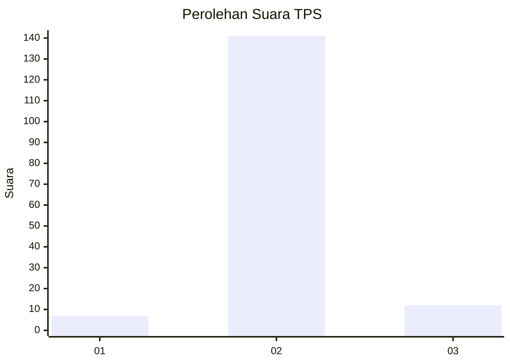
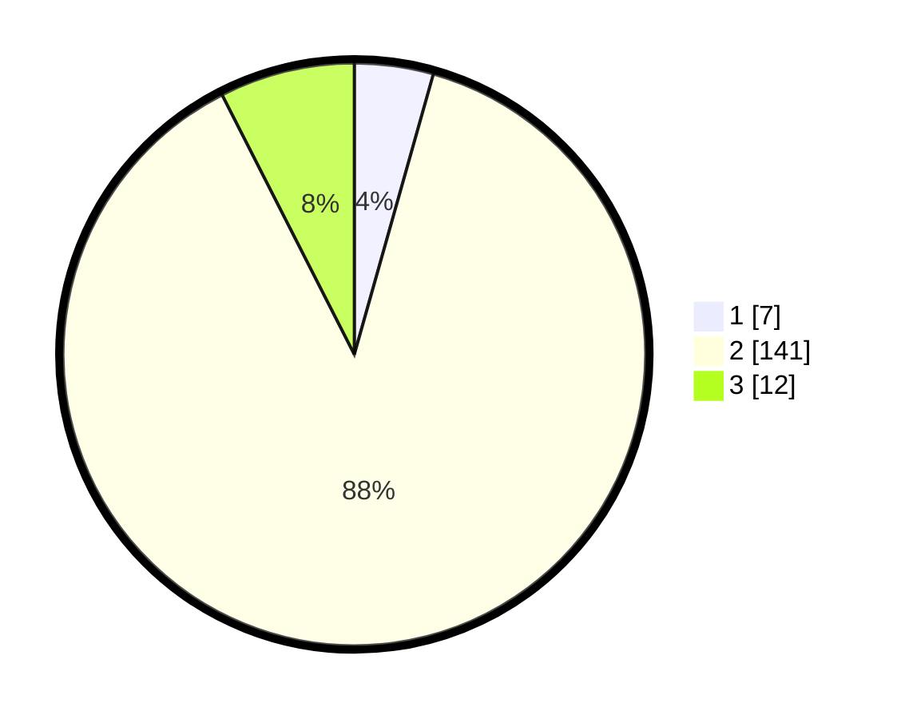

# Hasil

## Grafik

## Tabel

| No. | Nama Paslon    | Suara | Suara (raw) | Persentase |
|:--- |:-------------- | -----:| -----------:| ----------:|
| 1   | ANIES MUHAIMIN | 7     | [7][p-1]    | 4,38       |
| 2   | PRABOWO GIBRAN | 141   | [141][p-2]  | 88,13      |
| 3   | GANJAR MAHFUD  | 12    | [12][p-3]   | 7,50       |

[p-1]: https://github.com/gigit-pemilu/pemilu-2024-14-riau/blob/main/pilpres/hitung-suara/sub/14-riau/sub/08-siak/sub/02-sungai-apit/sub/1001-sungai-apit/sub/001-tps/sub/paslon-1.txt
[p-2]: https://github.com/gigit-pemilu/pemilu-2024-14-riau/blob/main/pilpres/hitung-suara/sub/14-riau/sub/08-siak/sub/02-sungai-apit/sub/1001-sungai-apit/sub/001-tps/sub/paslon-2.txt
[p-3]: https://github.com/gigit-pemilu/pemilu-2024-14-riau/blob/main/pilpres/hitung-suara/sub/14-riau/sub/08-siak/sub/02-sungai-apit/sub/1001-sungai-apit/sub/001-tps/sub/paslon-3.txt

## Foto C Plano

https://sirekap-obj-formc.kpu.go.id/4580/pemilu/ppwp/14/08/02/10/01/1408021001001-20240226-200326--8289663a-1560-457c-8a16-78e32be2adee.jpg

https://sirekap-obj-formc.kpu.go.id/4580/pemilu/ppwp/14/08/02/10/01/1408021001001-20240227-112331--f2c3e669-5150-4b70-9bfa-ecdbe6f4ca52.jpg

https://sirekap-obj-formc.kpu.go.id/4580/pemilu/ppwp/14/08/02/10/01/1408021001001-20240226-144445--1b251716-ab02-44d7-9d6e-ca8d9ae6f241.jpg

## Metadata

| Key        | Value               |
| ---------- | ------------------- |
| Time Stamp | 2024-02-28 19:00:00 |

