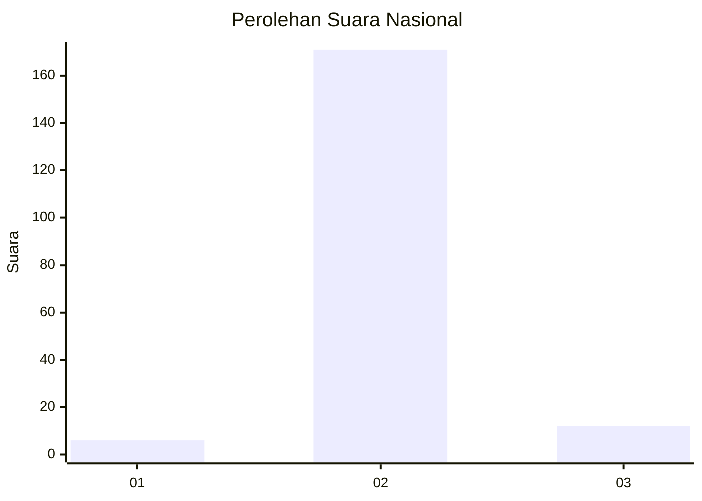
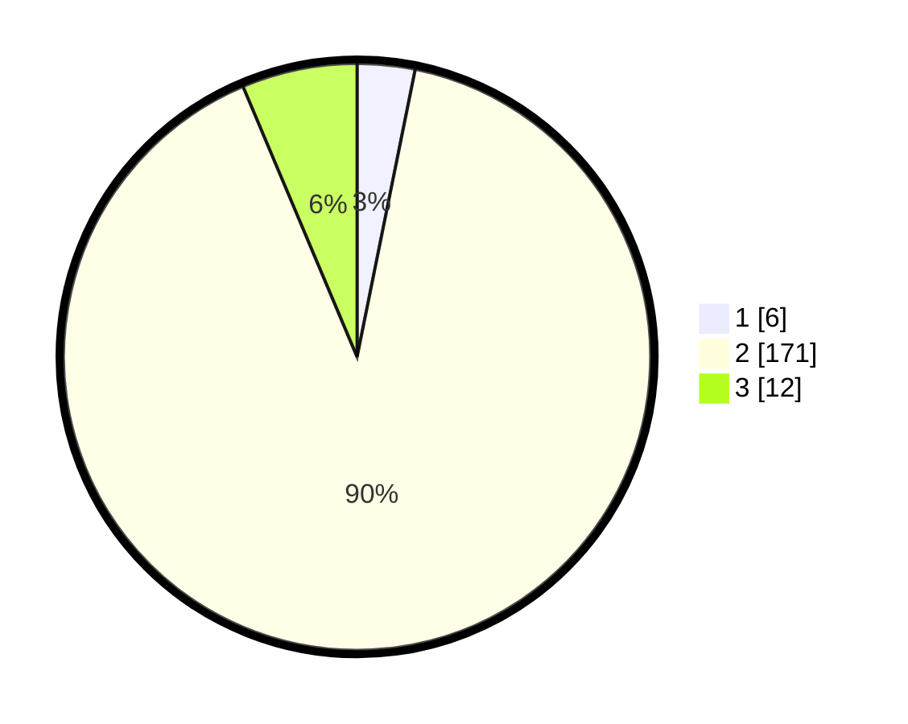

# Hasil

## Grafik

## Tabel

| No. | Nama Paslon    | Suara | Suara (raw) | Persentase |
|:--- |:-------------- | -----:| -----------:| ----------:|
| 1   | ANIES MUHAIMIN | 6     | [6][p-1]    | 3,17       |
| 2   | PRABOWO GIBRAN | 171   | [171][p-2]  | 90,48      |
| 3   | GANJAR MAHFUD  | 12    | [12][p-3]   | 6,35       |

[p-1]: https://github.com/gigit-pemilu/pemilu-2024/blob/main/pilpres/hitung-suara/sub/14-riau/sub/08-siak/sub/02-sungai-apit/sub/1001-sungai-apit/sub/004-tps/sub/paslon-1.txt
[p-2]: https://github.com/gigit-pemilu/pemilu-2024/blob/main/pilpres/hitung-suara/sub/14-riau/sub/08-siak/sub/02-sungai-apit/sub/1001-sungai-apit/sub/004-tps/sub/paslon-2.txt
[p-3]: https://github.com/gigit-pemilu/pemilu-2024/blob/main/pilpres/hitung-suara/sub/14-riau/sub/08-siak/sub/02-sungai-apit/sub/1001-sungai-apit/sub/004-tps/sub/paslon-3.txt

## Foto C Plano

https://sirekap-obj-formc.kpu.go.id/7c72/pemilu/ppwp/14/08/02/10/01/1408021001004-20240226-123624--547a3873-24bb-45cc-b22c-98ca2de06041.jpg

https://sirekap-obj-formc.kpu.go.id/7c72/pemilu/ppwp/14/08/02/10/01/1408021001004-20240227-103440--d62fe08f-7803-4fb5-b057-26df9b474633.jpg

https://sirekap-obj-formc.kpu.go.id/7c72/pemilu/ppwp/14/08/02/10/01/1408021001004-20240227-110005--7e18fb3c-cc05-4b69-84a1-382afd0af0da.jpg

## Metadata

| Key        | Value               |
| ---------- | ------------------- |
| Time Stamp | 2024-02-27 22:00:00 |

