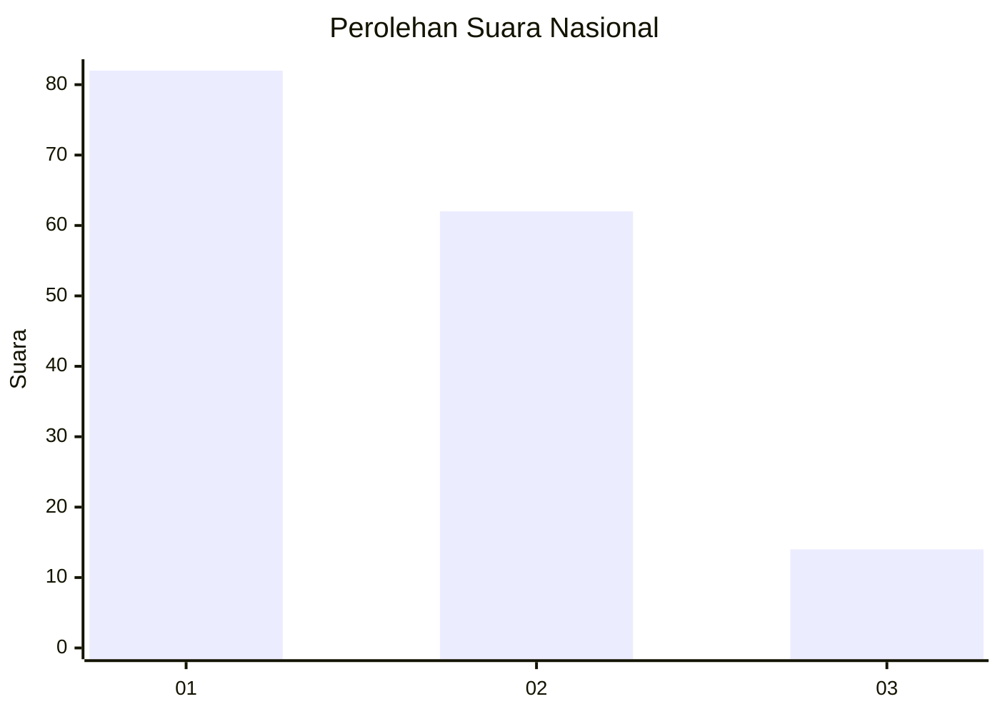
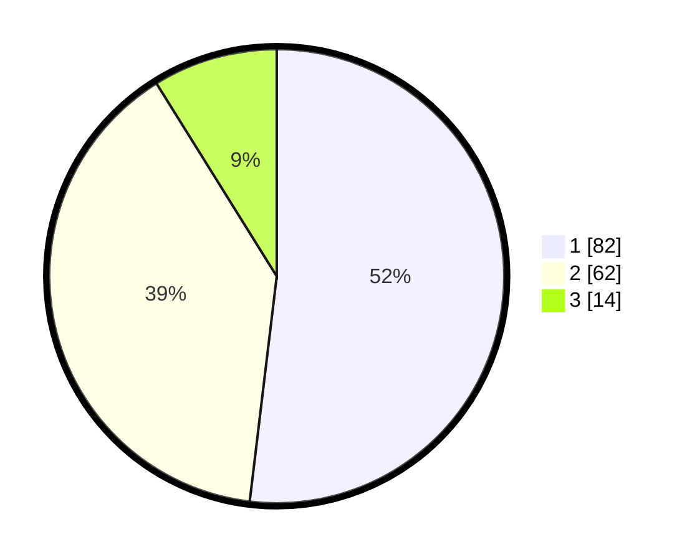

# Hasil

## Grafik

## Tabel

| No. | Nama Paslon    | Suara | Suara (raw) | Persentase |
|:--- |:-------------- | -----:| -----------:| ----------:|
| 1   | ANIES MUHAIMIN | 82    | [82][p-1]   | 51,90      |
| 2   | PRABOWO GIBRAN | 62    | [62][p-2]   | 39,24      |
| 3   | GANJAR MAHFUD  | 14    | [14][p-3]   | 8,86       |

[p-1]: https://github.com/gigit-pemilu/pemilu-2024/blob/main/pilpres/hitung-suara/sub/14-riau/sub/08-siak/sub/02-sungai-apit/sub/2008-sungai-kayu-ara/sub/008-tps/sub/paslon-1.txt
[p-2]: https://github.com/gigit-pemilu/pemilu-2024/blob/main/pilpres/hitung-suara/sub/14-riau/sub/08-siak/sub/02-sungai-apit/sub/2008-sungai-kayu-ara/sub/008-tps/sub/paslon-2.txt
[p-3]: https://github.com/gigit-pemilu/pemilu-2024/blob/main/pilpres/hitung-suara/sub/14-riau/sub/08-siak/sub/02-sungai-apit/sub/2008-sungai-kayu-ara/sub/008-tps/sub/paslon-3.txt

## Foto C Plano

https://sirekap-obj-formc.kpu.go.id/fcc2/pemilu/ppwp/14/08/02/20/08/1408022008008-20240226-145359--bd4c5fea-56fa-480e-b2a7-c4687af4c9c5.jpg

https://sirekap-obj-formc.kpu.go.id/fcc2/pemilu/ppwp/14/08/02/20/08/1408022008008-20240226-144529--38123458-59f1-49b5-b81d-d95181f1269d.jpg

https://sirekap-obj-formc.kpu.go.id/fcc2/pemilu/ppwp/14/08/02/20/08/1408022008008-20240226-144641--1008bb4a-78c5-44f1-bfb5-17d4d23de79b.jpg

## Metadata

| Key        | Value               |
| ---------- | ------------------- |
| Time Stamp | 2024-02-28 19:00:00 |

