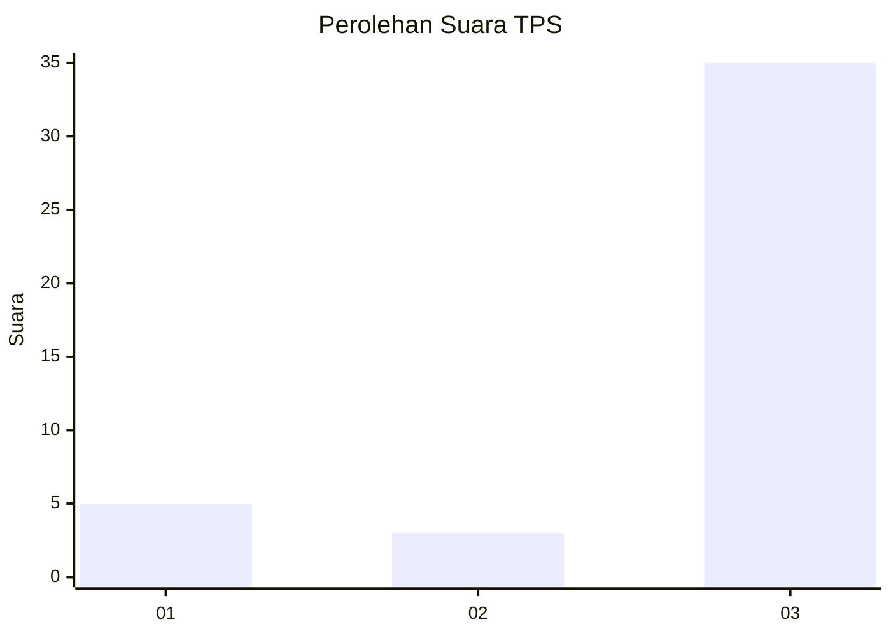
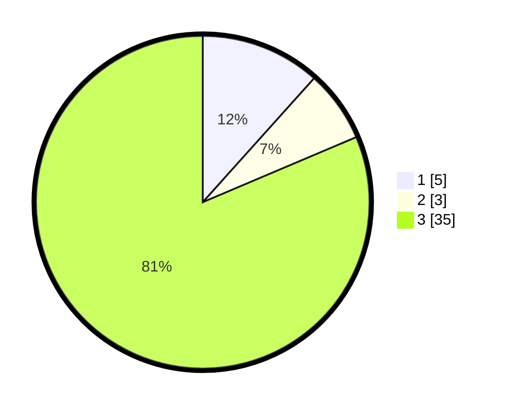

# Hasil

## Grafik

## Tabel

| No. | Nama Paslon    | Suara | Suara (raw) | Persentase |
|:--- |:-------------- | -----:| -----------:| ----------:|
| 1   | ANIES MUHAIMIN | 5     | [5][p-1]    | 11,63      |
| 2   | PRABOWO GIBRAN | 3     | [3][p-2]    | 6,98       |
| 3   | GANJAR MAHFUD  | 35    | [35][p-3]   | 81,40      |

[p-1]: https://github.com/gigit-pemilu/pemilu-2024-14-riau/blob/main/pilpres/hitung-suara/sub/14-riau/sub/08-siak/sub/03-minas/sub/2002-minas-timur/sub/008-tps/sub/paslon-1.txt
[p-2]: https://github.com/gigit-pemilu/pemilu-2024-14-riau/blob/main/pilpres/hitung-suara/sub/14-riau/sub/08-siak/sub/03-minas/sub/2002-minas-timur/sub/008-tps/sub/paslon-2.txt
[p-3]: https://github.com/gigit-pemilu/pemilu-2024-14-riau/blob/main/pilpres/hitung-suara/sub/14-riau/sub/08-siak/sub/03-minas/sub/2002-minas-timur/sub/008-tps/sub/paslon-3.txt

## Foto C Plano

https://sirekap-obj-formc.kpu.go.id/842a/pemilu/ppwp/14/08/03/20/02/1408032002008-20240221-164934--ecdea916-e4d4-4679-b657-873c27aa1f0f.jpg

https://sirekap-obj-formc.kpu.go.id/842a/pemilu/ppwp/14/08/03/20/02/1408032002008-20240221-152431--c33f408c-c44f-42d8-a5df-fef685427f26.jpg

https://sirekap-obj-formc.kpu.go.id/842a/pemilu/ppwp/14/08/03/20/02/1408032002008-20240221-152644--fee2251e-45f4-4b50-bd59-fceb5277db87.jpg

## Metadata

| Key        | Value               |
| ---------- | ------------------- |
| Time Stamp | 2024-02-21 17:00:00 |

