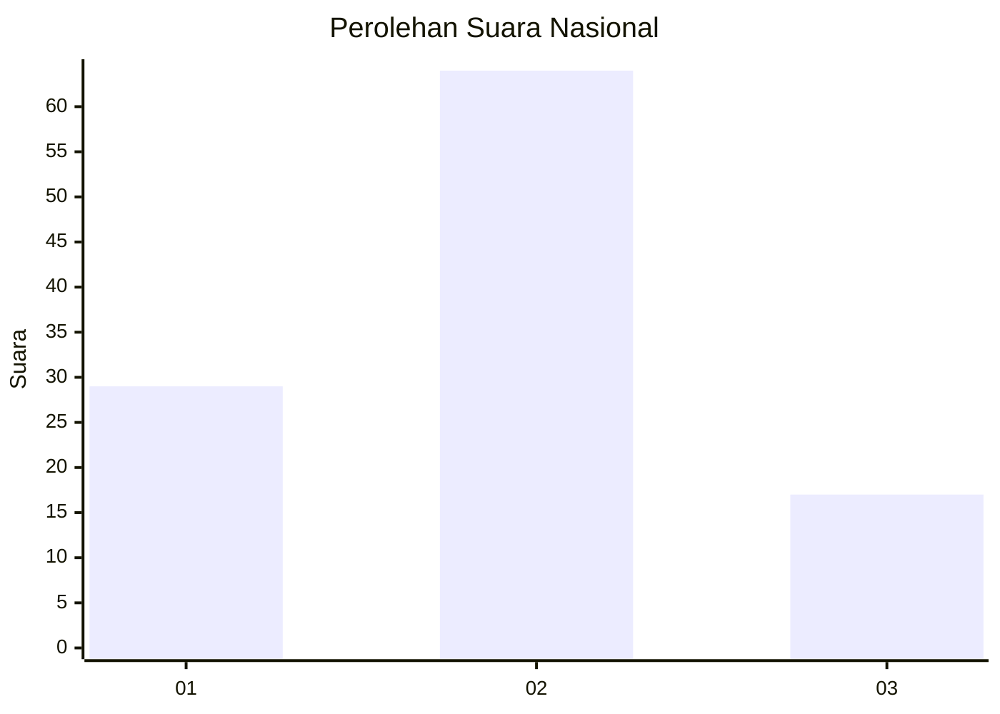
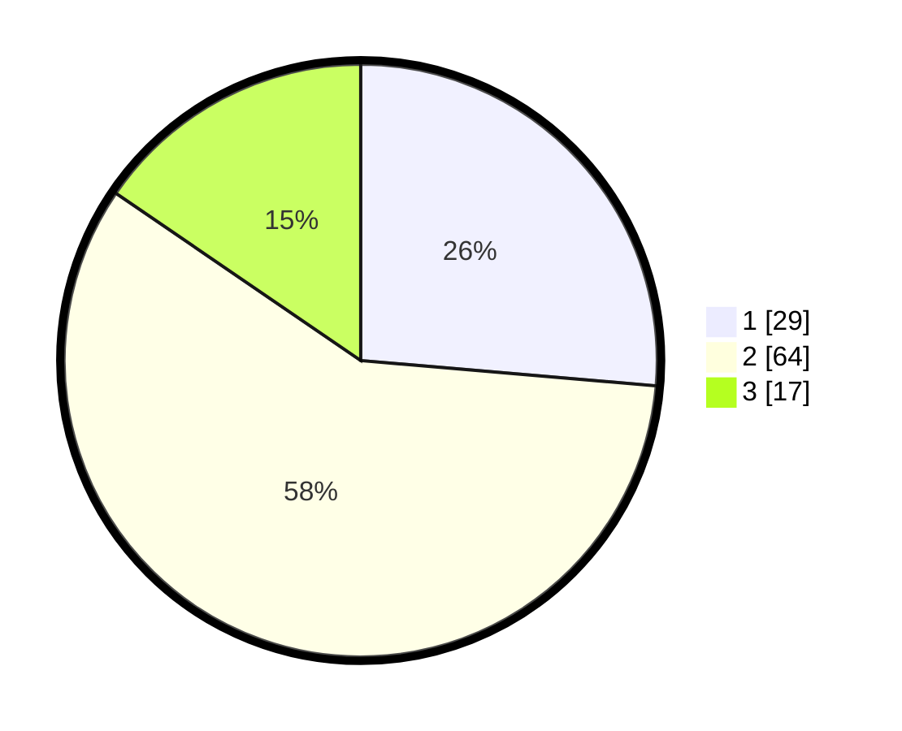

# Hasil

## Grafik

## Tabel

| No. | Nama Paslon    | Suara | Suara (raw) | Persentase |
|:--- |:-------------- | -----:| -----------:| ----------:|
| 1   | ANIES MUHAIMIN | 29    | [29][p-1]   | 26,36      |
| 2   | PRABOWO GIBRAN | 64    | [64][p-2]   | 58,18      |
| 3   | GANJAR MAHFUD  | 17    | [17][p-3]   | 15,45      |

[p-1]: https://github.com/gigit-pemilu/pemilu-2024/blob/main/pilpres/hitung-suara/sub/14-riau/sub/08-siak/sub/03-minas/sub/2004-mandi-angin/sub/003-tps/sub/paslon-1.txt
[p-2]: https://github.com/gigit-pemilu/pemilu-2024/blob/main/pilpres/hitung-suara/sub/14-riau/sub/08-siak/sub/03-minas/sub/2004-mandi-angin/sub/003-tps/sub/paslon-2.txt
[p-3]: https://github.com/gigit-pemilu/pemilu-2024/blob/main/pilpres/hitung-suara/sub/14-riau/sub/08-siak/sub/03-minas/sub/2004-mandi-angin/sub/003-tps/sub/paslon-3.txt

## Foto C Plano

https://sirekap-obj-formc.kpu.go.id/b865/pemilu/ppwp/14/08/03/20/04/1408032004003-20240214-222156--63d1a014-d3b2-4e77-994c-fd4e5b5eccf2.jpg

https://sirekap-obj-formc.kpu.go.id/b865/pemilu/ppwp/14/08/03/20/04/1408032004003-20240214-222435--acdd0e4a-ed70-46ff-be58-b9976a6d8e3c.jpg

https://sirekap-obj-formc.kpu.go.id/b865/pemilu/ppwp/14/08/03/20/04/1408032004003-20240214-222620--c5600442-b5f8-4f7c-8aff-962cdaef9ad1.jpg

## Metadata

| Key        | Value               |
| ---------- | ------------------- |
| Time Stamp | 2024-02-15 22:00:27 |

