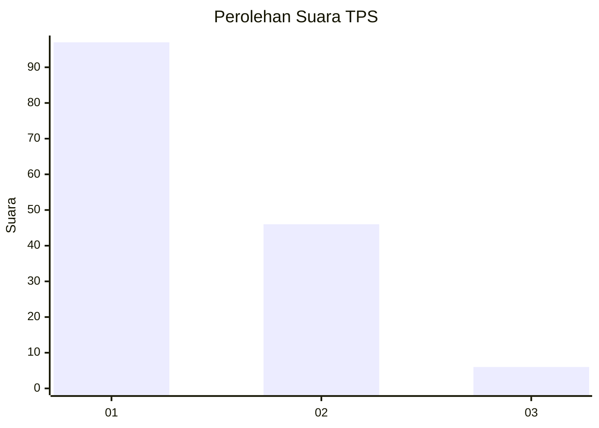
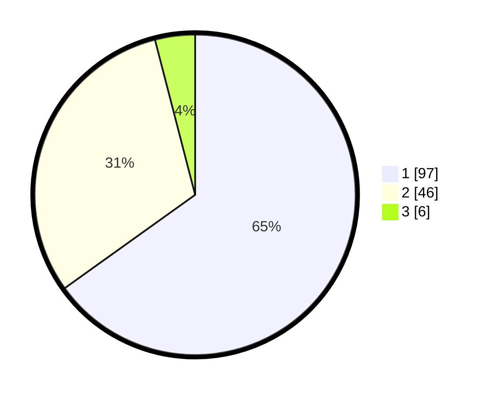

# Hasil

## Grafik

## Tabel

| No. | Nama Paslon    | Suara | Suara (raw) | Persentase |
|:--- |:-------------- | -----:| -----------:| ----------:|
| 1   | ANIES MUHAIMIN | 97    | [97][p-1]   | 65,10      |
| 2   | PRABOWO GIBRAN | 46    | [46][p-2]   | 30,87      |
| 3   | GANJAR MAHFUD  | 6     | [6][p-3]    | 4,03       |

[p-1]: https://github.com/gigit-pemilu/pemilu-2024-14-riau/blob/main/pilpres/hitung-suara/sub/14-riau/sub/08-siak/sub/04-tualang/sub/1001-perawang/sub/009-tps/sub/paslon-1.txt
[p-2]: https://github.com/gigit-pemilu/pemilu-2024-14-riau/blob/main/pilpres/hitung-suara/sub/14-riau/sub/08-siak/sub/04-tualang/sub/1001-perawang/sub/009-tps/sub/paslon-2.txt
[p-3]: https://github.com/gigit-pemilu/pemilu-2024-14-riau/blob/main/pilpres/hitung-suara/sub/14-riau/sub/08-siak/sub/04-tualang/sub/1001-perawang/sub/009-tps/sub/paslon-3.txt

## Foto C Plano

https://sirekap-obj-formc.kpu.go.id/bd43/pemilu/ppwp/14/08/04/10/01/1408041001009-20240215-022646--67929aa6-6f9b-4b9d-8223-58d56272790f.jpg

https://sirekap-obj-formc.kpu.go.id/bd43/pemilu/ppwp/14/08/04/10/01/1408041001009-20240215-022704--4724c2fa-2d36-45c7-8c43-1e41e164e6ce.jpg

https://sirekap-obj-formc.kpu.go.id/bd43/pemilu/ppwp/14/08/04/10/01/1408041001009-20240215-022721--7f138546-921d-4135-a413-3e4728fa825f.jpg

## Metadata

| Key        | Value               |
| ---------- | ------------------- |
| Time Stamp | 2024-02-19 06:16:00 |

