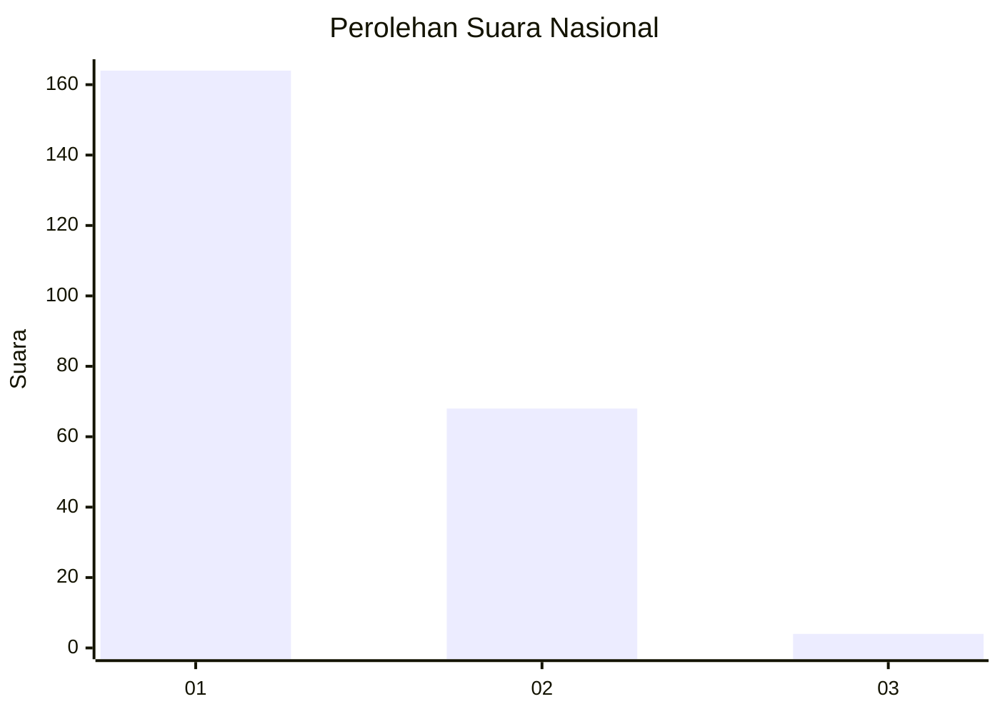
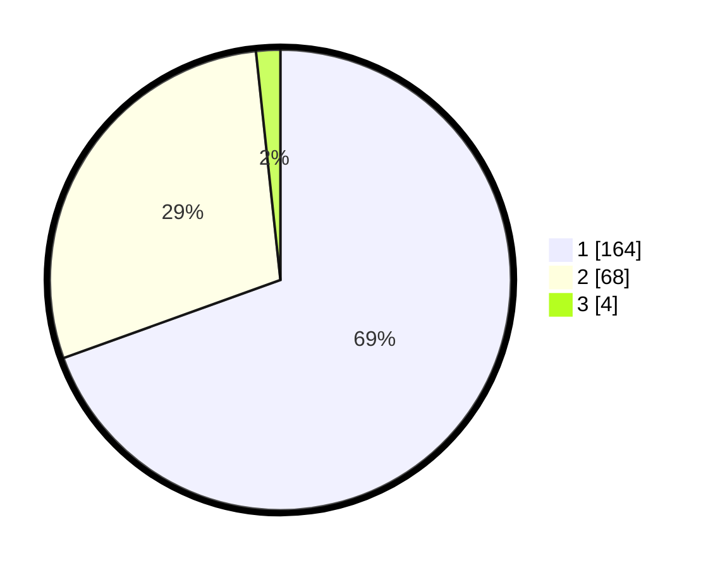

# Hasil

## Grafik

## Tabel

| No. | Nama Paslon    | Suara | Suara (raw) | Persentase |
|:--- |:-------------- | -----:| -----------:| ----------:|
| 1   | ANIES MUHAIMIN | 164   | [164][p-1]  | 69,49      |
| 2   | PRABOWO GIBRAN | 68    | [68][p-2]   | 28,81      |
| 3   | GANJAR MAHFUD  | 4     | [4][p-3]    | 1,69       |

[p-1]: https://github.com/gigit-pemilu/pemilu-2024/blob/main/pilpres/hitung-suara/sub/14-riau/sub/08-siak/sub/04-tualang/sub/1001-perawang/sub/053-tps/sub/paslon-1.txt
[p-2]: https://github.com/gigit-pemilu/pemilu-2024/blob/main/pilpres/hitung-suara/sub/14-riau/sub/08-siak/sub/04-tualang/sub/1001-perawang/sub/053-tps/sub/paslon-2.txt
[p-3]: https://github.com/gigit-pemilu/pemilu-2024/blob/main/pilpres/hitung-suara/sub/14-riau/sub/08-siak/sub/04-tualang/sub/1001-perawang/sub/053-tps/sub/paslon-3.txt

## Foto C Plano

https://sirekap-obj-formc.kpu.go.id/c7a2/pemilu/ppwp/14/08/04/10/01/1408041001053-20240216-014228--a6d65489-4781-46ee-9678-5d189d2ba94d.jpg

https://sirekap-obj-formc.kpu.go.id/c7a2/pemilu/ppwp/14/08/04/10/01/1408041001053-20240216-014310--9da1c2ff-0470-436c-b894-412087ffec9b.jpg

https://sirekap-obj-formc.kpu.go.id/c7a2/pemilu/ppwp/14/08/04/10/01/1408041001053-20240216-005331--f9384319-873f-4205-918d-b812a2370ce0.jpg

## Metadata

| Key        | Value               |
| ---------- | ------------------- |
| Time Stamp | 2024-02-19 06:16:00 |

