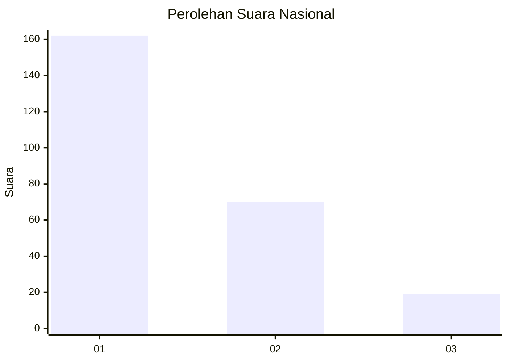
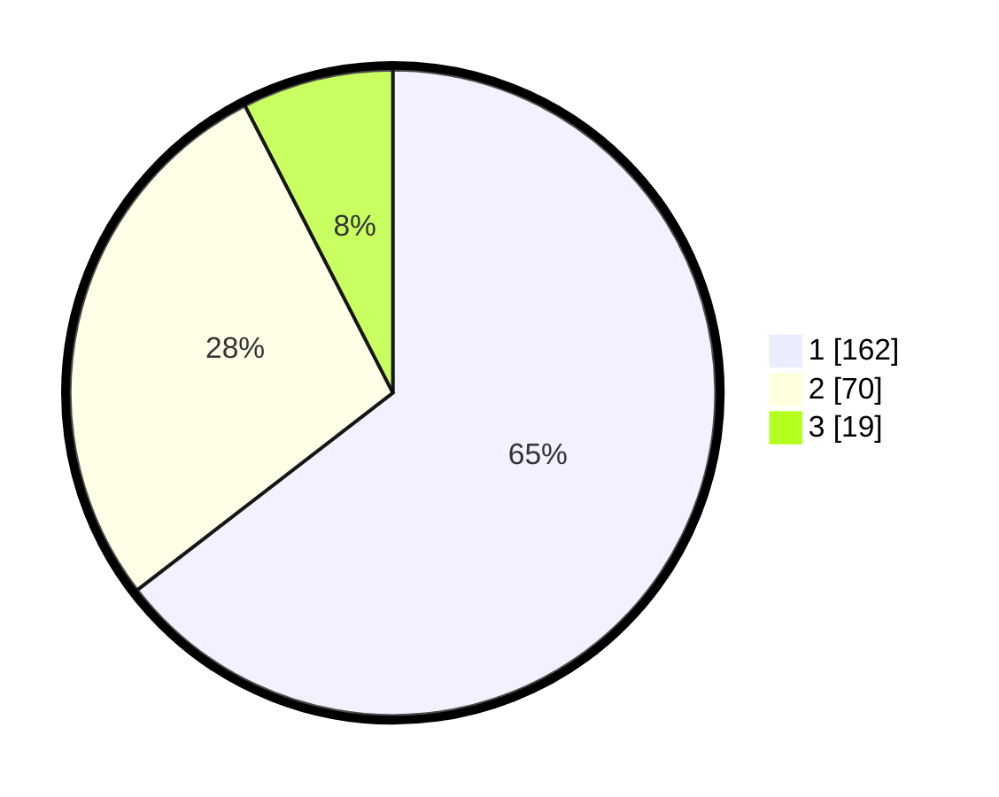

# Hasil

## Grafik

## Tabel

| No. | Nama Paslon    | Suara | Suara (raw) | Persentase |
|:--- |:-------------- | -----:| -----------:| ----------:|
| 1   | ANIES MUHAIMIN | 162   | [162][p-1]  | 64,54      |
| 2   | PRABOWO GIBRAN | 70    | [70][p-2]   | 27,89      |
| 3   | GANJAR MAHFUD  | 19    | [19][p-3]   | 7,57       |

[p-1]: https://github.com/gigit-pemilu/pemilu-2024/blob/main/pilpres/hitung-suara/sub/14-riau/sub/08-siak/sub/04-tualang/sub/1001-perawang/sub/062-tps/sub/paslon-1.txt
[p-2]: https://github.com/gigit-pemilu/pemilu-2024/blob/main/pilpres/hitung-suara/sub/14-riau/sub/08-siak/sub/04-tualang/sub/1001-perawang/sub/062-tps/sub/paslon-2.txt
[p-3]: https://github.com/gigit-pemilu/pemilu-2024/blob/main/pilpres/hitung-suara/sub/14-riau/sub/08-siak/sub/04-tualang/sub/1001-perawang/sub/062-tps/sub/paslon-3.txt

## Foto C Plano

https://sirekap-obj-formc.kpu.go.id/96a7/pemilu/ppwp/14/08/04/10/01/1408041001062-20240215-201121--b322aae0-0fd1-4ba5-bb58-fe42c9970ae3.jpg

https://sirekap-obj-formc.kpu.go.id/96a7/pemilu/ppwp/14/08/04/10/01/1408041001062-20240215-201817--3608617e-9fc0-42e6-ae54-642121e75cfb.jpg

https://sirekap-obj-formc.kpu.go.id/96a7/pemilu/ppwp/14/08/04/10/01/1408041001062-20240215-202111--018dd851-2b33-4372-bd62-2ccbb119ef4f.jpg

## Metadata

| Key        | Value               |
| ---------- | ------------------- |
| Time Stamp | 2024-02-15 22:00:27 |

