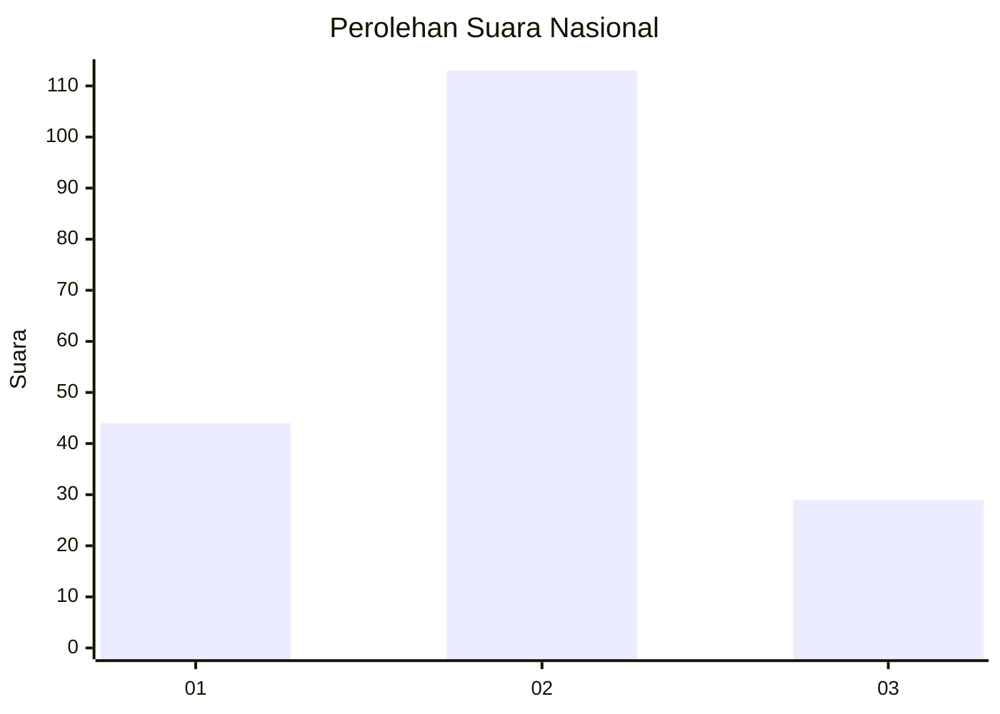
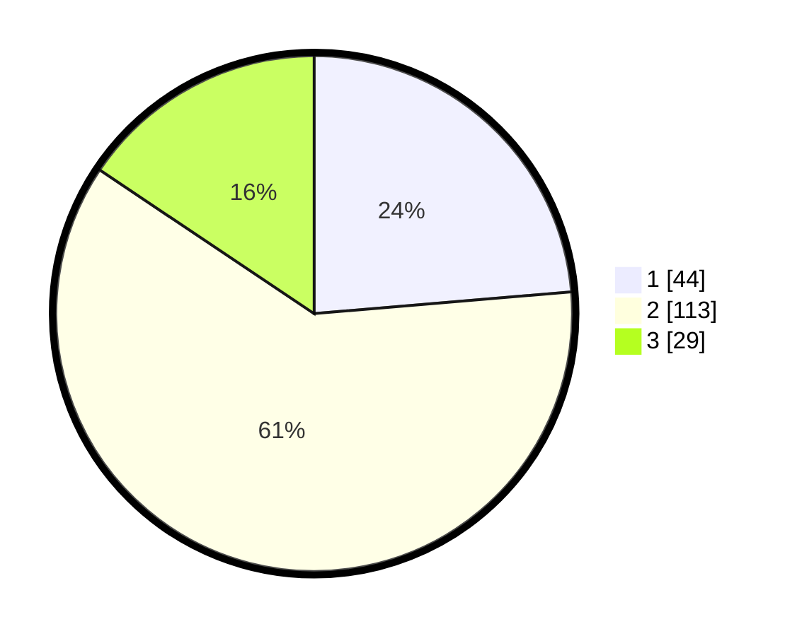

# Hasil

## Grafik

## Tabel

| No. | Nama Paslon    | Suara | Suara (raw) | Persentase |
|:--- |:-------------- | -----:| -----------:| ----------:|
| 1   | ANIES MUHAIMIN | 44    | [44][p-1]   | 23,66      |
| 2   | PRABOWO GIBRAN | 113   | [113][p-2]  | 60,75      |
| 3   | GANJAR MAHFUD  | 29    | [29][p-3]   | 15,59      |

[p-1]: https://github.com/gigit-pemilu/pemilu-2024/blob/main/pilpres/hitung-suara/sub/14-riau/sub/08-siak/sub/04-tualang/sub/2003-pinang-sebatang/sub/003-tps/sub/paslon-1.txt
[p-2]: https://github.com/gigit-pemilu/pemilu-2024/blob/main/pilpres/hitung-suara/sub/14-riau/sub/08-siak/sub/04-tualang/sub/2003-pinang-sebatang/sub/003-tps/sub/paslon-2.txt
[p-3]: https://github.com/gigit-pemilu/pemilu-2024/blob/main/pilpres/hitung-suara/sub/14-riau/sub/08-siak/sub/04-tualang/sub/2003-pinang-sebatang/sub/003-tps/sub/paslon-3.txt

## Foto C Plano

https://sirekap-obj-formc.kpu.go.id/88ab/pemilu/ppwp/14/08/04/20/03/1408042003003-20240225-120753--09a489a6-758c-4aff-b377-b2ee6b1a83c0.jpg

https://sirekap-obj-formc.kpu.go.id/88ab/pemilu/ppwp/14/08/04/20/03/1408042003003-20240225-120906--7ba9897e-24bd-4c2e-bbfa-4a13d3acc8a7.jpg

https://sirekap-obj-formc.kpu.go.id/88ab/pemilu/ppwp/14/08/04/20/03/1408042003003-20240225-121027--722f3ec8-f615-4e57-9b3b-1f185dcad093.jpg

## Metadata

| Key        | Value               |
| ---------- | ------------------- |
| Time Stamp | 2024-02-25 13:00:00 |

