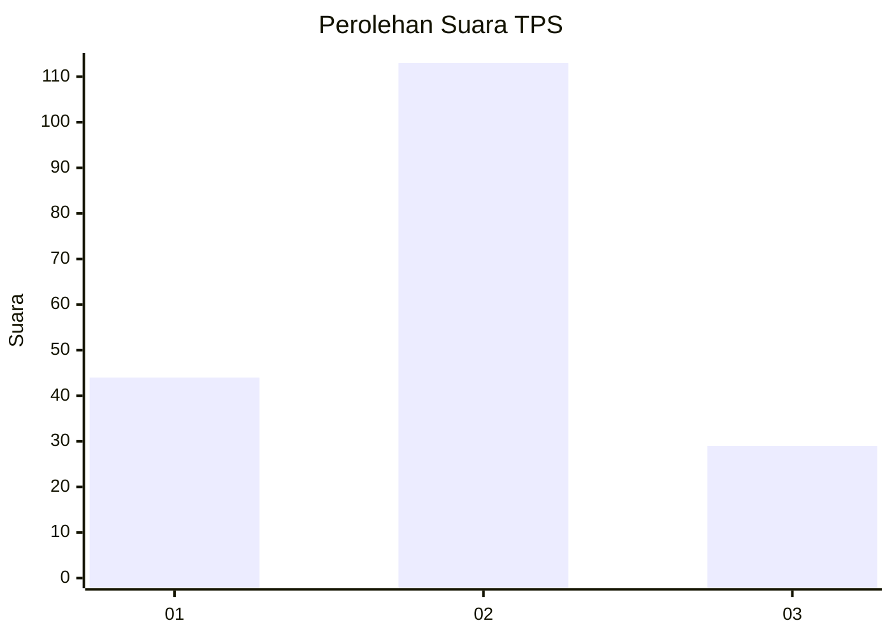
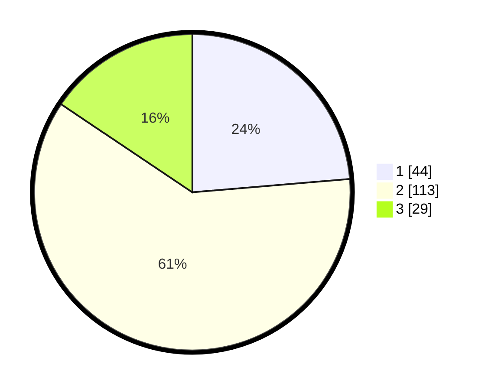

# Hasil

## Grafik

## Tabel

| No. | Nama Paslon    | Suara | Suara (raw) | Persentase |
|:--- |:-------------- | -----:| -----------:| ----------:|
| 1   | ANIES MUHAIMIN | 44    | [44][p-1]   | 23,66      |
| 2   | PRABOWO GIBRAN | 113   | [113][p-2]  | 60,75      |
| 3   | GANJAR MAHFUD  | 29    | [29][p-3]   | 15,59      |

[p-1]: https://github.com/gigit-pemilu/pemilu-2024-14-riau/blob/main/pilpres/hitung-suara/sub/14-riau/sub/08-siak/sub/04-tualang/sub/2003-pinang-sebatang/sub/004-tps/sub/paslon-1.txt
[p-2]: https://github.com/gigit-pemilu/pemilu-2024-14-riau/blob/main/pilpres/hitung-suara/sub/14-riau/sub/08-siak/sub/04-tualang/sub/2003-pinang-sebatang/sub/004-tps/sub/paslon-2.txt
[p-3]: https://github.com/gigit-pemilu/pemilu-2024-14-riau/blob/main/pilpres/hitung-suara/sub/14-riau/sub/08-siak/sub/04-tualang/sub/2003-pinang-sebatang/sub/004-tps/sub/paslon-3.txt

## Foto C Plano

https://sirekap-obj-formc.kpu.go.id/42cc/pemilu/ppwp/14/08/04/20/03/1408042003004-20240225-122937--10368698-977a-4e97-abb1-572c3d9d88fe.jpg

https://sirekap-obj-formc.kpu.go.id/42cc/pemilu/ppwp/14/08/04/20/03/1408042003004-20240225-121911--15ff126c-bcd0-4656-9fbd-e997755c8172.jpg

https://sirekap-obj-formc.kpu.go.id/42cc/pemilu/ppwp/14/08/04/20/03/1408042003004-20240225-122013--efdfb9f8-0d0a-42a6-85ce-fc8e9d34685e.jpg

## Metadata

| Key        | Value               |
| ---------- | ------------------- |
| Time Stamp | 2024-02-25 13:00:00 |

