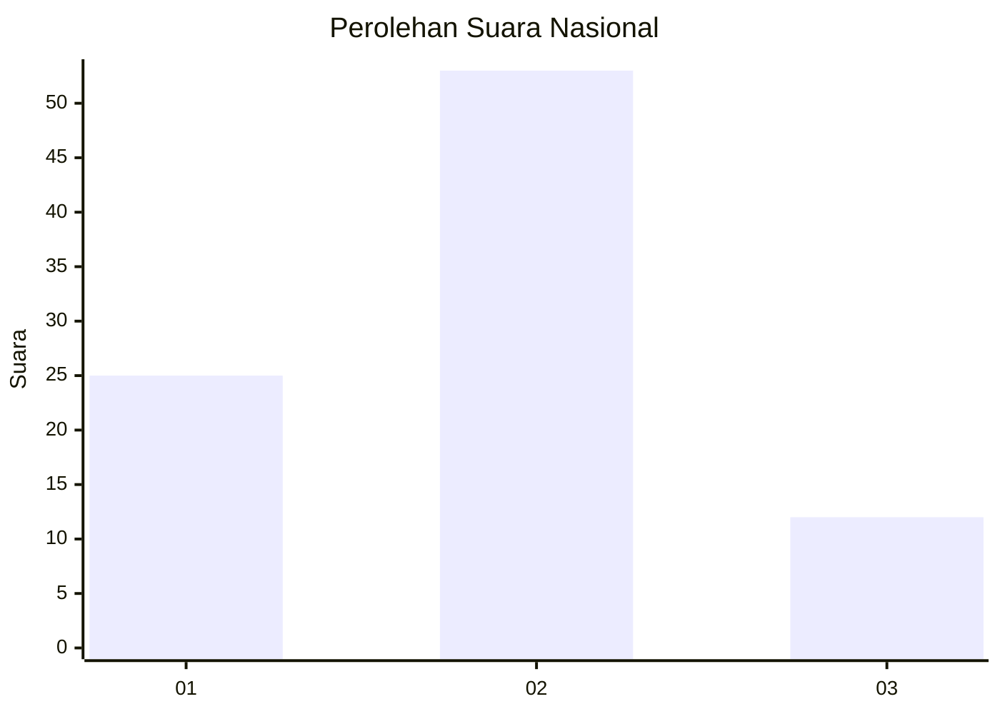
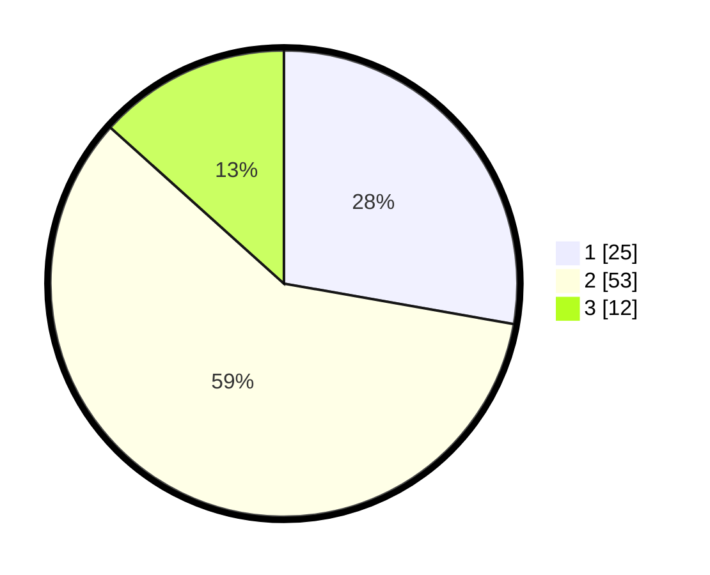

# Hasil

## Grafik

## Tabel

| No. | Nama Paslon    | Suara | Suara (raw) | Persentase |
|:--- |:-------------- | -----:| -----------:| ----------:|
| 1   | ANIES MUHAIMIN | 25    | [25][p-1]   | 27,78      |
| 2   | PRABOWO GIBRAN | 53    | [53][p-2]   | 58,89      |
| 3   | GANJAR MAHFUD  | 12    | [12][p-3]   | 13,33      |

[p-1]: https://github.com/gigit-pemilu/pemilu-2024/blob/main/pilpres/hitung-suara/sub/14-riau/sub/08-siak/sub/04-tualang/sub/2004-meredan/sub/003-tps/sub/paslon-1.txt
[p-2]: https://github.com/gigit-pemilu/pemilu-2024/blob/main/pilpres/hitung-suara/sub/14-riau/sub/08-siak/sub/04-tualang/sub/2004-meredan/sub/003-tps/sub/paslon-2.txt
[p-3]: https://github.com/gigit-pemilu/pemilu-2024/blob/main/pilpres/hitung-suara/sub/14-riau/sub/08-siak/sub/04-tualang/sub/2004-meredan/sub/003-tps/sub/paslon-3.txt

## Foto C Plano

https://sirekap-obj-formc.kpu.go.id/f05e/pemilu/ppwp/14/08/04/20/04/1408042004003-20240225-162808--832254bd-e01c-4181-9eef-f9078f65eacd.jpg

https://sirekap-obj-formc.kpu.go.id/f05e/pemilu/ppwp/14/08/04/20/04/1408042004003-20240225-162859--0973ccbf-e6f8-416c-bccb-1ebef95b8e2d.jpg

https://sirekap-obj-formc.kpu.go.id/f05e/pemilu/ppwp/14/08/04/20/04/1408042004003-20240225-163012--32e1fec1-f6d6-496c-bdd9-e0bda5e0aedd.jpg

## Metadata

| Key        | Value               |
| ---------- | ------------------- |
| Time Stamp | 2024-02-25 18:00:00 |

