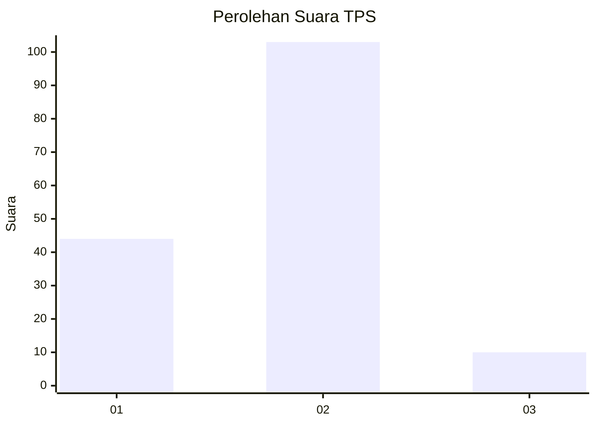
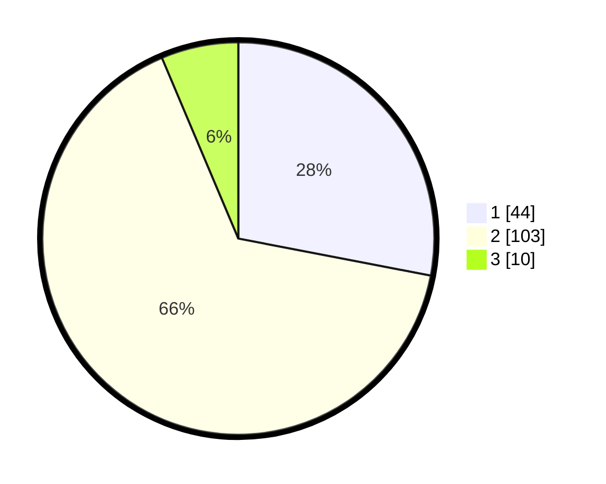

# Hasil

## Grafik

## Tabel

| No. | Nama Paslon    | Suara | Suara (raw) | Persentase |
|:--- |:-------------- | -----:| -----------:| ----------:|
| 1   | ANIES MUHAIMIN | 44    | [44][p-1]   | 28,03      |
| 2   | PRABOWO GIBRAN | 103   | [103][p-2]  | 65,61      |
| 3   | GANJAR MAHFUD  | 10    | [10][p-3]   | 6,37       |

[p-1]: https://github.com/gigit-pemilu/pemilu-2024-14-riau/blob/main/pilpres/hitung-suara/sub/14-riau/sub/08-siak/sub/04-tualang/sub/2004-meredan/sub/004-tps/sub/paslon-1.txt
[p-2]: https://github.com/gigit-pemilu/pemilu-2024-14-riau/blob/main/pilpres/hitung-suara/sub/14-riau/sub/08-siak/sub/04-tualang/sub/2004-meredan/sub/004-tps/sub/paslon-2.txt
[p-3]: https://github.com/gigit-pemilu/pemilu-2024-14-riau/blob/main/pilpres/hitung-suara/sub/14-riau/sub/08-siak/sub/04-tualang/sub/2004-meredan/sub/004-tps/sub/paslon-3.txt

## Foto C Plano

https://sirekap-obj-formc.kpu.go.id/c4c3/pemilu/ppwp/14/08/04/20/04/1408042004004-20240215-024944--1ba4348d-032d-4c69-bd70-e3cf2e283f5d.jpg

https://sirekap-obj-formc.kpu.go.id/c4c3/pemilu/ppwp/14/08/04/20/04/1408042004004-20240215-025339--6676d4b3-441b-40b7-bde2-b932f1f43355.jpg

https://sirekap-obj-formc.kpu.go.id/c4c3/pemilu/ppwp/14/08/04/20/04/1408042004004-20240215-025503--25f0bf89-05cb-4e13-91ad-fbfeba2b9f2f.jpg

## Metadata

| Key        | Value               |
| ---------- | ------------------- |
| Time Stamp | 2024-02-19 06:16:00 |

