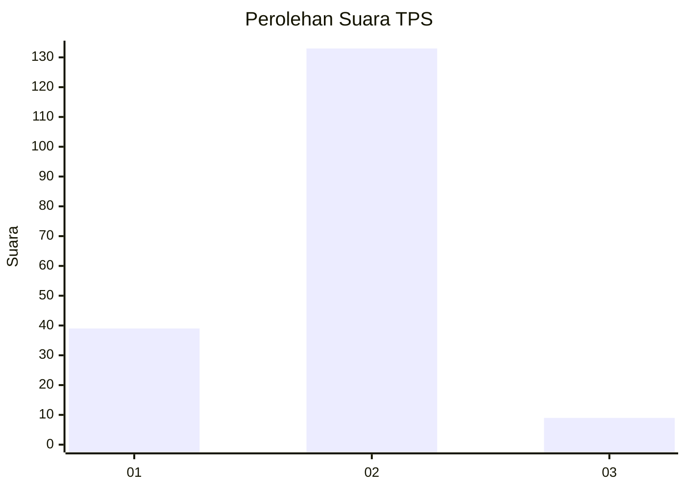
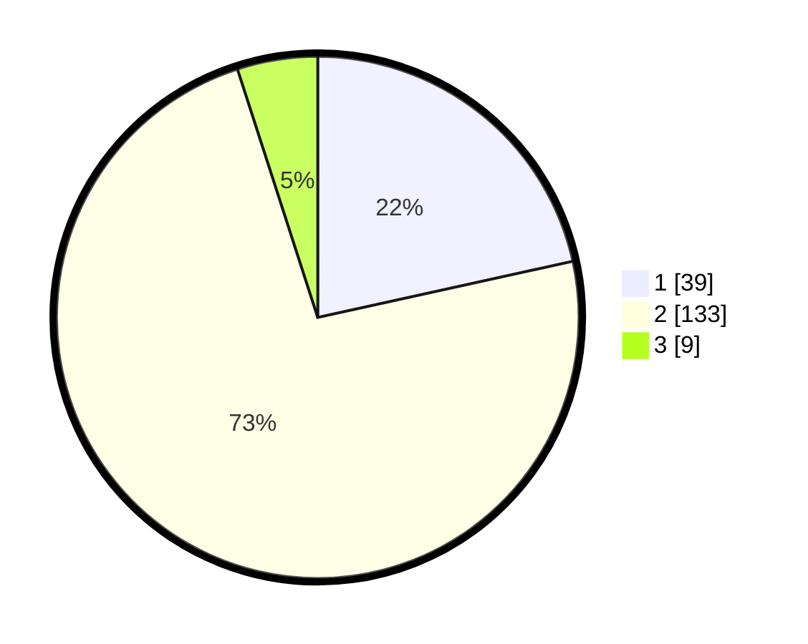

# Hasil

## Grafik

## Tabel

| No. | Nama Paslon    | Suara | Suara (raw) | Persentase |
|:--- |:-------------- | -----:| -----------:| ----------:|
| 1   | ANIES MUHAIMIN | 39    | [39][p-1]   | 21,55      |
| 2   | PRABOWO GIBRAN | 133   | [133][p-2]  | 73,48      |
| 3   | GANJAR MAHFUD  | 9     | [9][p-3]    | 4,97       |

[p-1]: https://github.com/gigit-pemilu/pemilu-2024-14-riau/blob/main/pilpres/hitung-suara/sub/14-riau/sub/08-siak/sub/04-tualang/sub/2005-pinang-sebatang-timur/sub/004-tps/sub/paslon-1.txt
[p-2]: https://github.com/gigit-pemilu/pemilu-2024-14-riau/blob/main/pilpres/hitung-suara/sub/14-riau/sub/08-siak/sub/04-tualang/sub/2005-pinang-sebatang-timur/sub/004-tps/sub/paslon-2.txt
[p-3]: https://github.com/gigit-pemilu/pemilu-2024-14-riau/blob/main/pilpres/hitung-suara/sub/14-riau/sub/08-siak/sub/04-tualang/sub/2005-pinang-sebatang-timur/sub/004-tps/sub/paslon-3.txt

## Foto C Plano

https://sirekap-obj-formc.kpu.go.id/9e16/pemilu/ppwp/14/08/04/20/05/1408042005004-20240215-062151--68a80db6-5922-4097-b3da-444979aa09ef.jpg

https://sirekap-obj-formc.kpu.go.id/9e16/pemilu/ppwp/14/08/04/20/05/1408042005004-20240215-061826--12970949-9ade-4b39-be08-238e80ec532f.jpg

https://sirekap-obj-formc.kpu.go.id/9e16/pemilu/ppwp/14/08/04/20/05/1408042005004-20240215-062004--1d28af60-e00f-427c-8a6c-a248004aa5a3.jpg

## Metadata

| Key        | Value               |
| ---------- | ------------------- |
| Time Stamp | 2024-02-19 06:16:00 |

