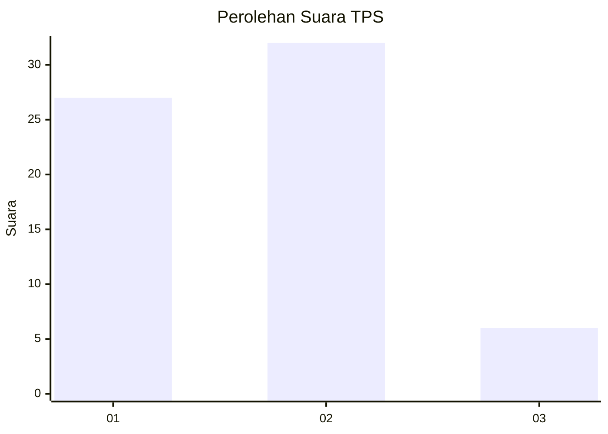
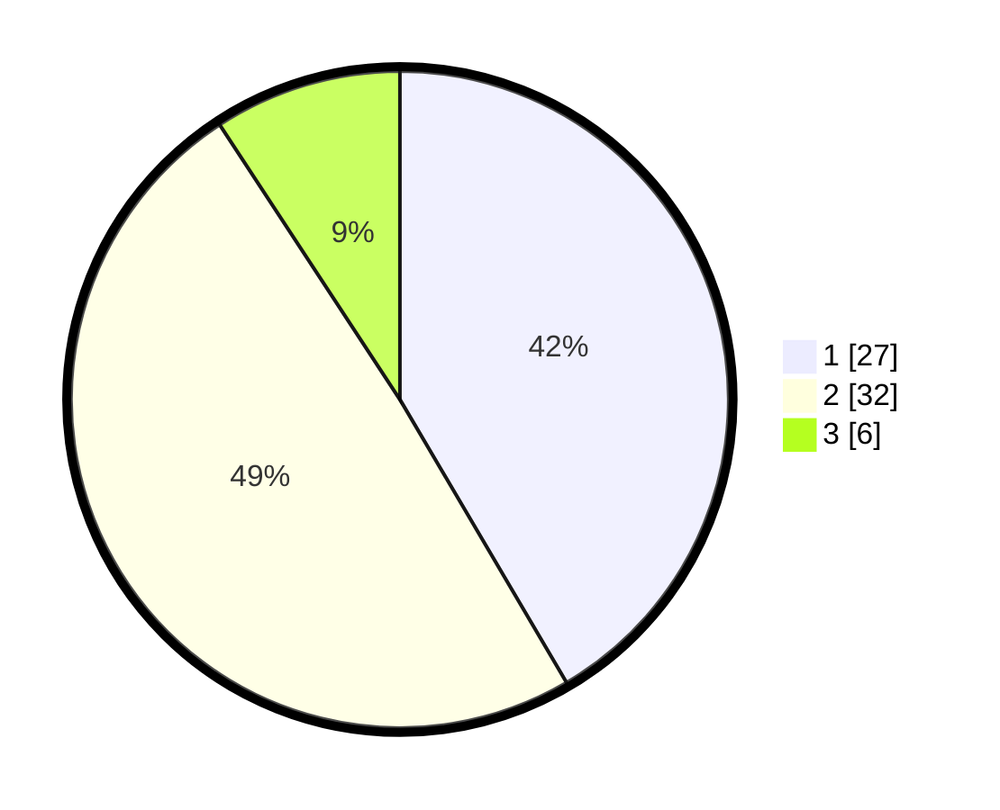

# Hasil

## Grafik

## Tabel

| No. | Nama Paslon    | Suara | Suara (raw) | Persentase |
|:--- |:-------------- | -----:| -----------:| ----------:|
| 1   | ANIES MUHAIMIN | 27    | [27][p-1]   | 41,54      |
| 2   | PRABOWO GIBRAN | 32    | [32][p-2]   | 49,23      |
| 3   | GANJAR MAHFUD  | 6     | [6][p-3]    | 9,23       |

[p-1]: https://github.com/gigit-pemilu/pemilu-2024-14-riau/blob/main/pilpres/hitung-suara/sub/14-riau/sub/08-siak/sub/04-tualang/sub/2006-pinang-sebatang-barat/sub/002-tps/sub/paslon-1.txt
[p-2]: https://github.com/gigit-pemilu/pemilu-2024-14-riau/blob/main/pilpres/hitung-suara/sub/14-riau/sub/08-siak/sub/04-tualang/sub/2006-pinang-sebatang-barat/sub/002-tps/sub/paslon-2.txt
[p-3]: https://github.com/gigit-pemilu/pemilu-2024-14-riau/blob/main/pilpres/hitung-suara/sub/14-riau/sub/08-siak/sub/04-tualang/sub/2006-pinang-sebatang-barat/sub/002-tps/sub/paslon-3.txt

## Foto C Plano

https://sirekap-obj-formc.kpu.go.id/80f5/pemilu/ppwp/14/08/04/20/06/1408042006002-20240225-151258--2c911cab-b377-4643-bec7-392deb0d9b48.jpg

https://sirekap-obj-formc.kpu.go.id/80f5/pemilu/ppwp/14/08/04/20/06/1408042006002-20240225-151610--feb2b824-5dd3-4408-a63d-d5d05ef58dcd.jpg

https://sirekap-obj-formc.kpu.go.id/80f5/pemilu/ppwp/14/08/04/20/06/1408042006002-20240225-151943--b306ccc8-c751-4002-a5b4-8ce5b7635787.jpg

## Metadata

| Key        | Value               |
| ---------- | ------------------- |
| Time Stamp | 2024-02-25 17:00:00 |

