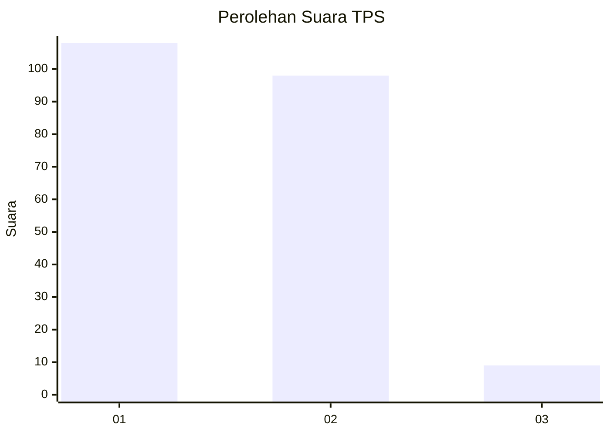
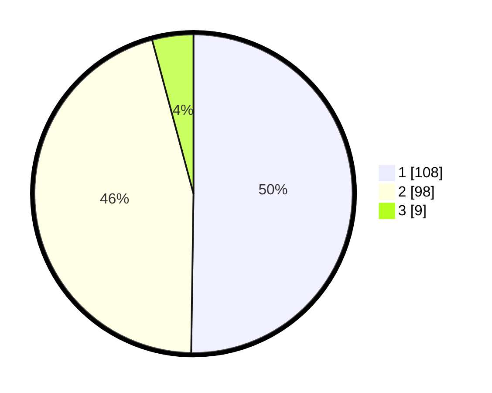

# Hasil

## Grafik

## Tabel

| No. | Nama Paslon    | Suara | Suara (raw) | Persentase |
|:--- |:-------------- | -----:| -----------:| ----------:|
| 1   | ANIES MUHAIMIN | 108   | [108][p-1]  | 50,23      |
| 2   | PRABOWO GIBRAN | 98    | [98][p-2]   | 45,58      |
| 3   | GANJAR MAHFUD  | 9     | [9][p-3]    | 4,19       |

[p-1]: https://github.com/gigit-pemilu/pemilu-2024-14-riau/blob/main/pilpres/hitung-suara/sub/14-riau/sub/08-siak/sub/04-tualang/sub/2006-pinang-sebatang-barat/sub/003-tps/sub/paslon-1.txt
[p-2]: https://github.com/gigit-pemilu/pemilu-2024-14-riau/blob/main/pilpres/hitung-suara/sub/14-riau/sub/08-siak/sub/04-tualang/sub/2006-pinang-sebatang-barat/sub/003-tps/sub/paslon-2.txt
[p-3]: https://github.com/gigit-pemilu/pemilu-2024-14-riau/blob/main/pilpres/hitung-suara/sub/14-riau/sub/08-siak/sub/04-tualang/sub/2006-pinang-sebatang-barat/sub/003-tps/sub/paslon-3.txt

## Foto C Plano

https://sirekap-obj-formc.kpu.go.id/7c82/pemilu/ppwp/14/08/04/20/06/1408042006003-20240215-051412--a65dcdd8-0b4c-414d-8bf3-d5b9dac6470f.jpg

https://sirekap-obj-formc.kpu.go.id/7c82/pemilu/ppwp/14/08/04/20/06/1408042006003-20240215-051014--20a1eff8-8fb8-4b55-8ec4-a2aef21de904.jpg

https://sirekap-obj-formc.kpu.go.id/7c82/pemilu/ppwp/14/08/04/20/06/1408042006003-20240215-052848--336a92e3-a71b-46fe-9fc6-f7d2fb9e823b.jpg

## Metadata

| Key        | Value               |
| ---------- | ------------------- |
| Time Stamp | 2024-02-19 06:16:00 |

