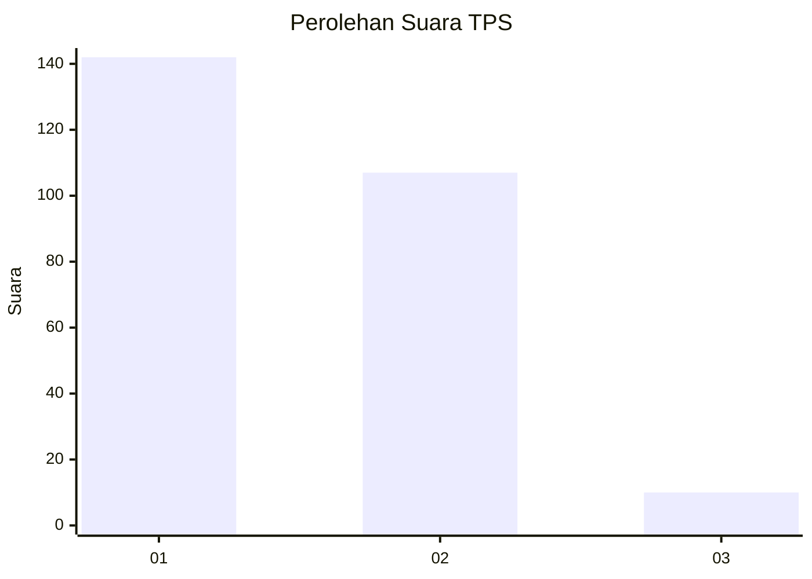
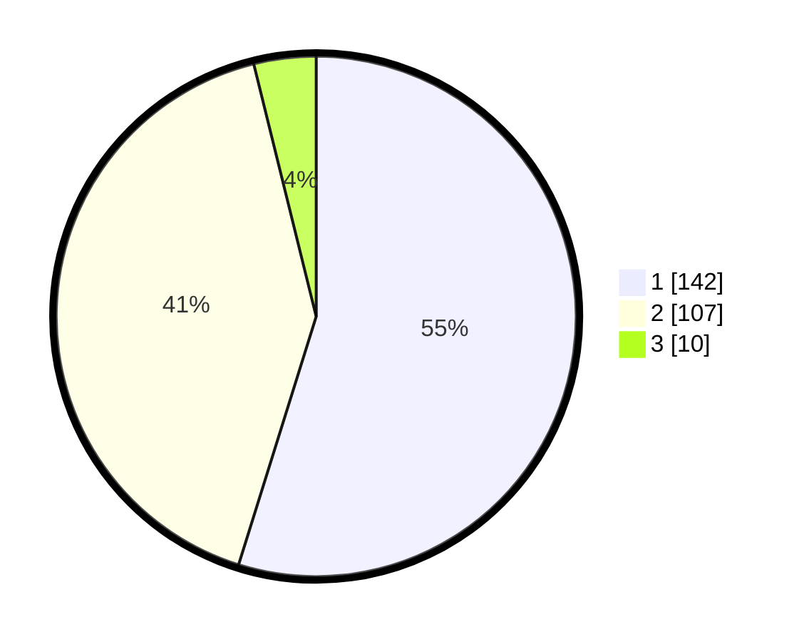

# Hasil

## Grafik

## Tabel

| No. | Nama Paslon    | Suara | Suara (raw) | Persentase |
|:--- |:-------------- | -----:| -----------:| ----------:|
| 1   | ANIES MUHAIMIN | 142   | [142][p-1]  | 54,83      |
| 2   | PRABOWO GIBRAN | 107   | [107][p-2]  | 41,31      |
| 3   | GANJAR MAHFUD  | 10    | [10][p-3]   | 3,86       |

[p-1]: https://github.com/gigit-pemilu/pemilu-2024-14-riau/blob/main/pilpres/hitung-suara/sub/14-riau/sub/08-siak/sub/04-tualang/sub/2008-perawang-barat/sub/030-tps/sub/paslon-1.txt
[p-2]: https://github.com/gigit-pemilu/pemilu-2024-14-riau/blob/main/pilpres/hitung-suara/sub/14-riau/sub/08-siak/sub/04-tualang/sub/2008-perawang-barat/sub/030-tps/sub/paslon-2.txt
[p-3]: https://github.com/gigit-pemilu/pemilu-2024-14-riau/blob/main/pilpres/hitung-suara/sub/14-riau/sub/08-siak/sub/04-tualang/sub/2008-perawang-barat/sub/030-tps/sub/paslon-3.txt

## Foto C Plano

https://sirekap-obj-formc.kpu.go.id/3e0c/pemilu/ppwp/14/08/04/20/08/1408042008030-20240214-192853--bdcc40bc-708a-4553-92b8-0bc577a4a5a8.jpg

https://sirekap-obj-formc.kpu.go.id/3e0c/pemilu/ppwp/14/08/04/20/08/1408042008030-20240214-193006--10520bb4-4ee2-4715-ae9b-bbad1f1faec3.jpg

https://sirekap-obj-formc.kpu.go.id/3e0c/pemilu/ppwp/14/08/04/20/08/1408042008030-20240214-185439--b4d17f93-79ce-4514-8b72-41d7d08f0fb7.jpg

## Metadata

| Key        | Value               |
| ---------- | ------------------- |
| Time Stamp | 2024-02-19 06:16:00 |

