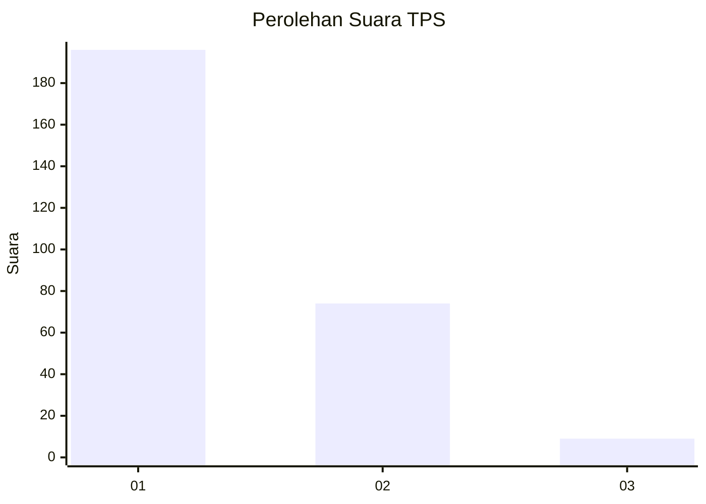
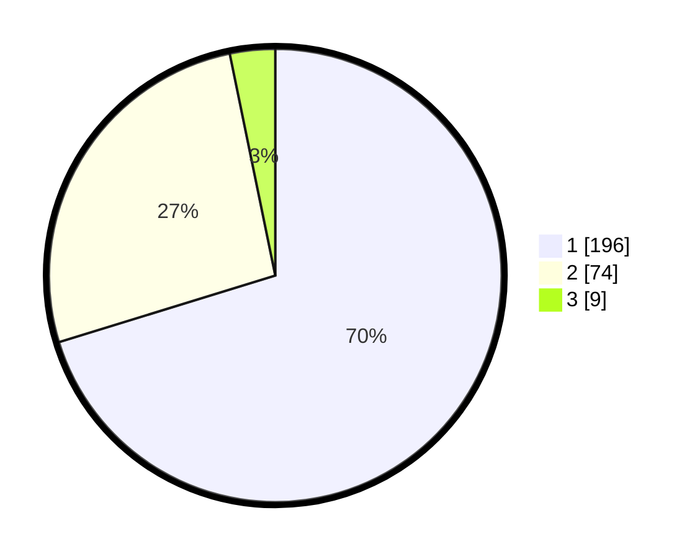

# Hasil

## Grafik

## Tabel

| No. | Nama Paslon    | Suara | Suara (raw) | Persentase |
|:--- |:-------------- | -----:| -----------:| ----------:|
| 1   | ANIES MUHAIMIN | 196   | [196][p-1]  | 70,25      |
| 2   | PRABOWO GIBRAN | 74    | [74][p-2]   | 26,52      |
| 3   | GANJAR MAHFUD  | 9     | [9][p-3]    | 3,23       |

[p-1]: https://github.com/gigit-pemilu/pemilu-2024-14-riau/blob/main/pilpres/hitung-suara/sub/14-riau/sub/08-siak/sub/04-tualang/sub/2008-perawang-barat/sub/042-tps/sub/paslon-1.txt
[p-2]: https://github.com/gigit-pemilu/pemilu-2024-14-riau/blob/main/pilpres/hitung-suara/sub/14-riau/sub/08-siak/sub/04-tualang/sub/2008-perawang-barat/sub/042-tps/sub/paslon-2.txt
[p-3]: https://github.com/gigit-pemilu/pemilu-2024-14-riau/blob/main/pilpres/hitung-suara/sub/14-riau/sub/08-siak/sub/04-tualang/sub/2008-perawang-barat/sub/042-tps/sub/paslon-3.txt

## Foto C Plano

https://sirekap-obj-formc.kpu.go.id/4a89/pemilu/ppwp/14/08/04/20/08/1408042008042-20240214-193548--31e6975d-0c6b-4fad-93cc-3538f066894a.jpg

https://sirekap-obj-formc.kpu.go.id/4a89/pemilu/ppwp/14/08/04/20/08/1408042008042-20240214-193626--e4759114-081d-4b58-b389-300ed6ff8add.jpg

https://sirekap-obj-formc.kpu.go.id/4a89/pemilu/ppwp/14/08/04/20/08/1408042008042-20240214-193706--443312ee-345f-4f8f-9959-c738565aa1b7.jpg

## Metadata

| Key        | Value               |
| ---------- | ------------------- |
| Time Stamp | 2024-02-19 06:16:00 |

