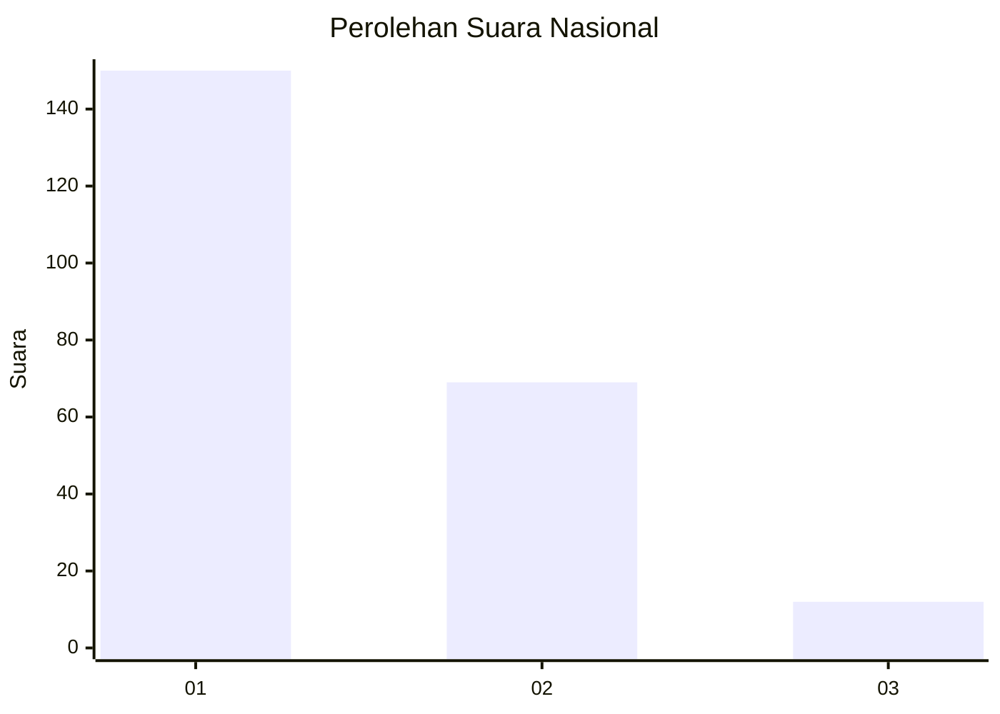
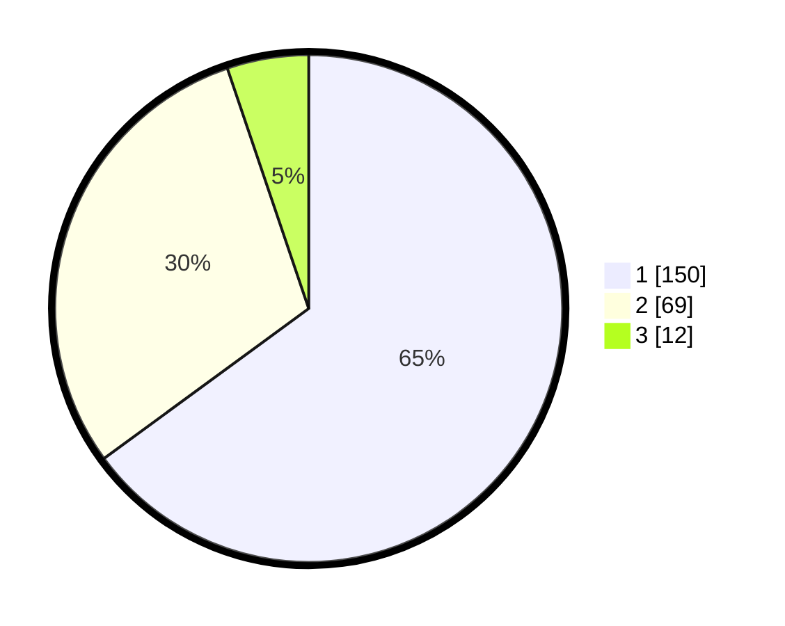

# Hasil

## Grafik

## Tabel

| No. | Nama Paslon    | Suara | Suara (raw) | Persentase |
|:--- |:-------------- | -----:| -----------:| ----------:|
| 1   | ANIES MUHAIMIN | 150   | [150][p-1]  | 64,94      |
| 2   | PRABOWO GIBRAN | 69    | [69][p-2]   | 29,87      |
| 3   | GANJAR MAHFUD  | 12    | [12][p-3]   | 5,19       |

[p-1]: https://github.com/gigit-pemilu/pemilu-2024/blob/main/pilpres/hitung-suara/sub/14-riau/sub/08-siak/sub/04-tualang/sub/2008-perawang-barat/sub/065-tps/sub/paslon-1.txt
[p-2]: https://github.com/gigit-pemilu/pemilu-2024/blob/main/pilpres/hitung-suara/sub/14-riau/sub/08-siak/sub/04-tualang/sub/2008-perawang-barat/sub/065-tps/sub/paslon-2.txt
[p-3]: https://github.com/gigit-pemilu/pemilu-2024/blob/main/pilpres/hitung-suara/sub/14-riau/sub/08-siak/sub/04-tualang/sub/2008-perawang-barat/sub/065-tps/sub/paslon-3.txt

## Foto C Plano

https://sirekap-obj-formc.kpu.go.id/151d/pemilu/ppwp/14/08/04/20/08/1408042008065-20240214-234820--5dd90e21-5d15-4fbb-9fc3-9fb5299ac8f3.jpg

https://sirekap-obj-formc.kpu.go.id/151d/pemilu/ppwp/14/08/04/20/08/1408042008065-20240214-234920--5770c6f2-3073-4b46-8968-8db0e52670ff.jpg

https://sirekap-obj-formc.kpu.go.id/151d/pemilu/ppwp/14/08/04/20/08/1408042008065-20240214-234956--a39b8f02-9fa6-4f6e-9bd6-e29a0ed63cf8.jpg

## Metadata

| Key        | Value               |
| ---------- | ------------------- |
| Time Stamp | 2024-02-19 06:16:00 |

