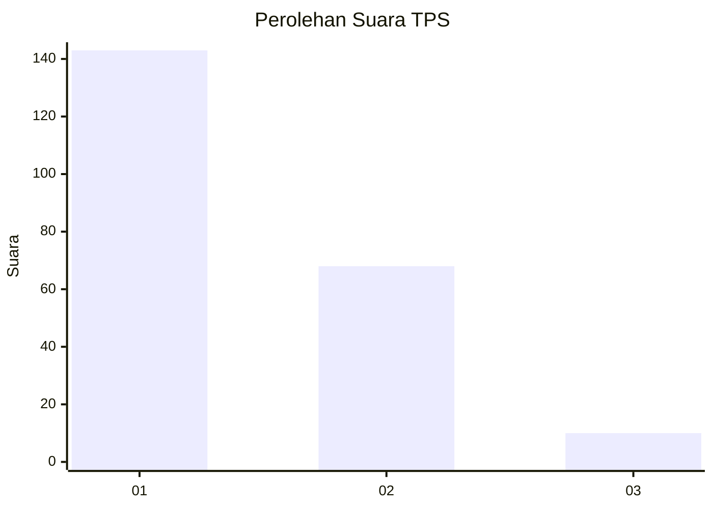
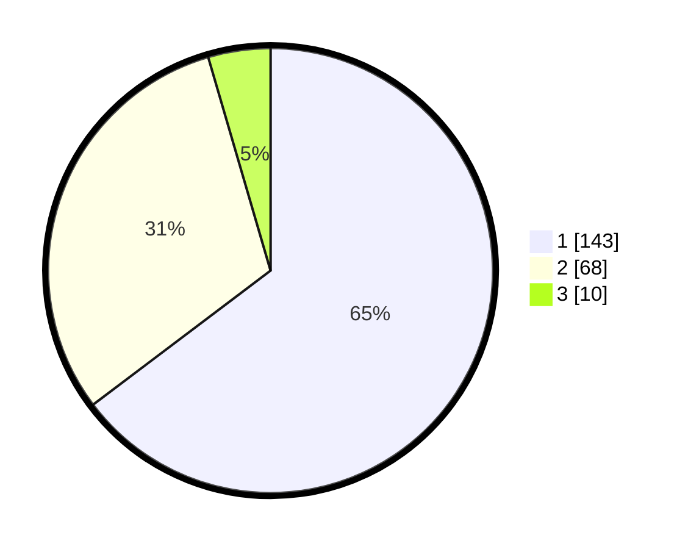

# Hasil

## Grafik

## Tabel

| No. | Nama Paslon    | Suara | Suara (raw) | Persentase |
|:--- |:-------------- | -----:| -----------:| ----------:|
| 1   | ANIES MUHAIMIN | 143   | [143][p-1]  | 64,71      |
| 2   | PRABOWO GIBRAN | 68    | [68][p-2]   | 30,77      |
| 3   | GANJAR MAHFUD  | 10    | [10][p-3]   | 4,52       |

[p-1]: https://github.com/gigit-pemilu/pemilu-2024-14-riau/blob/main/pilpres/hitung-suara/sub/14-riau/sub/08-siak/sub/04-tualang/sub/2008-perawang-barat/sub/066-tps/sub/paslon-1.txt
[p-2]: https://github.com/gigit-pemilu/pemilu-2024-14-riau/blob/main/pilpres/hitung-suara/sub/14-riau/sub/08-siak/sub/04-tualang/sub/2008-perawang-barat/sub/066-tps/sub/paslon-2.txt
[p-3]: https://github.com/gigit-pemilu/pemilu-2024-14-riau/blob/main/pilpres/hitung-suara/sub/14-riau/sub/08-siak/sub/04-tualang/sub/2008-perawang-barat/sub/066-tps/sub/paslon-3.txt

## Foto C Plano

https://sirekap-obj-formc.kpu.go.id/5acf/pemilu/ppwp/14/08/04/20/08/1408042008066-20240214-231047--827e3c48-58cf-4c16-86ac-a667a5dc76ba.jpg

https://sirekap-obj-formc.kpu.go.id/5acf/pemilu/ppwp/14/08/04/20/08/1408042008066-20240214-231423--d992e194-4810-42b5-9bb8-91e55c31725c.jpg

https://sirekap-obj-formc.kpu.go.id/5acf/pemilu/ppwp/14/08/04/20/08/1408042008066-20240214-231601--193ee290-4f1c-42b2-aa5f-04cb4dd7d268.jpg

## Metadata

| Key        | Value               |
| ---------- | ------------------- |
| Time Stamp | 2024-02-19 06:16:00 |

