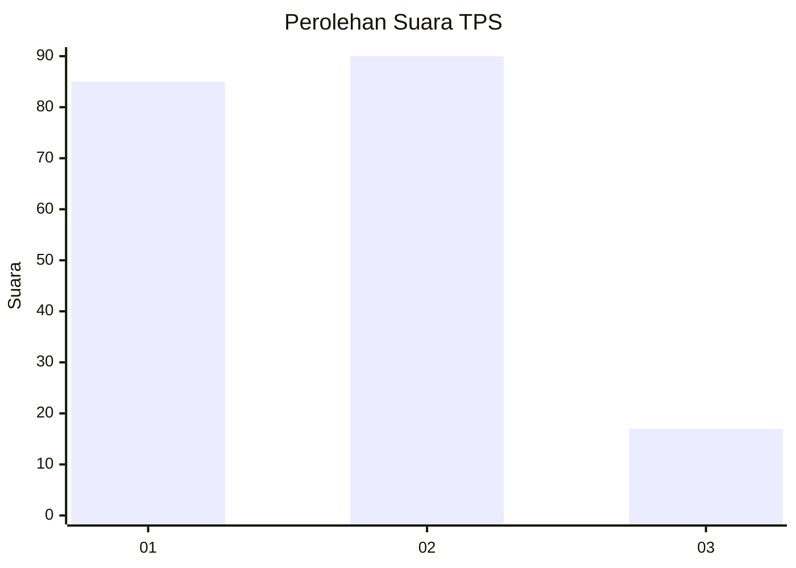
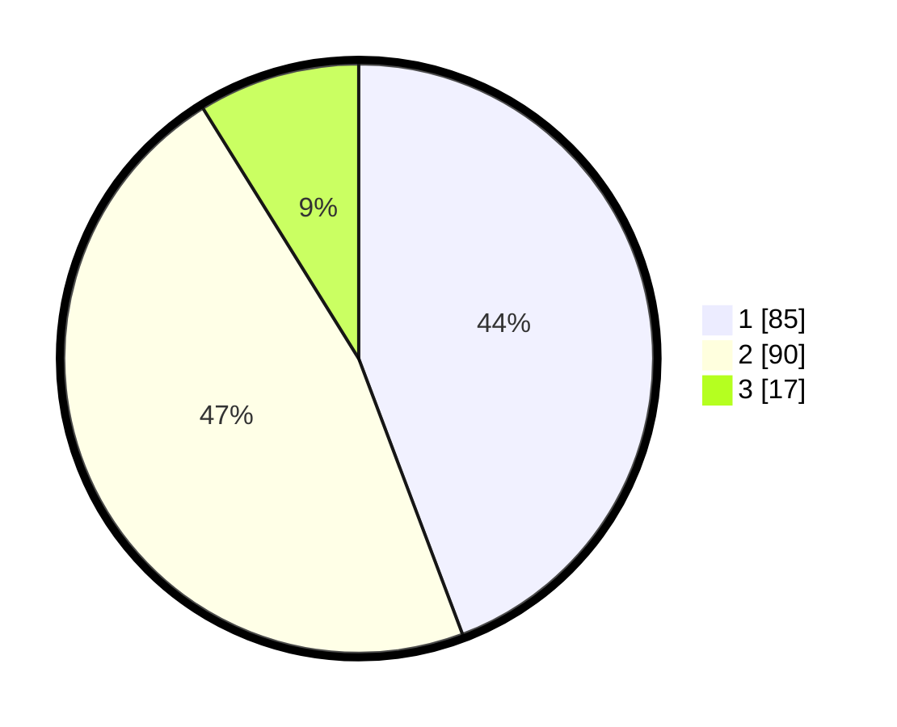

# Hasil

## Grafik

## Tabel

| No. | Nama Paslon    | Suara | Suara (raw) | Persentase |
|:--- |:-------------- | -----:| -----------:| ----------:|
| 1   | ANIES MUHAIMIN | 85    | [85][p-1]   | 44,27      |
| 2   | PRABOWO GIBRAN | 90    | [90][p-2]   | 46,88      |
| 3   | GANJAR MAHFUD  | 17    | [17][p-3]   | 8,85       |

[p-1]: https://github.com/gigit-pemilu/pemilu-2024-14-riau/blob/main/pilpres/hitung-suara/sub/14-riau/sub/08-siak/sub/05-sungai-mandau/sub/2001-muara-kelantan/sub/004-tps/sub/paslon-1.txt
[p-2]: https://github.com/gigit-pemilu/pemilu-2024-14-riau/blob/main/pilpres/hitung-suara/sub/14-riau/sub/08-siak/sub/05-sungai-mandau/sub/2001-muara-kelantan/sub/004-tps/sub/paslon-2.txt
[p-3]: https://github.com/gigit-pemilu/pemilu-2024-14-riau/blob/main/pilpres/hitung-suara/sub/14-riau/sub/08-siak/sub/05-sungai-mandau/sub/2001-muara-kelantan/sub/004-tps/sub/paslon-3.txt

## Foto C Plano

https://sirekap-obj-formc.kpu.go.id/5636/pemilu/ppwp/14/08/05/20/01/1408052001004-20240215-110403--d85cfd1a-bf43-4094-82e5-eebb4c862ff2.jpg

https://sirekap-obj-formc.kpu.go.id/5636/pemilu/ppwp/14/08/05/20/01/1408052001004-20240215-110457--219a4eb9-f097-479c-8b84-9a093f04803f.jpg

https://sirekap-obj-formc.kpu.go.id/5636/pemilu/ppwp/14/08/05/20/01/1408052001004-20240215-110647--bee76c1a-4ef4-47d7-b702-b08774e0b668.jpg

## Metadata

| Key        | Value               |
| ---------- | ------------------- |
| Time Stamp | 2024-02-15 21:30:27 |

