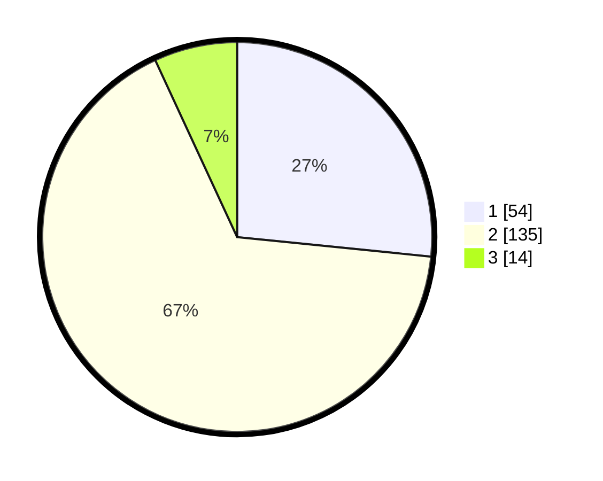

# Hasil

## Grafik

## Tabel

| No. | Nama Paslon    | Suara | Suara (raw) | Persentase |
|:--- |:-------------- | -----:| -----------:| ----------:|
| 1   | ANIES MUHAIMIN | 54    | [54][p-1]   | 26,60      |
| 2   | PRABOWO GIBRAN | 135   | [135][p-2]  | 66,50      |
| 3   | GANJAR MAHFUD  | 14    | [14][p-3]   | 6,90       |

[p-1]: https://github.com/gigit-pemilu/pemilu-2024-14-riau/blob/main/pilpres/hitung-suara/sub/14-riau/sub/08-siak/sub/05-sungai-mandau/sub/2008-bencah-umbai/sub/002-tps/sub/paslon-1.txt
[p-2]: https://github.com/gigit-pemilu/pemilu-2024-14-riau/blob/main/pilpres/hitung-suara/sub/14-riau/sub/08-siak/sub/05-sungai-mandau/sub/2008-bencah-umbai/sub/002-tps/sub/paslon-2.txt
[p-3]: https://github.com/gigit-pemilu/pemilu-2024-14-riau/blob/main/pilpres/hitung-suara/sub/14-riau/sub/08-siak/sub/05-sungai-mandau/sub/2008-bencah-umbai/sub/002-tps/sub/paslon-3.txt

## Foto C Plano

https://sirekap-obj-formc.kpu.go.id/c82c/pemilu/ppwp/14/08/05/20/08/1408052008002-20240215-041930--c436c8aa-0ff7-44c4-9364-4d1fcdd1313f.jpg

https://sirekap-obj-formc.kpu.go.id/c82c/pemilu/ppwp/14/08/05/20/08/1408052008002-20240215-042409--ef516604-2ed2-4768-aa52-013bb03fe96a.jpg

https://sirekap-obj-formc.kpu.go.id/c82c/pemilu/ppwp/14/08/05/20/08/1408052008002-20240215-042710--646f1be1-3b11-43df-8e6e-350ad4a3faa8.jpg

## Metadata

| Key        | Value               |
| ---------- | ------------------- |
| Time Stamp | 2024-02-15 21:30:27 |

