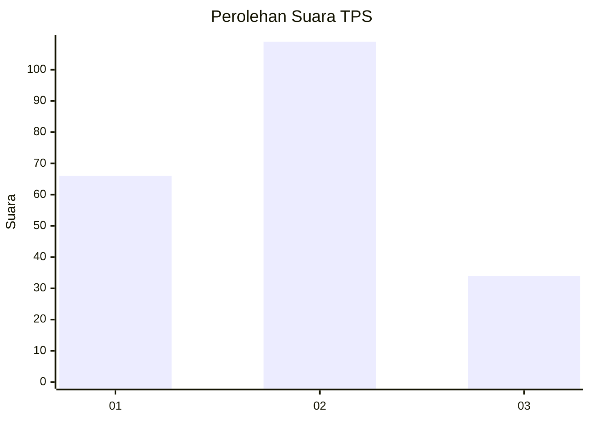
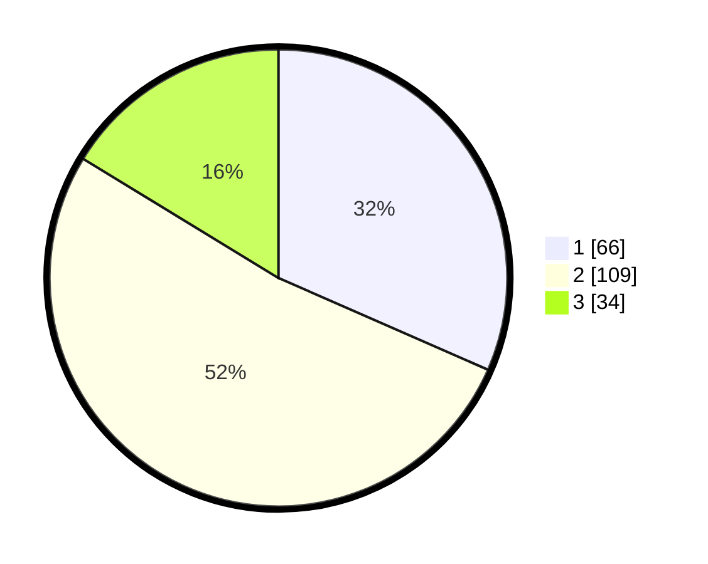

# Hasil

## Grafik

## Tabel

| No. | Nama Paslon    | Suara | Suara (raw) | Persentase |
|:--- |:-------------- | -----:| -----------:| ----------:|
| 1   | ANIES MUHAIMIN | 66    | [66][p-1]   | 31,58      |
| 2   | PRABOWO GIBRAN | 109   | [109][p-2]  | 52,15      |
| 3   | GANJAR MAHFUD  | 34    | [34][p-3]   | 16,27      |

[p-1]: https://github.com/gigit-pemilu/pemilu-2024-14-riau/blob/main/pilpres/hitung-suara/sub/14-riau/sub/08-siak/sub/06-dayun/sub/2001-dayun/sub/008-tps/sub/paslon-1.txt
[p-2]: https://github.com/gigit-pemilu/pemilu-2024-14-riau/blob/main/pilpres/hitung-suara/sub/14-riau/sub/08-siak/sub/06-dayun/sub/2001-dayun/sub/008-tps/sub/paslon-2.txt
[p-3]: https://github.com/gigit-pemilu/pemilu-2024-14-riau/blob/main/pilpres/hitung-suara/sub/14-riau/sub/08-siak/sub/06-dayun/sub/2001-dayun/sub/008-tps/sub/paslon-3.txt

## Foto C Plano

https://sirekap-obj-formc.kpu.go.id/918c/pemilu/ppwp/14/08/06/20/01/1408062001008-20240215-041054--d6f8ce9c-7a8c-4c94-a941-e268a0086d18.jpg

https://sirekap-obj-formc.kpu.go.id/918c/pemilu/ppwp/14/08/06/20/01/1408062001008-20240215-041235--956b4e98-e5af-413d-99ec-ad4b5aa504fc.jpg

https://sirekap-obj-formc.kpu.go.id/918c/pemilu/ppwp/14/08/06/20/01/1408062001008-20240215-041437--79404694-f51b-4145-93e6-84351162c90a.jpg

## Metadata

| Key        | Value               |
| ---------- | ------------------- |
| Time Stamp | 2024-02-24 22:31:28 |

