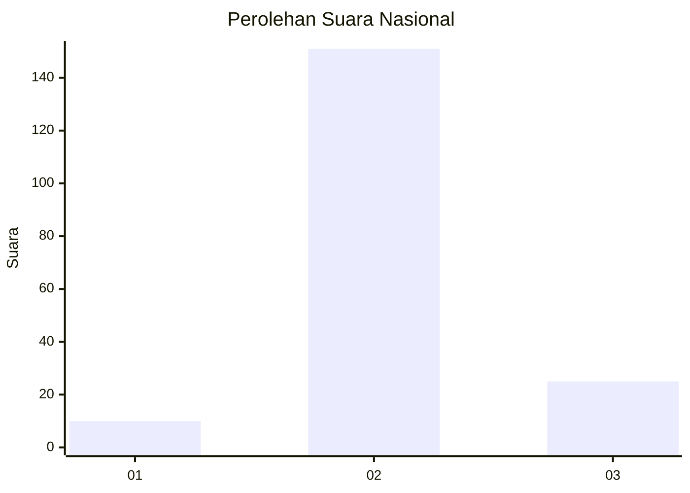
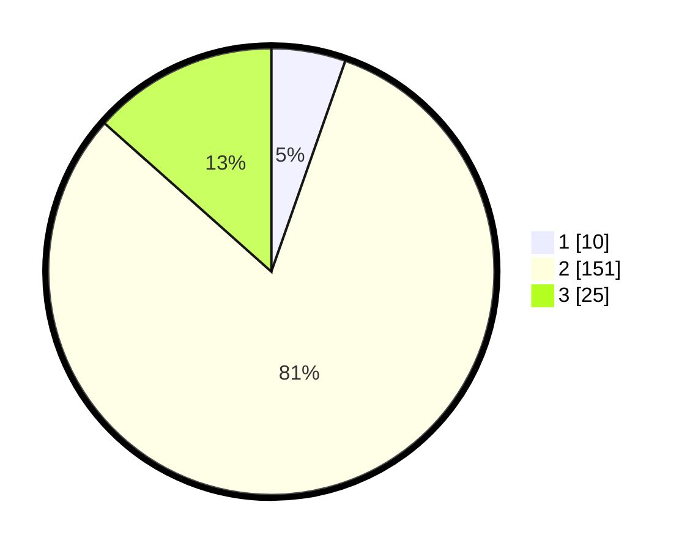

# Hasil

## Grafik

## Tabel

| No. | Nama Paslon    | Suara | Suara (raw) | Persentase |
|:--- |:-------------- | -----:| -----------:| ----------:|
| 1   | ANIES MUHAIMIN | 10    | [10][p-1]   | 5,38       |
| 2   | PRABOWO GIBRAN | 151   | [151][p-2]  | 81,18      |
| 3   | GANJAR MAHFUD  | 25    | [25][p-3]   | 13,44      |

[p-1]: https://github.com/gigit-pemilu/pemilu-2024/blob/main/pilpres/hitung-suara/sub/14-riau/sub/08-siak/sub/06-dayun/sub/2006-berumbung-baru/sub/008-tps/sub/paslon-1.txt
[p-2]: https://github.com/gigit-pemilu/pemilu-2024/blob/main/pilpres/hitung-suara/sub/14-riau/sub/08-siak/sub/06-dayun/sub/2006-berumbung-baru/sub/008-tps/sub/paslon-2.txt
[p-3]: https://github.com/gigit-pemilu/pemilu-2024/blob/main/pilpres/hitung-suara/sub/14-riau/sub/08-siak/sub/06-dayun/sub/2006-berumbung-baru/sub/008-tps/sub/paslon-3.txt

## Foto C Plano

https://sirekap-obj-formc.kpu.go.id/ffd8/pemilu/ppwp/14/08/06/20/06/1408062006008-20240226-142138--56f17b19-a79f-4b35-b26a-475fd887a233.jpg

https://sirekap-obj-formc.kpu.go.id/ffd8/pemilu/ppwp/14/08/06/20/06/1408062006008-20240226-144346--b3798f3f-b17d-4cde-826f-b5c7a74da5d9.jpg

https://sirekap-obj-formc.kpu.go.id/ffd8/pemilu/ppwp/14/08/06/20/06/1408062006008-20240226-144547--0b1b0004-0c1b-41a1-956e-9f02ed2063a5.jpg

## Metadata

| Key        | Value               |
| ---------- | ------------------- |
| Time Stamp | 2024-02-26 15:00:00 |

## DATA PEMILIH TETAP

Jumlah pemilih dalam DPT: **134**.
 * L: **125**.
 * P: **89**.

## DATA PENGGUNA HAK PILIH

Jumlah pengguna hak pilih dalam DPT: **176**.
 * L: **97**.
 * P: **879**.

Jumlah pengguna hak pilih dalam DPTb: **4**.
 * L: **272**.
 * P: **82**.

Jumlah pengguna hak pilih dalam DPK: **86**.
 * L: **3**.
 * P: **3**.

Jumlah pengguna hak pilih: **186**.
 * L: **102**.
 * P: **84**.

## JUMLAH SUARA SAH DAN TIDAK SAH

JUMLAH SELURUH SUARA SAH: **585**.

JUMLAH SUARA TIDAK SAH: **88**.

JUMLAH SELURUH SUARA SAH DAN SUARA TIDAK SAH: **886**.

