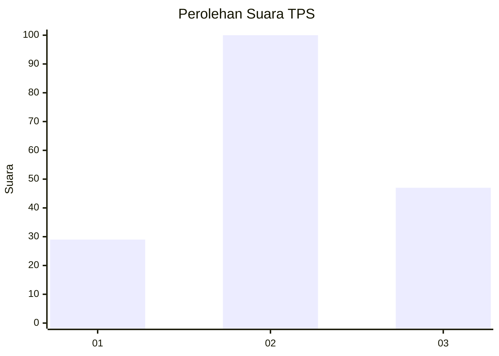
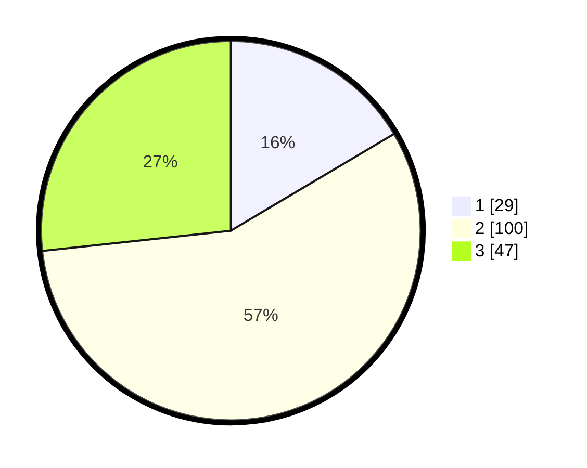

# Hasil

## Grafik

## Tabel

| No. | Nama Paslon    | Suara | Suara (raw) | Persentase |
|:--- |:-------------- | -----:| -----------:| ----------:|
| 1   | ANIES MUHAIMIN | 29    | [29][p-1]   | 16,48      |
| 2   | PRABOWO GIBRAN | 100   | [100][p-2]  | 56,82      |
| 3   | GANJAR MAHFUD  | 47    | [47][p-3]   | 26,70      |

[p-1]: https://github.com/gigit-pemilu/pemilu-2024-14-riau/blob/main/pilpres/hitung-suara/sub/14-riau/sub/08-siak/sub/06-dayun/sub/2010-sawit-permai/sub/008-tps/sub/paslon-1.txt
[p-2]: https://github.com/gigit-pemilu/pemilu-2024-14-riau/blob/main/pilpres/hitung-suara/sub/14-riau/sub/08-siak/sub/06-dayun/sub/2010-sawit-permai/sub/008-tps/sub/paslon-2.txt
[p-3]: https://github.com/gigit-pemilu/pemilu-2024-14-riau/blob/main/pilpres/hitung-suara/sub/14-riau/sub/08-siak/sub/06-dayun/sub/2010-sawit-permai/sub/008-tps/sub/paslon-3.txt

## Foto C Plano

https://sirekap-obj-formc.kpu.go.id/3eec/pemilu/ppwp/14/08/06/20/10/1408062010008-20240226-103406--e07a9303-4243-41ea-8f6a-07d46a30b174.jpg

https://sirekap-obj-formc.kpu.go.id/3eec/pemilu/ppwp/14/08/06/20/10/1408062010008-20240226-103520--1ce274a7-7290-46c8-beaf-5df05f8e444a.jpg

https://sirekap-obj-formc.kpu.go.id/3eec/pemilu/ppwp/14/08/06/20/10/1408062010008-20240226-103705--f99c5e5c-46ac-4dc3-b556-9e4231e2cd0b.jpg

## Metadata

| Key        | Value               |
| ---------- | ------------------- |
| Time Stamp | 2024-02-26 18:00:00 |

## DATA PEMILIH TETAP

Jumlah pemilih dalam DPT: **600**.
 * L: **505**.
 * P: **555**.

## DATA PENGGUNA HAK PILIH

Jumlah pengguna hak pilih dalam DPT: **555**.
 * L: **444**.
 * P: **655**.

Jumlah pengguna hak pilih dalam DPTb: **442**.
 * L: **444**.
 * P: **444**.

Jumlah pengguna hak pilih dalam DPK: **28**.
 * L: **444**.
 * P: **444**.

Jumlah pengguna hak pilih: **447**.
 * L: **444**.
 * P: **464**.

## JUMLAH SUARA SAH DAN TIDAK SAH

JUMLAH SELURUH SUARA SAH: **176**.

JUMLAH SUARA TIDAK SAH: **1**.

JUMLAH SELURUH SUARA SAH DAN SUARA TIDAK SAH: **177**.

