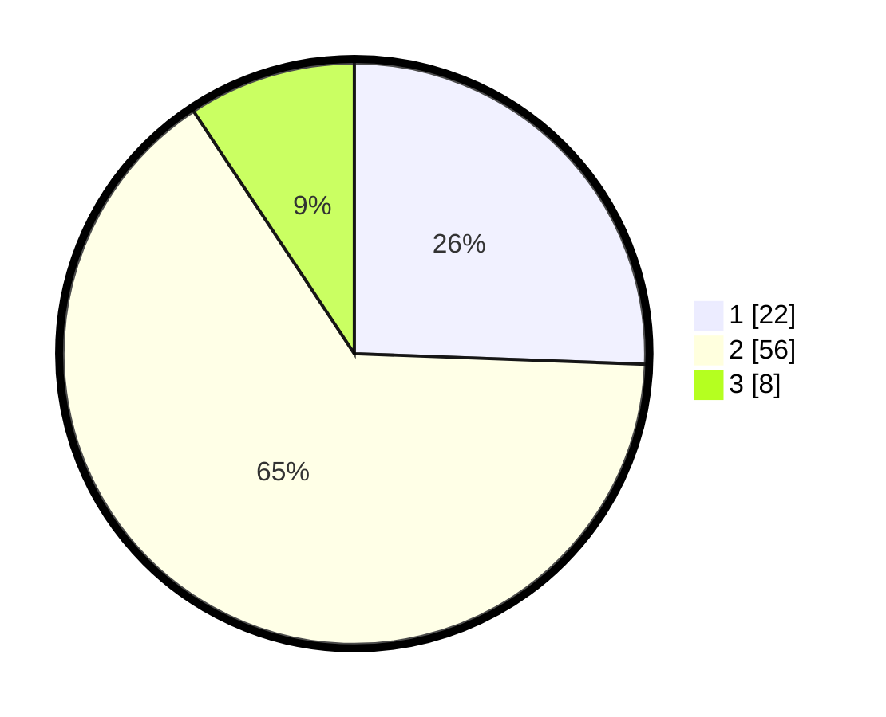

# Hasil

## Grafik

## Tabel

| No. | Nama Paslon    | Suara | Suara (raw) | Persentase |
|:--- |:-------------- | -----:| -----------:| ----------:|
| 1   | ANIES MUHAIMIN | 22    | [22][p-1]   | 25,58      |
| 2   | PRABOWO GIBRAN | 56    | [56][p-2]   | 65,12      |
| 3   | GANJAR MAHFUD  | 8     | [8][p-3]    | 9,30       |

[p-1]: https://github.com/gigit-pemilu/pemilu-2024-14-riau/blob/main/pilpres/hitung-suara/sub/14-riau/sub/08-siak/sub/07-kerinci-kanan/sub/2001-kerinci-kanan/sub/006-tps/sub/paslon-1.txt
[p-2]: https://github.com/gigit-pemilu/pemilu-2024-14-riau/blob/main/pilpres/hitung-suara/sub/14-riau/sub/08-siak/sub/07-kerinci-kanan/sub/2001-kerinci-kanan/sub/006-tps/sub/paslon-2.txt
[p-3]: https://github.com/gigit-pemilu/pemilu-2024-14-riau/blob/main/pilpres/hitung-suara/sub/14-riau/sub/08-siak/sub/07-kerinci-kanan/sub/2001-kerinci-kanan/sub/006-tps/sub/paslon-3.txt

## Foto C Plano

https://sirekap-obj-formc.kpu.go.id/e094/pemilu/ppwp/14/08/07/20/01/1408072001006-20240214-210740--f1af828e-a3f5-4cbb-923e-98959dd0cbcb.jpg

https://sirekap-obj-formc.kpu.go.id/e094/pemilu/ppwp/14/08/07/20/01/1408072001006-20240214-210948--1c63440d-5691-4da9-a7d2-e9371f41ccd7.jpg

https://sirekap-obj-formc.kpu.go.id/e094/pemilu/ppwp/14/08/07/20/01/1408072001006-20240214-211321--9c4e166a-6177-4193-b8ba-9832efc16f18.jpg

## Metadata

| Key        | Value               |
| ---------- | ------------------- |
| Time Stamp | 2024-02-15 00:41:44 |

## DATA PEMILIH TETAP

Jumlah pemilih dalam DPT: **130**.
 * L: **73**.
 * P: **57**.

## DATA PENGGUNA HAK PILIH

Jumlah pengguna hak pilih dalam DPT: **77**.
 * L: **43**.
 * P: **34**.

Jumlah pengguna hak pilih dalam DPTb: **0**.
 * L: **0**.
 * P: **0**.

Jumlah pengguna hak pilih dalam DPK: **10**.
 * L: **4**.
 * P: **6**.

Jumlah pengguna hak pilih: **87**.
 * L: **47**.
 * P: **40**.

## JUMLAH SUARA SAH DAN TIDAK SAH

JUMLAH SELURUH SUARA SAH: **86**.

JUMLAH SUARA TIDAK SAH: **1**.

JUMLAH SELURUH SUARA SAH DAN SUARA TIDAK SAH: **87**.

